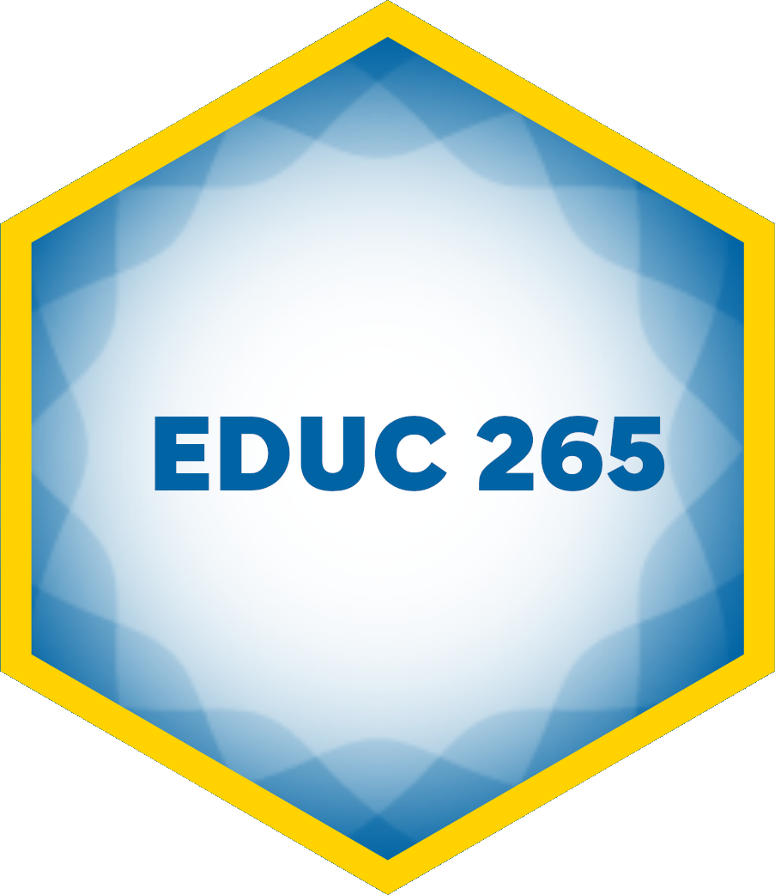
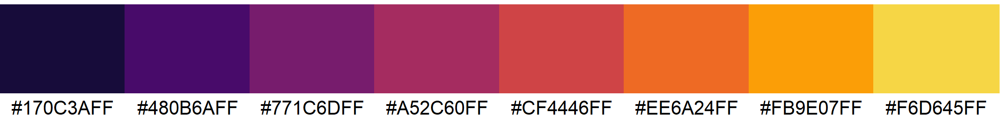

<!-- README.md is generated from README.qmd. Please edit that file -->

# Program Evaluation for Public Service <a href='https://evalsp24.classes.andrewheiss.com/'></a>

[PMAP 8521 • Spring 2024](https://evalsp24.classes.andrewheiss.com/)  
[Andrew Heiss](https://www.andrewheiss.com/) • Andrew Young School of
Policy Studies • Georgia State University

------------------------------------------------------------------------

**[Quarto](https://quarto.org/) +
[{targets}](https://docs.ropensci.org/targets/) +
[{renv}](https://rstudio.github.io/renv/) +
[{xaringan}](https://github.com/yihui/xaringan) = magic! 🪄**

------------------------------------------------------------------------

## How to build the site

1.  Install
    [RStudio](https://www.rstudio.com/products/rstudio/download/#download)
    version 2022.07.1 or later since it has a
    [Quarto](https://quarto.org/) installation embedded in it.
    Otherwise, download and install [Quarto](https://quarto.org/)
    separately.
2.  Open `evalsp24.Rproj` to open an [RStudio
    Project](https://r4ds.hadley.nz/workflow-scripts.html).
3.  If it’s not installed already, R *should* try to install the [{renv}
    package](https://rstudio.github.io/renv/) when you open the RStudio
    Project for the first time. If you don’t see a message about package
    installation, install it yourself by running
    `install.packages("renv")` in the R console.
4.  Run `renv::restore()` in the R console to install all the required
    packages for this project.
5.  Run `targets::tar_make()` in the R console to build everything.
6.  🎉 All done! 🎉 The complete website will be in a folder named
    `_site/`.

## {targets} pipeline

I use the [{targets} package](https://docs.ropensci.org/targets/) to
build this site and all its supporting files. The complete pipeline is
defined in [`_targets.R`](_targets.R) and can be run in the R console
with:

``` r
targets::tar_make()
```

The pipeline does several major tasks:

- **Create supporting data files**: The problem sets and examples I use
  throughout the course use many different datasets that come
  prepackaged in R packages, I downloaded from sources online, or that I
  generated myself. To make sure I and my students are using the latest,
  most correct datasets, the functions in [`R/tar_data.R`](R/tar_data.R)
  save and/or generate these datasets prior to building the website.

- **Compress project folders**: To make it easier to distribute problem
  sets and in-class activities to students, I compress all the folders
  in the [`/projects/`](/projects/) folder so that students can download
  and unzip a self-contained RStudio Project as a `.zip` file. These
  targets are [dynamically
  generated](https://books.ropensci.org/targets/dynamic.html) so that
  any new folder that is added to `/projects/` will automatically be
  zipped up when running the pipeline.

- **Render xaringan slides to HTML and PDF**: Quarto supports HTML-based
  slideshows through
  [reveal.js](https://quarto.org/docs/presentations/revealjs/). However,
  I created all my slides using
  [{xaringan}](https://github.com/yihui/xaringan), which is based on
  [remark.js](https://remarkjs.com/) and doesn’t work with Quarto.
  Since (1) I recorded all the class videos using my {xaringan} slides
  with a fancy template I made, and (2) I don’t want to recreate my
  fancy template in reveal.js yet, I want to keep using {xaringan}.

  The pipeline [dynamically generates
  targets](https://books.ropensci.org/targets/dynamic.html) for all the
  `.Rmd` files in [`/slides/`](/slides/) and renders them using R
  Markdown rather than Quarto.

  The pipeline then uses
  [{renderthis}](https://jhelvy.github.io/renderthis/) to convert each
  set of HTML slides into PDFs.

- **Build Quarto website**: This project is a [Quarto
  website](https://quarto.org/docs/websites/), which compiles and
  stitches together all the `.qmd` files in this project based on the
  settings in [`_quarto.yml`](_quarto.yml). See the [Quarto website
  documentation](https://quarto.org/docs/websites/) for more details.

- **Upload resulting `_site/` folder to my remote server**: Quarto
  places the compiled website in a folder named `/_site/`. The pipeline
  uses `rsync` to upload this folder to my personal remote server. This
  target will only run if the `UPLOAD_WEBSITES` environment variable is
  set to `TRUE`, and it will only work if you have an SSH key set up on
  my personal server, which only I do.

The complete pipeline looks like this:

<small>(This uses [`mermaid.js`
syntax](https://mermaid-js.github.io/mermaid/) and should display as a
graph on GitHub. You can also view it by pasting the code into
<https://mermaid.live>.)</small>

``` mermaid
graph LR
  style Graph fill:#FFFFFF00,stroke:#000000;
  subgraph Graph
    direction LR
    xb453b5ae08dcaee7(["build_data"]):::queued --> xcb7695204bbb82c0(["zip_proj_problem_set_2"]):::queued
    x41092a7251862a9e(["copy_data"]):::queued --> xcb7695204bbb82c0(["zip_proj_problem_set_2"]):::queued
    xce5c40e724fae117["proj_problem_set_2"]:::queued --> xcb7695204bbb82c0(["zip_proj_problem_set_2"]):::queued
    xddbb92c08f88ed11(["slide_pdf_01_class"]):::queued --> x4a305c917823f255(["all_slides"]):::queued
    x3fed6f344703f0bc(["slide_pdf_01_class_01_markdown_writing"]):::queued --> x4a305c917823f255(["all_slides"]):::queued
    x90ef6a61cf63fa9a(["slide_pdf_01_class_02_getting_started"]):::queued --> x4a305c917823f255(["all_slides"]):::queued
    x95c941177f609767(["slide_pdf_01_class_03_data_basics"]):::queued --> x4a305c917823f255(["all_slides"]):::queued
    x4220f76d6298aba9(["slide_pdf_01_class_04_visualize_data"]):::queued --> x4a305c917823f255(["all_slides"]):::queued
    xc966f38bbfcb4636(["slide_pdf_01_class_05_transform_data"]):::queued --> x4a305c917823f255(["all_slides"]):::queued
    xa935f0e01fef2cde(["slide_pdf_01_slides"]):::queued --> x4a305c917823f255(["all_slides"]):::queued
    xa9e1f1b05055309d(["slide_pdf_02_class"]):::queued --> x4a305c917823f255(["all_slides"]):::queued
    xacabf68fb9268ebf(["slide_pdf_02_slides"]):::queued --> x4a305c917823f255(["all_slides"]):::queued
    xf129103527922de3(["slide_pdf_03_class"]):::queued --> x4a305c917823f255(["all_slides"]):::queued
    x4e46395be22dfa25(["slide_pdf_03_slides"]):::queued --> x4a305c917823f255(["all_slides"]):::queued
    xd6aae5bf8ff9eadd(["slide_pdf_04_class"]):::queued --> x4a305c917823f255(["all_slides"]):::queued
    x7de51ccacf286754(["slide_pdf_04_slides"]):::queued --> x4a305c917823f255(["all_slides"]):::queued
    xf71fbb514d5d7f6c(["slide_pdf_05_slides"]):::queued --> x4a305c917823f255(["all_slides"]):::queued
    x20ef3085e77d776d(["slide_pdf_06_class"]):::queued --> x4a305c917823f255(["all_slides"]):::queued
    xde9053fae0cc2fc3(["slide_pdf_06_slides"]):::queued --> x4a305c917823f255(["all_slides"]):::queued
    x96e5dfffe446ba81(["slide_pdf_07_class"]):::queued --> x4a305c917823f255(["all_slides"]):::queued
    x387a6ab397131078(["slide_pdf_07_slides"]):::queued --> x4a305c917823f255(["all_slides"]):::queued
    xa81d84edee006771(["slide_pdf_08_class"]):::queued --> x4a305c917823f255(["all_slides"]):::queued
    xd268eecf4e67b7f9(["slide_pdf_08_slides"]):::queued --> x4a305c917823f255(["all_slides"]):::queued
    x74c104ab293061aa(["slide_pdf_09_class"]):::queued --> x4a305c917823f255(["all_slides"]):::queued
    xc9f6fb07c0e299d1(["slide_pdf_10_class"]):::queued --> x4a305c917823f255(["all_slides"]):::queued
    xa65edaef33970b12(["slide_pdf_10_slides"]):::queued --> x4a305c917823f255(["all_slides"]):::queued
    x58a52184afd4ddb3(["slide_pdf_11_class"]):::queued --> x4a305c917823f255(["all_slides"]):::queued
    x1be4dc0a34e6f4ac(["slide_pdf_11_slides"]):::queued --> x4a305c917823f255(["all_slides"]):::queued
    x5f4593345046a94b(["slide_pdf_12_slides"]):::queued --> x4a305c917823f255(["all_slides"]):::queued
    xe8a1446ad7f6e747(["slide_pdf_13_slides"]):::queued --> x4a305c917823f255(["all_slides"]):::queued
    xf1b987ab2b5a7566(["slide_pdf_14_slides"]):::queued --> x4a305c917823f255(["all_slides"]):::queued
    xb453b5ae08dcaee7(["build_data"]):::queued --> x02abe5443edb9276(["zip_proj_problem_set_3"]):::queued
    x41092a7251862a9e(["copy_data"]):::queued --> x02abe5443edb9276(["zip_proj_problem_set_3"]):::queued
    x4df2d668e9331d0f["proj_problem_set_3"]:::queued --> x02abe5443edb9276(["zip_proj_problem_set_3"]):::queued
    xb453b5ae08dcaee7(["build_data"]):::queued --> xe0f43c7a90683afd(["zip_proj_problem_set_4"]):::queued
    x41092a7251862a9e(["copy_data"]):::queued --> xe0f43c7a90683afd(["zip_proj_problem_set_4"]):::queued
    x79abf3076e3227ae["proj_problem_set_4"]:::queued --> xe0f43c7a90683afd(["zip_proj_problem_set_4"]):::queued
    xb453b5ae08dcaee7(["build_data"]):::queued --> x5b8b16011318f35a(["zip_proj_problem_set_5"]):::queued
    x41092a7251862a9e(["copy_data"]):::queued --> x5b8b16011318f35a(["zip_proj_problem_set_5"]):::queued
    xe9ec5432eb288c63["proj_problem_set_5"]:::queued --> x5b8b16011318f35a(["zip_proj_problem_set_5"]):::queued
    xb453b5ae08dcaee7(["build_data"]):::queued --> x9607d5b8ddbc5886(["zip_proj_problem_set_6"]):::queued
    x41092a7251862a9e(["copy_data"]):::queued --> x9607d5b8ddbc5886(["zip_proj_problem_set_6"]):::queued
    xecf69fd14421791d["proj_problem_set_6"]:::queued --> x9607d5b8ddbc5886(["zip_proj_problem_set_6"]):::queued
    xb453b5ae08dcaee7(["build_data"]):::queued --> xfc12a75225adcc79(["zip_proj_problem_set_7"]):::queued
    x41092a7251862a9e(["copy_data"]):::queued --> xfc12a75225adcc79(["zip_proj_problem_set_7"]):::queued
    x7c8161010f3a4a10["proj_problem_set_7"]:::queued --> xfc12a75225adcc79(["zip_proj_problem_set_7"]):::queued
    xb453b5ae08dcaee7(["build_data"]):::queued --> x386282c1d1f08d3b(["zip_proj_problem_set_8"]):::queued
    x41092a7251862a9e(["copy_data"]):::queued --> x386282c1d1f08d3b(["zip_proj_problem_set_8"]):::queued
    x724ac806b95c3a65["proj_problem_set_8"]:::queued --> x386282c1d1f08d3b(["zip_proj_problem_set_8"]):::queued
    xa30417f6e537b4f8["slide_rmd_06_class"]:::queued --> xfc6670f666c4565d(["slide_html_06_class"]):::queued
    xb453b5ae08dcaee7(["build_data"]):::queued --> x10f2a6c741c41a02(["zip_proj_problem_set_9"]):::queued
    x41092a7251862a9e(["copy_data"]):::queued --> x10f2a6c741c41a02(["zip_proj_problem_set_9"]):::queued
    x0965ae383a530b1d["proj_problem_set_9"]:::queued --> x10f2a6c741c41a02(["zip_proj_problem_set_9"]):::queued
    x3b57af17100db412["slide_rmd_08_class"]:::queued --> x8a01703e0e017431(["slide_html_08_class"]):::queued
    x5ef50f29502839c1["slide_rmd_02_class"]:::queued --> xe2260dee7de0d774(["slide_html_02_class"]):::queued
    x4637cdb6e5dd9a34(["slide_rmd_08_class_files"]):::completed --> x3b57af17100db412["slide_rmd_08_class"]:::queued
    xcd22d99b911c212c(["slide_rmd_02_class_files"]):::completed --> x5ef50f29502839c1["slide_rmd_02_class"]:::queued
    xb453b5ae08dcaee7(["build_data"]):::queued --> xd46b573b52e9ac86(["zip_proj_rcts_ipw"]):::queued
    x41092a7251862a9e(["copy_data"]):::queued --> xd46b573b52e9ac86(["zip_proj_rcts_ipw"]):::queued
    x551c5d5237a0ee09["proj_rcts_ipw"]:::queued --> xd46b573b52e9ac86(["zip_proj_rcts_ipw"]):::queued
    xc020cf9175cdcafc(["slide_html_01_class_03_data_basics"]):::queued --> x95c941177f609767(["slide_pdf_01_class_03_data_basics"]):::queued
    xf32a2ee500a34c2b(["slide_rmd_11_class_files"]):::completed --> xfeac4b3b722e91dd["slide_rmd_11_class"]:::queued
    x7b056887098d4c56(["copy_attendance"]):::queued --> x41092a7251862a9e(["copy_data"]):::queued
    x3b13eed8c2f4209e(["copy_barrels_obs"]):::queued --> x41092a7251862a9e(["copy_data"]):::queued
    x04215792a9a4d36b(["copy_barrels_rct"]):::queued --> x41092a7251862a9e(["copy_data"]):::queued
    xbbb6d7ed9a6f640a(["copy_eitc"]):::completed --> x41092a7251862a9e(["copy_data"]):::queued
    xf17ad1e9c3822d18(["copy_evaluation"]):::completed --> x41092a7251862a9e(["copy_data"]):::queued
    xf812cd9b8b5444a5(["copy_food_health_politics"]):::completed --> x41092a7251862a9e(["copy_data"]):::queued
    xd2260b533f1829cb(["copy_monthly_panel"]):::completed --> x41092a7251862a9e(["copy_data"]):::queued
    x2a5bb41380dcc5b0(["copy_penguins"]):::queued --> x41092a7251862a9e(["copy_data"]):::queued
    xa7f6f0c1b16f542a(["copy_plot_barrel_dag_obs"]):::queued --> x41092a7251862a9e(["copy_data"]):::queued
    x6271c0b6a170e94e(["copy_plot_barrel_dag_rct"]):::queued --> x41092a7251862a9e(["copy_data"]):::queued
    x9c50e551b1b09085(["copy_public_housing"]):::completed --> x41092a7251862a9e(["copy_data"]):::queued
    x0897796b858a5b3d(["copy_wage"]):::queued --> x41092a7251862a9e(["copy_data"]):::queued
    x58e40994c93d4c10(["slide_html_07_class"]):::queued --> x96e5dfffe446ba81(["slide_pdf_07_class"]):::queued
    x40858e227951387a(["slide_html_01_class"]):::queued --> xddbb92c08f88ed11(["slide_pdf_01_class"]):::queued
    xfcb7d632dd954213["slide_rmd_10_slides"]:::queued --> xe7be80b29c6e93f0(["slide_html_10_slides"]):::queued
    x9d65856d614f77f4(["gen_data_bed_nets_real"]):::queued --> xcd2bd51d3f2880dc(["data_bed_nets_real"]):::queued
    xa3d8306cecf136f4(["data_penguins"]):::completed --> x2a5bb41380dcc5b0(["copy_penguins"]):::queued
    x9061f97ff2027ff8(["data_attendance"]):::queued --> xb453b5ae08dcaee7(["build_data"]):::queued
    xcd68d1a7c07ebab6(["data_barrels_obs"]):::queued --> xb453b5ae08dcaee7(["build_data"]):::queued
    x7ece18ea4dfd37ad(["data_barrels_rct"]):::queued --> xb453b5ae08dcaee7(["build_data"]):::queued
    xcd2bd51d3f2880dc(["data_bed_nets_real"]):::queued --> xb453b5ae08dcaee7(["build_data"]):::queued
    x10e4e9d82e7b691d(["data_bed_nets_time_machine"]):::queued --> xb453b5ae08dcaee7(["build_data"]):::queued
    xdba7a42d19fbbe49(["data_card"]):::completed --> xb453b5ae08dcaee7(["build_data"]):::queued
    x068350206b5f4fee(["data_father_educ"]):::queued --> xb453b5ae08dcaee7(["build_data"]):::queued
    x8288901d8e9e8d55(["data_gapminder"]):::completed --> xb453b5ae08dcaee7(["build_data"]):::queued
    x81182810f96b04c1(["data_injury"]):::completed --> xb453b5ae08dcaee7(["build_data"]):::queued
    x182180f03bcfc8dc(["data_mpg"]):::completed --> xb453b5ae08dcaee7(["build_data"]):::queued
    xbe28472fe2bce29e(["data_nets"]):::queued --> xb453b5ae08dcaee7(["build_data"]):::queued
    xa3d8306cecf136f4(["data_penguins"]):::completed --> xb453b5ae08dcaee7(["build_data"]):::queued
    x676cecdcd5eb7813(["data_plot_barrel_dag_obs"]):::queued --> xb453b5ae08dcaee7(["build_data"]):::queued
    xc72ce427df7cb6d6(["data_plot_barrel_dag_rct"]):::queued --> xb453b5ae08dcaee7(["build_data"]):::queued
    x313ad24da404b651(["data_tutoring_fuzzy"]):::queued --> xb453b5ae08dcaee7(["build_data"]):::queued
    x6182dfd3a1ca6e02(["data_tutoring_sharp"]):::queued --> xb453b5ae08dcaee7(["build_data"]):::queued
    x7ba0dec890393ab6(["data_village_obs"]):::queued --> xb453b5ae08dcaee7(["build_data"]):::queued
    x4df77a4d5c017917(["data_village_rct"]):::queued --> xb453b5ae08dcaee7(["build_data"]):::queued
    x9a78ab75449e880d(["data_wage"]):::completed --> xb453b5ae08dcaee7(["build_data"]):::queued
    xb9fb625c05443344(["data_wage2"]):::completed --> xb453b5ae08dcaee7(["build_data"]):::queued
    x034f1fa660a61175(["proj_01_class_files"]):::completed --> xfeef68a0faf25569["proj_01_class"]:::queued
    x9061f97ff2027ff8(["data_attendance"]):::queued --> x7b056887098d4c56(["copy_attendance"]):::queued
    xb453b5ae08dcaee7(["build_data"]):::queued --> x6dfedd768ea46f49(["zip_proj_threats_validity"]):::queued
    x41092a7251862a9e(["copy_data"]):::queued --> x6dfedd768ea46f49(["zip_proj_threats_validity"]):::queued
    xe4e3c63020655aec["proj_threats_validity"]:::queued --> x6dfedd768ea46f49(["zip_proj_threats_validity"]):::queued
    x20b85e3488818f5e(["gen_data_tutoring"]):::completed --> x5cef82ddbf74dbd2(["gen_data_tutoring_sharp"]):::queued
    xc5cdd24fb6bd9f0e(["gen_village"]):::completed --> x4df77a4d5c017917(["data_village_rct"]):::queued
    xf95df5a0ed82a187(["proj_measurement_files"]):::completed --> x62ade426bd1bb184["proj_measurement"]:::queued
    xb453b5ae08dcaee7(["build_data"]):::queued --> x655e5a96ca49e1db(["zip_proj_week_10"]):::queued
    x41092a7251862a9e(["copy_data"]):::queued --> x655e5a96ca49e1db(["zip_proj_week_10"]):::queued
    x9daed67b23dba1fe["proj_week_10"]:::queued --> x655e5a96ca49e1db(["zip_proj_week_10"]):::queued
    xb453b5ae08dcaee7(["build_data"]):::queued --> x264cc955021a6e08(["zip_proj_week_11"]):::queued
    x41092a7251862a9e(["copy_data"]):::queued --> x264cc955021a6e08(["zip_proj_week_11"]):::queued
    x50e8819d33dd3168["proj_week_11"]:::queued --> x264cc955021a6e08(["zip_proj_week_11"]):::queued
    xa57c114ce51a85bd(["slide_rmd_01_class_03_data_basics_files"]):::completed --> x4d620bb823466765["slide_rmd_01_class_03_data_basics"]:::queued
    xe45f0d950794f352["slide_rmd_03_class"]:::queued --> xb69f2ebe986e1a20(["slide_html_03_class"]):::queued
    x321442c4af97a3a7(["slide_html_01_class_05_transform_data"]):::queued --> xc966f38bbfcb4636(["slide_pdf_01_class_05_transform_data"]):::queued
    xcd84693f5814e138["slide_rmd_12_slides"]:::queued --> x6e70642aa1878ec1(["slide_html_12_slides"]):::queued
    x20b85e3488818f5e(["gen_data_tutoring"]):::completed --> x5c240766086c102f(["gen_data_tutoring_fuzzy"]):::queued
    xb548eeab2fe4c7a7["slide_rmd_05_slides"]:::queued --> xc25e38ca9d331796(["slide_html_05_slides"]):::queued
    x1b5d71f80f0ded23(["gen_data_father_educ"]):::completed --> x068350206b5f4fee(["data_father_educ"]):::queued
    xc971a96800aa1ddc(["zip_proj_01_class"]):::queued --> xeb37004f896ce8c2(["all_zipped_projects"]):::queued
    x2cdf1b73b5808b3e(["zip_proj_background_theory"]):::queued --> xeb37004f896ce8c2(["all_zipped_projects"]):::queued
    x94b208aa431d1acd(["zip_proj_causal_model"]):::queued --> xeb37004f896ce8c2(["all_zipped_projects"]):::queued
    x702998af1932dedb(["zip_proj_final_project"]):::queued --> xeb37004f896ce8c2(["all_zipped_projects"]):::queued
    x619a82e38ffc8bc1(["zip_proj_measurement"]):::queued --> xeb37004f896ce8c2(["all_zipped_projects"]):::queued
    xcb7695204bbb82c0(["zip_proj_problem_set_2"]):::queued --> xeb37004f896ce8c2(["all_zipped_projects"]):::queued
    x02abe5443edb9276(["zip_proj_problem_set_3"]):::queued --> xeb37004f896ce8c2(["all_zipped_projects"]):::queued
    xe0f43c7a90683afd(["zip_proj_problem_set_4"]):::queued --> xeb37004f896ce8c2(["all_zipped_projects"]):::queued
    x5b8b16011318f35a(["zip_proj_problem_set_5"]):::queued --> xeb37004f896ce8c2(["all_zipped_projects"]):::queued
    x9607d5b8ddbc5886(["zip_proj_problem_set_6"]):::queued --> xeb37004f896ce8c2(["all_zipped_projects"]):::queued
    xfc12a75225adcc79(["zip_proj_problem_set_7"]):::queued --> xeb37004f896ce8c2(["all_zipped_projects"]):::queued
    x386282c1d1f08d3b(["zip_proj_problem_set_8"]):::queued --> xeb37004f896ce8c2(["all_zipped_projects"]):::queued
    x10f2a6c741c41a02(["zip_proj_problem_set_9"]):::queued --> xeb37004f896ce8c2(["all_zipped_projects"]):::queued
    xd46b573b52e9ac86(["zip_proj_rcts_ipw"]):::queued --> xeb37004f896ce8c2(["all_zipped_projects"]):::queued
    xc8f2b7440df7b6f7(["zip_proj_regression_example"]):::queued --> xeb37004f896ce8c2(["all_zipped_projects"]):::queued
    x6dfedd768ea46f49(["zip_proj_threats_validity"]):::queued --> xeb37004f896ce8c2(["all_zipped_projects"]):::queued
    x655e5a96ca49e1db(["zip_proj_week_10"]):::queued --> xeb37004f896ce8c2(["all_zipped_projects"]):::queued
    x264cc955021a6e08(["zip_proj_week_11"]):::queued --> xeb37004f896ce8c2(["all_zipped_projects"]):::queued
    x610b45105cc01f51(["zip_proj_week_8"]):::queued --> xeb37004f896ce8c2(["all_zipped_projects"]):::queued
    x6deca4ab95db78c5(["gen_data_bed_nets"]):::completed --> x9d65856d614f77f4(["gen_data_bed_nets_real"]):::queued
    x07bd1301298fd82f(["gen_barrel_dags"]):::completed --> xc72ce427df7cb6d6(["data_plot_barrel_dag_rct"]):::queued
    x8a01703e0e017431(["slide_html_08_class"]):::queued --> xa81d84edee006771(["slide_pdf_08_class"]):::queued
    xe2260dee7de0d774(["slide_html_02_class"]):::queued --> xa9e1f1b05055309d(["slide_pdf_02_class"]):::queued
    x1488600036916e5e(["slide_rmd_05_slides_files"]):::completed --> xb548eeab2fe4c7a7["slide_rmd_05_slides"]:::queued
    x4a305c917823f255(["all_slides"]):::queued --> x7aa56383a054e8ba(["site"]):::queued
    xeb37004f896ce8c2(["all_zipped_projects"]):::queued --> x7aa56383a054e8ba(["site"]):::queued
    x4d31f5a49d5ae49f(["schedule_ical_file"]):::queued --> x7aa56383a054e8ba(["site"]):::queued
    x063edd335cc1b36f(["schedule_page_data"]):::queued --> x7aa56383a054e8ba(["site"]):::queued
    x6debe6653ebced18["slide_rmd_02_slides"]:::queued --> xad9807ccbaf7eb97(["slide_html_02_slides"]):::queued
    x7bb30b9c20b5ac41(["slide_html_11_class"]):::queued --> x58a52184afd4ddb3(["slide_pdf_11_class"]):::queued
    x1b3141cb2a7142a5(["slide_rmd_09_class_files"]):::completed --> xb286870e1883324d["slide_rmd_09_class"]:::queued
    x3180ebdaaf02d7cd["slide_rmd_01_class_04_visualize_data"]:::queued --> x6eee54be080d951a(["slide_html_01_class_04_visualize_data"]):::queued
    xdf832f8e1f99baf2(["schedule_file"]):::completed --> x063edd335cc1b36f(["schedule_page_data"]):::queued
    x93e8edd3b0f7add0["slide_rmd_01_class_02_getting_started"]:::queued --> x63ed38aaf6bbdf3a(["slide_html_01_class_02_getting_started"]):::queued
    x20c4b122a33cfa3a(["proj_final_project_files"]):::completed --> xadc089344bdd2d0c["proj_final_project"]:::queued
    x27aea7183e42c28e(["proj_background_theory_files"]):::completed --> x01d64fa66966313c["proj_background_theory"]:::queued
    xc25e38ca9d331796(["slide_html_05_slides"]):::queued --> xf71fbb514d5d7f6c(["slide_pdf_05_slides"]):::queued
    xf5e532a71e46306f(["slide_rmd_08_slides_files"]):::completed --> x83bf625127f7d90f["slide_rmd_08_slides"]:::queued
    xcb6722e51d486a0c(["slide_rmd_11_slides_files"]):::completed --> x464dd7b417f3f6c1["slide_rmd_11_slides"]:::queued
    xc269c11f2259f080["slide_rmd_04_class"]:::queued --> x30c10b64bc4ef5d7(["slide_html_04_class"]):::queued
    x35552a73efe9c59f(["schedule_ical_data"]):::queued --> x4d31f5a49d5ae49f(["schedule_ical_file"]):::queued
    xf06b8b684df17d5e(["slide_rmd_06_class_files"]):::completed --> xa30417f6e537b4f8["slide_rmd_06_class"]:::queued
    xad3cd445f3944172(["slide_html_08_slides"]):::queued --> xd268eecf4e67b7f9(["slide_pdf_08_slides"]):::queued
    x67c5eb5e803e483b(["slide_rmd_07_slides_files"]):::completed --> xbe473d03ab9947a1["slide_rmd_07_slides"]:::queued
    xc1063e22acf244be["slide_rmd_14_slides"]:::queued --> xc26e987267801e27(["slide_html_14_slides"]):::queued
    x4e524b502f9000c2(["slide_html_11_slides"]):::queued --> x1be4dc0a34e6f4ac(["slide_pdf_11_slides"]):::queued
    x0b662a131f867dd1(["slide_rmd_14_slides_files"]):::completed --> xc1063e22acf244be["slide_rmd_14_slides"]:::queued
    xf246e0c681102dc7(["proj_week_10_files"]):::queued --> x9daed67b23dba1fe["proj_week_10"]:::queued
    xf496d975c78cef47["slide_rmd_04_slides"]:::queued --> x85c1bf2131118165(["slide_html_04_slides"]):::queued
    x0cda854712504172(["proj_week_11_files"]):::queued --> x50e8819d33dd3168["proj_week_11"]:::queued
    x4cc754353bcbad58["slide_rmd_10_class"]:::queued --> xbdabce5c9535e701(["slide_html_10_class"]):::queued
    xdb2b29031eef6b86(["slide_html_07_slides"]):::queued --> x387a6ab397131078(["slide_pdf_07_slides"]):::queued
    x9d3a3430f944afdc["slide_rmd_13_slides"]:::queued --> x433cbae128b2a43b(["slide_html_13_slides"]):::queued
    xb453b5ae08dcaee7(["build_data"]):::queued --> x610b45105cc01f51(["zip_proj_week_8"]):::queued
    x41092a7251862a9e(["copy_data"]):::queued --> x610b45105cc01f51(["zip_proj_week_8"]):::queued
    x33c22634400865e8["proj_week_8"]:::queued --> x610b45105cc01f51(["zip_proj_week_8"]):::queued
    xb453b5ae08dcaee7(["build_data"]):::queued --> x2cdf1b73b5808b3e(["zip_proj_background_theory"]):::queued
    x41092a7251862a9e(["copy_data"]):::queued --> x2cdf1b73b5808b3e(["zip_proj_background_theory"]):::queued
    x01d64fa66966313c["proj_background_theory"]:::queued --> x2cdf1b73b5808b3e(["zip_proj_background_theory"]):::queued
    xc26e987267801e27(["slide_html_14_slides"]):::queued --> xf1b987ab2b5a7566(["slide_pdf_14_slides"]):::queued
    x6eee54be080d951a(["slide_html_01_class_04_visualize_data"]):::queued --> x4220f76d6298aba9(["slide_pdf_01_class_04_visualize_data"]):::queued
    xdf832f8e1f99baf2(["schedule_file"]):::completed --> x35552a73efe9c59f(["schedule_ical_data"]):::queued
    x0b89fe3abbf17031(["slide_rmd_13_slides_files"]):::completed --> x9d3a3430f944afdc["slide_rmd_13_slides"]:::queued
    x2d7cdf30cd5759fd(["slide_html_01_class_01_markdown_writing"]):::queued --> x3fed6f344703f0bc(["slide_pdf_01_class_01_markdown_writing"]):::queued
    x1a70645cdb0e8eb9(["gen_barrels"]):::completed --> x7ece18ea4dfd37ad(["data_barrels_rct"]):::queued
    x21251f65e2f7a57a(["slide_html_09_class"]):::queued --> x74c104ab293061aa(["slide_pdf_09_class"]):::queued
    xc5cdd24fb6bd9f0e(["gen_village"]):::completed --> x7ba0dec890393ab6(["data_village_obs"]):::queued
    xdc51e9966e51d06e["slide_rmd_03_slides"]:::queued --> xab6a41754e103513(["slide_html_03_slides"]):::queued
    x11cf45c78f1d1dd7(["slide_rmd_01_slides_files"]):::queued --> xb002c7ac84ca38b6["slide_rmd_01_slides"]:::queued
    x433cbae128b2a43b(["slide_html_13_slides"]):::queued --> xe8a1446ad7f6e747(["slide_pdf_13_slides"]):::queued
    x410636fe6f714eca(["proj_week_8_files"]):::completed --> x33c22634400865e8["proj_week_8"]:::queued
    xb286870e1883324d["slide_rmd_09_class"]:::queued --> x21251f65e2f7a57a(["slide_html_09_class"]):::queued
    xfb1e521ad15d7735(["slide_rmd_03_class_files"]):::completed --> xe45f0d950794f352["slide_rmd_03_class"]:::queued
    x235c42ab5aaef562["slide_rmd_06_slides"]:::queued --> x94108736853f92f7(["slide_html_06_slides"]):::queued
    xc72ce427df7cb6d6(["data_plot_barrel_dag_rct"]):::queued --> x6271c0b6a170e94e(["copy_plot_barrel_dag_rct"]):::queued
    xb453b5ae08dcaee7(["build_data"]):::queued --> xc8f2b7440df7b6f7(["zip_proj_regression_example"]):::queued
    x41092a7251862a9e(["copy_data"]):::queued --> xc8f2b7440df7b6f7(["zip_proj_regression_example"]):::queued
    x3e60605b17cd12c4["proj_regression_example"]:::queued --> xc8f2b7440df7b6f7(["zip_proj_regression_example"]):::queued
    x8c12f929de7c6ecc(["slide_html_01_slides"]):::queued --> xa935f0e01fef2cde(["slide_pdf_01_slides"]):::queued
    xcd68d1a7c07ebab6(["data_barrels_obs"]):::queued --> x3b13eed8c2f4209e(["copy_barrels_obs"]):::queued
    xae2bc78d435c5f44(["slide_rmd_04_slides_files"]):::queued --> xf496d975c78cef47["slide_rmd_04_slides"]:::queued
    xe3259c0dcc5d9b1b(["slide_rmd_10_class_files"]):::queued --> x4cc754353bcbad58["slide_rmd_10_class"]:::queued
    x9c20b8c56debbe9a(["deploy_script"]):::queued --> x78f3e0b711425f1c(["deploy_site"]):::queued
    x7aa56383a054e8ba(["site"]):::queued --> x78f3e0b711425f1c(["deploy_site"]):::queued
    xde30ebf047f4b3fe(["proj_threats_validity_files"]):::completed --> xe4e3c63020655aec["proj_threats_validity"]:::queued
    xfc6670f666c4565d(["slide_html_06_class"]):::queued --> x20ef3085e77d776d(["slide_pdf_06_class"]):::queued
    xda45fea90bc61747(["proj_problem_set_2_files"]):::queued --> xce5c40e724fae117["proj_problem_set_2"]:::queued
    x7ff3299794b232dc(["proj_problem_set_3_files"]):::queued --> x4df2d668e9331d0f["proj_problem_set_3"]:::queued
    x2c6cc9a885d06ec5(["proj_problem_set_4_files"]):::queued --> x79abf3076e3227ae["proj_problem_set_4"]:::queued
    xfffde00bacc63562(["proj_problem_set_5_files"]):::queued --> xe9ec5432eb288c63["proj_problem_set_5"]:::queued
    x4389249bb7064fc5(["proj_problem_set_6_files"]):::completed --> xecf69fd14421791d["proj_problem_set_6"]:::queued
    x973026668109f664(["proj_problem_set_7_files"]):::queued --> x7c8161010f3a4a10["proj_problem_set_7"]:::queued
    x85c1bf2131118165(["slide_html_04_slides"]):::queued --> x7de51ccacf286754(["slide_pdf_04_slides"]):::queued
    xde234acafb5fc137(["proj_problem_set_8_files"]):::queued --> x724ac806b95c3a65["proj_problem_set_8"]:::queued
    xefee95fec3146c52(["proj_problem_set_9_files"]):::completed --> x0965ae383a530b1d["proj_problem_set_9"]:::queued
    x1832d068b590b17a(["slide_rmd_03_slides_files"]):::queued --> xdc51e9966e51d06e["slide_rmd_03_slides"]:::queued
    xe44da4a13bf08122(["slide_rmd_10_slides_files"]):::queued --> xfcb7d632dd954213["slide_rmd_10_slides"]:::queued
    x03526232fcb69c1a["slide_rmd_01_class_01_markdown_writing"]:::queued --> x2d7cdf30cd5759fd(["slide_html_01_class_01_markdown_writing"]):::queued
    x83bf625127f7d90f["slide_rmd_08_slides"]:::queued --> xad3cd445f3944172(["slide_html_08_slides"]):::queued
    xab6a41754e103513(["slide_html_03_slides"]):::queued --> x4e46395be22dfa25(["slide_pdf_03_slides"]):::queued
    x76b401fb244cb44b(["slide_rmd_06_slides_files"]):::queued --> x235c42ab5aaef562["slide_rmd_06_slides"]:::queued
    x5cef82ddbf74dbd2(["gen_data_tutoring_sharp"]):::queued --> x6182dfd3a1ca6e02(["data_tutoring_sharp"]):::queued
    xb453b5ae08dcaee7(["build_data"]):::queued --> x702998af1932dedb(["zip_proj_final_project"]):::queued
    x41092a7251862a9e(["copy_data"]):::queued --> x702998af1932dedb(["zip_proj_final_project"]):::queued
    xadc089344bdd2d0c["proj_final_project"]:::queued --> x702998af1932dedb(["zip_proj_final_project"]):::queued
    xe7be80b29c6e93f0(["slide_html_10_slides"]):::queued --> xa65edaef33970b12(["slide_pdf_10_slides"]):::queued
    x071bfbad42789781(["slide_rmd_04_class_files"]):::completed --> xc269c11f2259f080["slide_rmd_04_class"]:::queued
    xbe473d03ab9947a1["slide_rmd_07_slides"]:::queued --> xdb2b29031eef6b86(["slide_html_07_slides"]):::queued
    x94108736853f92f7(["slide_html_06_slides"]):::queued --> xde9053fae0cc2fc3(["slide_pdf_06_slides"]):::queued
    x7ece18ea4dfd37ad(["data_barrels_rct"]):::queued --> x04215792a9a4d36b(["copy_barrels_rct"]):::queued
    x9c67f2f7278f12da(["proj_regression_example_files"]):::queued --> x3e60605b17cd12c4["proj_regression_example"]:::queued
    x0455cce750a78fd0(["slide_rmd_01_class_04_visualize_data_files"]):::queued --> x3180ebdaaf02d7cd["slide_rmd_01_class_04_visualize_data"]:::queued
    xb69f2ebe986e1a20(["slide_html_03_class"]):::queued --> xf129103527922de3(["slide_pdf_03_class"]):::queued
    xb1cd610b54edd286(["slide_rmd_01_class_05_transform_data_files"]):::completed --> x8c2705a5c52976c8["slide_rmd_01_class_05_transform_data"]:::queued
    x8c2705a5c52976c8["slide_rmd_01_class_05_transform_data"]:::queued --> x321442c4af97a3a7(["slide_html_01_class_05_transform_data"]):::queued
    xbdabce5c9535e701(["slide_html_10_class"]):::queued --> xc9f6fb07c0e299d1(["slide_pdf_10_class"]):::queued
    x3c5e7df8b3d70ec4(["slide_rmd_12_slides_files"]):::completed --> xcd84693f5814e138["slide_rmd_12_slides"]:::queued
    x4d620bb823466765["slide_rmd_01_class_03_data_basics"]:::queued --> xc020cf9175cdcafc(["slide_html_01_class_03_data_basics"]):::queued
    xccb29afdb6aede8f(["gen_nets"]):::queued --> xbe28472fe2bce29e(["data_nets"]):::queued
    x464dd7b417f3f6c1["slide_rmd_11_slides"]:::queued --> x4e524b502f9000c2(["slide_html_11_slides"]):::queued
    xb453b5ae08dcaee7(["build_data"]):::queued --> xc971a96800aa1ddc(["zip_proj_01_class"]):::queued
    x41092a7251862a9e(["copy_data"]):::queued --> xc971a96800aa1ddc(["zip_proj_01_class"]):::queued
    xfeef68a0faf25569["proj_01_class"]:::queued --> xc971a96800aa1ddc(["zip_proj_01_class"]):::queued
    x1a70645cdb0e8eb9(["gen_barrels"]):::completed --> xcd68d1a7c07ebab6(["data_barrels_obs"]):::queued
    x6e70642aa1878ec1(["slide_html_12_slides"]):::queued --> x5f4593345046a94b(["slide_pdf_12_slides"]):::queued
    x07bd1301298fd82f(["gen_barrel_dags"]):::completed --> x676cecdcd5eb7813(["data_plot_barrel_dag_obs"]):::queued
    x362ed0be6d78fc0f(["slide_rmd_01_class_01_markdown_writing_files"]):::queued --> x03526232fcb69c1a["slide_rmd_01_class_01_markdown_writing"]:::queued
    x6deca4ab95db78c5(["gen_data_bed_nets"]):::completed --> x10e4e9d82e7b691d(["data_bed_nets_time_machine"]):::queued
    xb002c7ac84ca38b6["slide_rmd_01_slides"]:::queued --> x8c12f929de7c6ecc(["slide_html_01_slides"]):::queued
    xc53ab236a589f7a6["slide_rmd_07_class"]:::queued --> x58e40994c93d4c10(["slide_html_07_class"]):::queued
    xb0d41f05169c8b5b["slide_rmd_01_class"]:::queued --> x40858e227951387a(["slide_html_01_class"]):::queued
    x0b41f671f8d8be65(["slide_rmd_07_class_files"]):::completed --> xc53ab236a589f7a6["slide_rmd_07_class"]:::queued
    xf24c1e4decbec4b8(["slide_rmd_01_class_files"]):::completed --> xb0d41f05169c8b5b["slide_rmd_01_class"]:::queued
    xb453b5ae08dcaee7(["build_data"]):::queued --> x619a82e38ffc8bc1(["zip_proj_measurement"]):::queued
    x41092a7251862a9e(["copy_data"]):::queued --> x619a82e38ffc8bc1(["zip_proj_measurement"]):::queued
    x62ade426bd1bb184["proj_measurement"]:::queued --> x619a82e38ffc8bc1(["zip_proj_measurement"]):::queued
    x9a78ab75449e880d(["data_wage"]):::completed --> x0897796b858a5b3d(["copy_wage"]):::queued
    xbe5fb7fa8c7a5acc(["proj_rcts_ipw_files"]):::completed --> x551c5d5237a0ee09["proj_rcts_ipw"]:::queued
    x676cecdcd5eb7813(["data_plot_barrel_dag_obs"]):::queued --> xa7f6f0c1b16f542a(["copy_plot_barrel_dag_obs"]):::queued
    x6c7114985944aa63(["slide_rmd_02_slides_files"]):::completed --> x6debe6653ebced18["slide_rmd_02_slides"]:::queued
    x63ed38aaf6bbdf3a(["slide_html_01_class_02_getting_started"]):::queued --> x90ef6a61cf63fa9a(["slide_pdf_01_class_02_getting_started"]):::queued
    xc42295ca98683999(["proj_causal_model_files"]):::completed --> xc3dba3b8383a2e44["proj_causal_model"]:::queued
    x30c10b64bc4ef5d7(["slide_html_04_class"]):::queued --> xd6aae5bf8ff9eadd(["slide_pdf_04_class"]):::queued
    x5c240766086c102f(["gen_data_tutoring_fuzzy"]):::queued --> x313ad24da404b651(["data_tutoring_fuzzy"]):::queued
    xb91d56300ed67e72(["gen_attendance"]):::completed --> x9061f97ff2027ff8(["data_attendance"]):::queued
    xfeac4b3b722e91dd["slide_rmd_11_class"]:::queued --> x7bb30b9c20b5ac41(["slide_html_11_class"]):::queued
    xa20d37275ff56653(["slide_rmd_01_class_02_getting_started_files"]):::completed --> x93e8edd3b0f7add0["slide_rmd_01_class_02_getting_started"]:::queued
    xb453b5ae08dcaee7(["build_data"]):::queued --> x94b208aa431d1acd(["zip_proj_causal_model"]):::queued
    x41092a7251862a9e(["copy_data"]):::queued --> x94b208aa431d1acd(["zip_proj_causal_model"]):::queued
    xc3dba3b8383a2e44["proj_causal_model"]:::queued --> x94b208aa431d1acd(["zip_proj_causal_model"]):::queued
    xad9807ccbaf7eb97(["slide_html_02_slides"]):::queued --> xacabf68fb9268ebf(["slide_pdf_02_slides"]):::queued
    x6e52cb0f1668cc22(["readme"]):::dispatched --> x6e52cb0f1668cc22(["readme"]):::dispatched
  end
```

## Fonts and colors

The fonts used throughout the site are [Fira Sans
Condensed](https://fonts.google.com/specimen/Fira+Sans+Condensed) (for
headings and titles) and
[Barlow](https://fonts.google.com/specimen/Barlow) (for everything
else).

The colors for the site and hex logo come from a palette of 8 colors
generated from the [viridis inferno color
map](https://cran.r-project.org/web/packages/viridis/vignettes/intro-to-viridis.html#the-color-scales):

``` r
viridisLite::viridis(8, option = "inferno", begin = 0.1, end = 0.9)
```



## Licenses

**Text and figures:** All prose and images are licensed under Creative
Commons ([CC-BY-NC
4.0](https://creativecommons.org/licenses/by-nc/4.0/))

**Code:** All code is licensed under the [MIT License](LICENSE.md).
