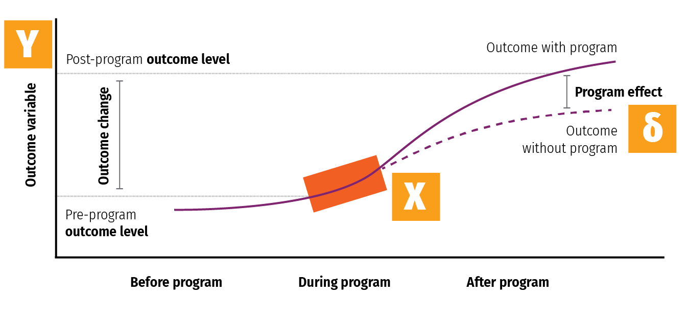

```{r setup, include=FALSE}
knitr::opts_chunk$set(warning = FALSE, message = FALSE, 
                      fig.retina = 3, fig.align = "center")
```

```{r packages-data, include=FALSE}
library(tidyverse)
library(ggdag)
library(broom)
```

```{r xaringanExtra, echo=FALSE}
xaringanExtra::use_xaringan_extra(c("tile_view"))
```

class: center middle main-title section-title-4

# The causal<br>revolution

.class-info[

**Class 1 - Part 2**

.light[EDUC 265: Applied Regression Analysis<br>
UCI School of Education
]

]
---

layout: false
class: bg-full
background-image: url("img/01/flowchart.png")

---

name: outline
class: title title-4

# Plan for today's second half

--

.box-1.medium.sp-after-half[Causal models]

--

.box-3.medium.sp-after-half[Paths, doors, and adjustment]

--

.box-6.medium[Potential outcomes]

---

layout: false
name: causal-models
class: center middle section-title section-title-1 animated fadeIn

# Causal models

---

layout: true
class: title title-1

---

# Types of data

.pull-left[

.box-inv-1.medium[Experimental]

.box-1[You have control over which units get treatment]

]

--

.pull-right[

.box-inv-1.medium[Observational]

.box-1[You don't have control over which units get treatment]

]

--

.box-inv-1.medium.sp-before[Which kind lets you prove causation?]

---

# Causation with observational data

.box-inv-1.medium.sp-after[Can you prove causation<br>with observational data?]

--

.box-inv-1.medium[Why is it so controversial<br>to use observational data?]

---

layout: false
class: bg-full
background-image: url("img/04/too-much-rct.jpg")

---

layout: true
class: title title-1

---

# The causal revolution

.pull-left-narrow[
<figure>
  
</figure>
]

.pull-right-wide.center[
<figure>
  
</figure>
]

---

# Causal diagrams

.box-inv-1.medium[Directed acyclic graphs (DAGs)]

.pull-left[

.box-1.SMALL[**Directed**: Each node has an arrow that points to another node]

.box-1.SMALL[**Acyclic**: You can't cycle back to a node (and arrows only have one direction)]

.box-1.SMALL[**Graph**: It's… um… a graph]

]

.pull-right[

```{r simple-dag, echo=FALSE, fig.width=4.5, fig.height=3, out.width="100%"}
dagify(
  Y ~ X + Z,
  X ~ Z,
  coords = list(x = c(X = 1, Y = 3, Z = 2),
                y = c(X = 1, Y = 1, Z = 2))
) %>% 
  ggplot(aes(x = x, y = y, xend = xend, yend = yend)) +
  geom_dag_edges() +
  geom_dag_point(color = "grey80", size = 14) +
  geom_dag_text(color = "black", size = 5) +
  theme_dag()
```

]

---

# Causal diagrams

.box-inv-1.medium[Directed acyclic graphs (DAGs)]

.pull-left[

.box-1.SMALL[Graphical model of the process that generates the data]

.box-1.SMALL[Maps your philosophical model]

.box-1.SMALL[Fancy math ("*do*-calculus") tells you what to control for to isolate and identify causation]

]

.pull-right[

`)

]

---

# Acyclicalness

.box-inv-1[What if there's something that really is cyclical?]

--

.box-1[Wealth → Power → Wealth]

--

.box-1.sp-after[**This isn't acyclic!**<br>Wealth ↔ Power]

--

.box-inv-1[Split the node into different time periods]

--

.box-1[Wealth<sub>*t* - 1</sub> → Power<sub>*t*</sub> → Wealth<sub>*t*</sub>]

---

# How to draw a DAG

.box-inv-1.medium[What is the causal effect of an<br>additional year of education on earnings?]

--

.box-1[Step 1: List variables]

--

.box-1[Step 2: Simplify]

--

.box-1[Step 3: Connect arrows]

--

.box-1[Step 4: Use logic and math to determine<br>which nodes and arrows to measure]

---

# 1. List variables

.box-1.sp-after[Education (treatment) → Earnings (outcome)]

.center.float-left.sp-after-half[
.box-inv-1[Location]&ensp;.box-inv-1[Ability]&ensp;.box-inv-1[Demographics]
]

.center.float-left.sp-after-half[
.box-inv-1[Socioeonomic status]&ensp;.box-inv-1[Year of birth]
]

.center.float-left[
.box-inv-1[Compulsory schooling laws]&ensp;.box-inv-1[Job connections]
]

---

# 2. Simplify

.box-1.sp-after[Education (treatment) → Earnings (outcome)]

.center.float-left.sp-after-half[
.box-inv-1[Location]&ensp;.box-inv-3[Ability]&ensp;.box-inv-3[Demographics]
]

.center.float-left.sp-after-half[
.box-inv-3[Socioeonomic status]&ensp;.box-inv-1[Year of birth]
]

.center.float-left[
.box-inv-1[Compulsory schooling laws]&ensp;.box-inv-1[Job connections]
]

.box-inv-5[Background]

---

# 3. Draw arrows

.pull-left-narrow[

.box-inv-1[Education causes earnings]

]

.pull-right-wide[

```{r edu-earn-simple, echo=FALSE, fig.width=4.5, fig.height=3, out.width="100%"}
edu_earn_coords <- list(x = c(Edu = 2, Earn = 4, Year = 2, Bkgd = 4, 
                              Loc = 3, JobCx = 3, Req = 1, U1 = 3),
                        y = c(Edu = 2, Earn = 2, Year = 3, Bkgd = 3, 
                              Loc = 3, JobCx = 1, Req = 2, U1 = 4))

dagify(
  Earn ~ Edu,
  exposure = "Edu",
  outcome = "Earn",
  coords = edu_earn_coords) %>% 
  tidy_dagitty() %>% 
  node_status() %>% 
  ggplot(aes(x = x, y = y, xend = xend, yend = yend)) +
  geom_dag_edges() +
  geom_dag_point(aes(color = status), size = 14) +
  geom_dag_text(color = "black", size = 5) +
  scale_color_manual(values = c("#FF4136", "#0074D9"),
                     na.value = "#7FDBFF") +
  guides(color = FALSE) +
  theme_dag()
```

]

---

# 3. Draw arrows

.pull-left-narrow[

.box-inv-1[Background, year of birth, location, and school requirements all cause education]

]

.pull-right-wide[

```{r edu-earn-2, echo=FALSE, fig.width=4.5, fig.height=3, out.width="100%"}
dagify(
  Earn ~ Edu,
  Edu ~ Req + Loc + Bkgd + Year,
  exposure = "Edu",
  outcome = "Earn",
  coords = edu_earn_coords) %>% 
  tidy_dagitty() %>% 
  node_status() %>% 
  ggplot(aes(x = x, y = y, xend = xend, yend = yend)) +
  geom_dag_edges() +
  geom_dag_point(aes(color = status), size = 14) +
  geom_dag_text(color = "black", size = 5) +
  scale_color_manual(values = c("#FF4136", "#0074D9"),
                     na.value = "#7FDBFF") +
  guides(color = FALSE) +
  coord_cartesian(ylim = c(1, 3)) +
  theme_dag()
```

]

---

# 3. Draw arrows

.pull-left-narrow[

.box-inv-1[Background, year of birth, job connections, and location all cause earnings too]

]

.pull-right-wide[

```{r edu-earn-3, echo=FALSE, fig.width=4.5, fig.height=3, out.width="100%"}
dagify(
  Earn ~ Edu + Year + Bkgd + Loc + JobCx,
  Edu ~ Req + Loc + Bkgd + Year,
  exposure = "Edu",
  outcome = "Earn",
  coords = edu_earn_coords) %>% 
  tidy_dagitty() %>% 
  node_status() %>% 
  ggplot(aes(x = x, y = y, xend = xend, yend = yend)) +
  geom_dag_edges() +
  geom_dag_point(aes(color = status), size = 14) +
  geom_dag_text(color = "black", size = 5) +
  scale_color_manual(values = c("#FF4136", "#0074D9"),
                     na.value = "#7FDBFF") +
  guides(color = FALSE) +
  theme_dag()
```

]

---

# 3. Draw arrows

.pull-left-narrow[

.box-inv-1[Education causes job earnings]

]

.pull-right-wide[

```{r edu-earn-4, echo=FALSE, fig.width=4.5, fig.height=3, out.width="100%"}
dagify(
  Earn ~ Edu + Year + Bkgd + Loc + JobCx,
  Edu ~ Req + Loc + Bkgd + Year,
  JobCx ~ Edu,
  exposure = "Edu",
  outcome = "Earn",
  coords = edu_earn_coords) %>% 
  tidy_dagitty() %>% 
  node_status() %>% 
  ggplot(aes(x = x, y = y, xend = xend, yend = yend)) +
  geom_dag_edges() +
  geom_dag_point(aes(color = status), size = 14) +
  geom_dag_text(color = "black", size = 5) +
  scale_color_manual(values = c("#FF4136", "#0074D9"),
                     na.value = "#7FDBFF") +
  guides(color = FALSE) +
  theme_dag()
```

]

---

# 3. Draw arrows

.pull-left-narrow[

.box-inv-1[Location and background are probably related, but neither causes the other. Something unobservable (U1) does that.]

]

.pull-right-wide[

```{r edu-earn-full, echo=FALSE, fig.width=4.5, fig.height=3, out.width="100%"}
dagify(
  Earn ~ Edu + Year + Bkgd + Loc + JobCx,
  Edu ~ Req + Loc + Bkgd + Year,
  JobCx ~ Edu,
  Bkgd ~ U1,
  Loc ~ U1,
  exposure = "Edu",
  outcome = "Earn",
  latent = "U1",
  labels = c("Earn" = "Earnings", "Edu" = "Education",
             "Year" = "Year", "Bkgd" = "Background",
             "Loc" = "Location", "JobCx" = "Job connections",
             "U1" = "Unobserved stuff"),
  coords = edu_earn_coords) %>% 
  tidy_dagitty() %>% 
  node_status() %>% 
  ggplot(aes(x = x, y = y, xend = xend, yend = yend)) +
  geom_dag_edges() +
  geom_dag_point(aes(color = status), size = 14) +
  geom_dag_text(color = "black", size = 5) +
  scale_color_manual(values = c("#FF4136", "grey60", "#0074D9"),
                     na.value = "#7FDBFF") +
  guides(color = FALSE) +
  theme_dag()
```

]

---

layout: false
name: paths-doors-adjustment
class: center middle section-title section-title-3 animated fadeIn

# Paths, doors,<br>and adjustment

---

layout: true
class: title title-3

---

# Causal identification

.pull-left-narrow[

.box-inv-3[All these nodes are related; there's correlation between them all]

.box-inv-3[We care about Edu → Earn, but what do we do about all the other nodes?]

]

.pull-right-wide[

`)

]

---

# Causal identification

.box-inv-3.medium[A causal effect is *identified* if the association between treatment and outcome is properly stripped and isolated]

---

# Paths and associations

.box-inv-3.medium[Arrows in a DAG transmit associations]

.box-inv-3.medium[You can redirect and control those paths by "adjusting" or "conditioning"]

---

# Three types of associations

.pull-left-3[
.box-3.medium[Confounding]

```{r confounding-dag, echo=FALSE, fig.width=4.5, fig.height=3.35, out.width="100%"}
dagify(
  Y ~ X + Z,
  X ~ Z,
  coords = list(x = c(X = 1, Y = 3, Z = 2),
                y = c(X = 1, Y = 1, Z = 2))
) %>% 
  ggplot(aes(x = x, y = y, xend = xend, yend = yend)) +
  geom_dag_edges() +
  geom_dag_point(color = "grey80", size = 17) +
  geom_dag_text(color = "black", size = 5) +
  theme_dag()
```

.box-inv-3.small[Common cause]
]

.pull-middle-3.center[
.box-3.medium[Causation]

```{r mediation-dag, echo=FALSE, fig.width=4.5, fig.height=3.35, out.width="100%"}
dagify(
  Y ~ X + Z,
  Z ~ X,
  coords = list(x = c(X = 1, Y = 3, Z = 2),
                y = c(X = 1, Y = 1, Z = 2))
) %>% 
  ggplot(aes(x = x, y = y, xend = xend, yend = yend)) +
  geom_dag_edges() +
  geom_dag_point(color = "grey80", size = 17) +
  geom_dag_text(color = "black", size = 5) +
  theme_dag()
```

.box-inv-3.small[Mediation]
]

.pull-right-3[
.box-3.medium[Collision]

```{r collision-dag, echo=FALSE, fig.width=4.5, fig.height=3.35, out.width="100%"}
dagify(
  Y ~ X,
  Z ~ Y,
  Z ~ X,
  coords = list(x = c(X = 1, Y = 3, Z = 2),
                y = c(X = 1, Y = 1, Z = 2))
) %>% 
  ggplot(aes(x = x, y = y, xend = xend, yend = yend)) +
  geom_dag_edges() +
  geom_dag_point(color = "grey80", size = 17) +
  geom_dag_text(color = "black", size = 5) +
  theme_dag()
```

.box-inv-3.small[Selection /<br>endogeneity]
]

---

# Confounding

.pull-left-wide[
```{r confounding-dag-big, echo=FALSE, fig.width=4.5, fig.height=3, out.width="100%"}
dagify(
  Y ~ X + Z,
  X ~ Z,
  coords = list(x = c(X = 1, Y = 3, Z = 2),
                y = c(X = 1, Y = 1, Z = 2))
) %>% 
  ggplot(aes(x = x, y = y, xend = xend, yend = yend)) +
  geom_dag_edges() +
  geom_dag_point(color = "grey80", size = 15) +
  geom_dag_text(color = "black", size = 5) +
  theme_dag()
```
]

.pull-right-narrow[
.box-inv-3.medium[**X** causes **Y**]

.box-inv-3.medium[But **Z** causes both **X** and **Y**]

.box-inv-3.medium[**Z** * confounds* the **X** → **Y** association]
]

---

# Paths

.pull-left-wide[
`)
]

.pull-right-narrow[
.box-inv-3[Paths between<br>**X** and **Y**?]

.box-3[**X** → **Y**]

.box-3[**X** ← **Z** → **Y**]

.box-inv-3.medium[**Z** is a *backdoor*]
]

---

# *d*-connection

.pull-left-wide[
`)
]

.pull-right-narrow[
.box-inv-3[**X** and **Y** are<br>"*d*-connected" because associations can pass through **Z**]

.box-3[The relationship between **X** and **Y** is not identified / isolated]
]

---

# Effect of tutoring on student learning

.box-inv-3.medium[What are the paths<br>between **tutoring** and **student learning**?]

.pull-left[
```{r money-elections, echo=FALSE, fig.width=5, fig.height=3, out.width="100%"}
dagify(
  Y ~ X + Z,
  X ~ Z,
  coords = list(x = c(X = 1, Y = 3, Z = 2),
                y = c(X = 1, Y = 1, Z = 2)),
  exposure = "X",
  outcome = "Y",
  labels = c("X" = "Tutoring", "Y" = "Student learning",
             "Z" = "Wealth")
) %>% 
  tidy_dagitty() %>% 
  node_status() %>% 
  ggplot(aes(x = x, y = y, xend = xend, yend = yend)) +
  geom_dag_edges() +
  geom_dag_point(aes(color = status), size = 15) +
  geom_dag_text(color = "white", size = 5) +
  geom_dag_label_repel(aes(label = label), nudge_y = c(0.25, -0.25, 0.25)) +
  scale_color_manual(values = c("#FF4136", "#0074D9"),
                     na.value = "#7FDBFF") +
  guides(color = FALSE) +
  theme_dag()
```
]

--

.pull-right[
.box-3[Tutoring → Learning]

.box-3[Tutoring ← Wealth → Learning]

.box-inv-3[Wealth is a *backdoor*]
]

---

# Closing doors

.pull-left[
```{r confounding-dag-adjusted, echo=FALSE, fig.width=4.5, fig.height=3, out.width="100%"}
dagify(
  Y ~ X + Z,
  X ~ Z,
  coords = list(x = c(X = 1, Y = 3, Z = 2),
                y = c(X = 1, Y = 1, Z = 2))
) %>% 
  tidy_dagitty() %>% 
  adjust_for("Z") %>% 
  ggplot(aes(x = x, y = y, xend = xend, yend = yend)) +
  geom_dag_edges() +
  geom_dag_point(aes(shape = adjusted, color = adjusted), size = 15) +
  geom_dag_text(color = "black", size = 5) +
  scale_shape_manual(values = c(15, 19)) +
  scale_color_manual(values = c("#FFDC00", "grey80")) +
  guides(shape = FALSE, color = FALSE) +
  theme_dag()
```
]

.pull-right[
.box-inv-3.medium[Close the backdoor by adjusting for **Z**]
]

---

# Closing doors

.pull-left[
.box-inv-3.small[Find the part of tutoring that is explained by wealth, remove it.<br>This is the residual part of tutoring.]

.box-inv-3.small[Find the part of student learning that is explained by wealth, remove it.<br>This is the residual part of learning.]

.box-inv-3.small[Find the relationship between the residual part of tutoring and residual part of learning.<br>**This is the causal effect**.]
]

.pull-right[
```{r money-elections-adjusted, echo=FALSE, fig.width=5, fig.height=3.3, out.width="100%"}
dagify(
  Y ~ X + Z,
  X ~ Z,
  coords = list(x = c(X = 1, Y = 3, Z = 2),
                y = c(X = 1, Y = 1, Z = 2)),
  exposure = "X",
  outcome = "Y",
  labels = c("X" = "Tutoring", "Y" = "Student learning",
             "Z" = "Wealth")
) %>% 
  tidy_dagitty() %>% 
  node_status() %>% 
  adjust_for("Z") %>% 
  ggplot(aes(x = x, y = y, xend = xend, yend = yend)) +
  geom_dag_edges() +
  geom_dag_point(aes(color = status, shape = adjusted), size = 15) +
  geom_dag_text(color = "white", size = 5) +
  geom_dag_label_repel(aes(label = label), nudge_y = c(0.25, -0.25, 0.25)) +
  scale_color_manual(values = c("#FF4136", "#0074D9"),
                     na.value = "#FFDC00") +
  scale_shape_manual(values = c(15, 19)) +
  guides(color = FALSE, shape = FALSE) +
  theme_dag()
```
]

---

# Closing doors

.pull-left[
.box-inv-3[Compare students as if they had the same wealth]

.box-inv-3[Remove differences that are predicted by wealth]

.box-inv-3[Hold wealth constant]
]

.pull-right[
`)
]

---

# How to adjust

.box-inv-3.medium[Include term in regression]

$$
\begin{aligned}
\text{Student learning} =& \beta_0 + \beta_1 \text{Tutoring} +\\
& \beta_2 \text{Wealth} + \varepsilon
\end{aligned}
$$

.center.float-left[
.box-inv-3.medium[Matching]&ensp;.box-inv-3.medium[Stratifying]

.box-inv-3.medium.sp-before-half[Inverse probability weighting]
]

---

# *d*-separation

.pull-left[
`)
]

.pull-right[
.box-inv-3.medium[If we control for **Z**,<br>**X** and **Y** are now<br>"*d*-separated" and the association is isolated!]

]

---

# Closing backdoors

.pull-left-narrow[
.box-inv-3[Block all backdoor paths to identify the main pathway you care about]
]

.pull-right-wide[
`)
]

---

# All paths

.pull-left.left[
.box-3.smaller[Education → Earnings]

.box-3.smaller[Education → Job connections → Earnings]

.box-7.smaller[Education ← Background → Earnings]

.box-7.smaller[Education ← Background ← U1 → Location → Earnings]

.box-7.smaller[Education ← Location → Earnings]

.box-7.smaller[Education ← Location ← U1 → Background → Earnings]

.box-7.smaller[Education ← Year → Earnings]
]

.pull-right[
`)
]

---

# All paths

.pull-left-narrow[
.box-inv-3[Adjust for **Location**, **Background** and **Year** to isolate the **Education → Earnings** causal effect]
]

.pull-right-wide[
```{r edu-earn-adjust, echo=FALSE, fig.width=4.5, fig.height=3, out.width="100%"}
dagify(
  Earn ~ Edu + Year + Bkgd + Loc + JobCx,
  Edu ~ Req + Loc + Bkgd + Year,
  JobCx ~ Edu,
  Bkgd ~ U1,
  Loc ~ U1,
  exposure = "Edu",
  outcome = "Earn",
  latent = "U1",
  labels = c("Earn" = "Earnings", "Edu" = "Education",
             "Year" = "Year", "Bkgd" = "Background",
             "Loc" = "Location", "JobCx" = "Job connections",
             "U1" = "Unobserved stuff"),
  coords = edu_earn_coords) %>% 
  tidy_dagitty() %>% 
  node_status() %>% 
  adjust_for(c("Loc", "Bkgd", "Year")) %>% 
  ggplot(aes(x = x, y = y, xend = xend, yend = yend)) +
  geom_dag_edges() +
  geom_dag_point(aes(color = status, shape = adjusted), size = 14) +
  geom_dag_text(color = "black", size = 5) +
  scale_color_manual(values = c("#FF4136", "grey60", "#0074D9"),
                     na.value = "#7FDBFF") +
  scale_shape_manual(values = c(15, 19)) +
  guides(color = FALSE, shape = FALSE) +
  theme_dag()
```
]

---

# Causation

.pull-left-wide[
```{r causation-dag-big, echo=FALSE, fig.width=4.5, fig.height=3, out.width="100%"}
dagify(
  Y ~ X + Z,
  Z ~ X,
  coords = list(x = c(X = 1, Y = 3, Z = 2),
                y = c(X = 1, Y = 1, Z = 2))
) %>% 
  ggplot(aes(x = x, y = y, xend = xend, yend = yend)) +
  geom_dag_edges() +
  geom_dag_point(color = "grey80", size = 15) +
  geom_dag_text(color = "black", size = 5) +
  theme_dag()
```
]

.pull-right-narrow[
.box-inv-3.medium[**X** causes **Y**]

.box-inv-3.medium[**X** causes<br>**Z** which causes **Y**]

.box-3.medium[Should you control for **Z**?]
]

---

# Causation

.pull-left-wide[
`)
]

.pull-right-narrow[
.box-3.medium[Should you control for **Z**?]

.box-inv-3.medium[No!]

.box-inv-3[Overcontrolling]
]

---

# Causation and overcontrolling

.pull-left-wide[
`)
]

.pull-right-narrow[
.box-inv-3[Should you control for job connections?]
]

---

# Colliders

.pull-left-wide[
```{r collider-dag-big, echo=FALSE, fig.width=4.5, fig.height=3, out.width="100%"}
dagify(
  Y ~ X,
  Z ~ Y,
  Z ~ X,
  coords = list(x = c(X = 1, Y = 3, Z = 2),
                y = c(X = 1, Y = 1, Z = 2))
) %>% 
  ggplot(aes(x = x, y = y, xend = xend, yend = yend)) +
  geom_dag_edges() +
  geom_dag_point(color = "grey80", size = 15) +
  geom_dag_text(color = "black", size = 5) +
  theme_dag()
```
]

.pull-right-narrow[
.box-inv-3.medium[**X** causes **Z**]

.box-inv-3.medium[**Y** causes **Z**]

.box-3.medium[Should you control for **Z**?]
]

---

# Programming and social skills

.box-inv-3.medium[Do programming skills reduce social skills?]

.pull-left[
```{r programming-social-skills, echo=FALSE, fig.width=5, fig.height=3, out.width="100%"}
dagify(
  Y ~ X,
  Z ~ Y,
  Z ~ X,
  coords = list(x = c(X = 1, Y = 3, Z = 2),
                y = c(X = 1, Y = 1, Z = 2)),
  exposure = "X",
  outcome = "Y",
  labels = c("X" = "Programming skills", "Y" = "Social skills",
             "Z" = "Hired by a tech company")
) %>% 
  tidy_dagitty() %>% 
  node_status() %>% 
  ggplot(aes(x = x, y = y, xend = xend, yend = yend)) +
  geom_dag_edges() +
  geom_dag_point(aes(color = status), size = 15) +
  geom_dag_text(color = "white", size = 5) +
  geom_dag_label_repel(aes(label = label), nudge_y = c(0.25, 0.25, -0.25)) +
  scale_color_manual(values = c("#FF4136", "#0074D9"),
                     na.value = "#7FDBFF") +
  guides(color = FALSE) +
  theme_dag()
```
]

--

.pull-right[
.box-3[You go to a tech company and conduct a survey. You find a negative relationship!<br>Is it real?]
]

---

# Programming and social skills

.box-inv-3.medium[Do programming skills reduce social skills?]

.pull-left[
`)
]

.pull-right[
.box-3[No! **Hired by a tech company** is a collider and we controlled for it.]

.box-3[This inadvertently connected the two.]
]

---

layout: false

.pull-left[
.box-3.medium[Colliders can create<br>fake causal effects]
]

.pull-right[
.box-3.medium[Colliders can hide<br>real causal effects]
]

```{r bulls-scores, echo=FALSE, fig.width=6, fig.height=3.3, out.width="50%"}
basketball <- read.csv(text = 'PointsPerGame,HeightInches
                          20.8,75
                          17.6,81
                          12.7,78
                          10.9,76
                          10.7,83
                          10.1,75
                          9,81
                          8.8,82
                          8.8,84
                          8.7,81
                          5.5,75
                          5.5,73
                          3.9,81
                          2.3,84
                          2.1,81
                          1.8,77
                          1,74
                          0.5,80')

ggplot(basketball, aes(x = HeightInches, y = PointsPerGame)) +
  geom_point() +
  geom_smooth() +
  labs(x = "Height in Inches",
       y = "Points Per Game",
       title = "Chicago Bulls 2009-10")
# Data from Scott Andrews at StatCrunch
```

.center[
.box-inv-3[Height is unrelated to basketball skill… among NBA players]
]

---

layout: true
class: title title-3

---

# Colliders and selection bias

```{r nba-dag, echo=FALSE, fig.width=5, fig.height=3, out.width="65%"}
dagify(
  Y ~ X,
  Z ~ Y,
  Z ~ X,
  coords = list(x = c(X = 1, Y = 3, Z = 2),
                y = c(X = 1, Y = 1, Z = 2)),
  exposure = "X",
  outcome = "Y",
  labels = c("X" = "Height", "Y" = "Points scored",
             "Z" = "Being in the NBA")
) %>% 
  tidy_dagitty() %>% 
  node_status() %>% 
  ggplot(aes(x = x, y = y, xend = xend, yend = yend)) +
  geom_dag_edges() +
  geom_dag_point(aes(color = status), size = 15) +
  geom_dag_text(color = "white", size = 5) +
  geom_dag_label_repel(aes(label = label), nudge_y = c(0.25, 0.25, -0.25)) +
  scale_color_manual(values = c("#FF4136", "#0074D9"),
                     na.value = "#7FDBFF") +
  guides(color = FALSE) +
  theme_dag()
```

---

# Three types of associations

.pull-left-3[
.box-3.medium[Confounding]

`)

.box-inv-3.small[Common cause]
]

.pull-middle-3[
.box-3.medium[Causation]

`)

.box-inv-3.small[Mediation]
]

.pull-right-3[
.box-3.medium[Collision]

`)

.box-inv-3.small[Selection /<br>endogeneity]
]


---

layout: true
class: title title-3

---

# Causal identification

.pull-left-narrow[

.box-inv-3[All these nodes are related; there's correlation between them all]

.box-inv-3[We care about<br>**Edu → Earn**, but what do we do about all the other nodes?]

]

.pull-right-wide[

```{r edu-earn-full2, echo=FALSE, fig.width=4.5, fig.height=3, out.width="100%"}
dagify(
  Earn ~ Edu + Year + Bkgd + Loc + JobCx,
  Edu ~ Req + Loc + Bkgd + Year,
  JobCx ~ Edu,
  Bkgd ~ U1,
  Loc ~ U1,
  exposure = "Edu",
  outcome = "Earn",
  latent = "U1",
  labels = c("Earn" = "Earnings", "Edu" = "Education",
             "Year" = "Year", "Bkgd" = "Background",
             "Loc" = "Location", "JobCx" = "Job connections",
             "U1" = "Unobserved stuff"),
  coords = edu_earn_coords) %>% 
  tidy_dagitty() %>% 
  node_status() %>% 
  ggplot(aes(x = x, y = y, xend = xend, yend = yend)) +
  geom_dag_edges() +
  geom_dag_point(aes(color = status), size = 14) +
  geom_dag_text(color = "black", size = 5) +
  scale_color_manual(values = c("#FF4136", "grey60", "#0074D9"),
                     na.value = "#7FDBFF") +
  guides(color = FALSE) +
  theme_dag()
```

]

---

# Causal identification

.box-inv-3.medium[A causal effect is *identified* if the association between treatment and outcome is propertly stripped and isolated]

---

# Paths and associations

.box-inv-3.medium[Arrows in a DAG transmit associations]

.box-inv-3.medium[You can redirect and control those paths by "adjusting" or "conditioning"]

---

# Three types of associations

.pull-left-3[
.box-3.medium[Confounding]

```{r confounding-dag2, echo=FALSE, fig.width=4.5, fig.height=3.35, out.width="100%"}
dagify(
  Y ~ X + Z,
  X ~ Z,
  coords = list(x = c(X = 1, Y = 3, Z = 2),
                y = c(X = 1, Y = 1, Z = 2))
) %>% 
  ggplot(aes(x = x, y = y, xend = xend, yend = yend)) +
  geom_dag_edges() +
  geom_dag_point(color = "black", size = 17) +
  geom_dag_text(color = "white", size = 5) +
  theme_dag()
```

.box-inv-3.small[Common cause]
]

.pull-middle-3.center[
.box-3.medium[Causation]

```{r mediation-dag2, echo=FALSE, fig.width=4.5, fig.height=3.35, out.width="100%"}
dagify(
  Y ~ X + Z,
  Z ~ X,
  coords = list(x = c(X = 1, Y = 3, Z = 2),
                y = c(X = 1, Y = 1, Z = 2))
) %>% 
  ggplot(aes(x = x, y = y, xend = xend, yend = yend)) +
  geom_dag_edges() +
  geom_dag_point(color = "black", size = 17) +
  geom_dag_text(color = "white", size = 5) +
  theme_dag()
```

.box-inv-3.small[Mediation]
]

.pull-right-3[
.box-3.medium[Collision]

```{r collision-dag2, echo=FALSE, fig.width=4.5, fig.height=3.35, out.width="100%"}
dagify(
  Y ~ X,
  Z ~ Y,
  Z ~ X,
  coords = list(x = c(X = 1, Y = 3, Z = 2),
                y = c(X = 1, Y = 1, Z = 2))
) %>% 
  ggplot(aes(x = x, y = y, xend = xend, yend = yend)) +
  geom_dag_edges() +
  geom_dag_point(color = "black", size = 17) +
  geom_dag_text(color = "white", size = 5) +
  theme_dag()
```

.box-inv-3.small[Selection /<br>endogeneity]
]

---

# Interventions

.box-inv-3.medium[*do*-operator]

.box-3[Making an intervention in a DAG]

$$
P[Y\ |\ do(X = x)] \quad \text{or} \quad E[Y\ |\ do(X = x)]
$$

--

.box-3[P = probability distribution, or E = expectation/expected value]

--

.box-3[Y = outcome, X = treatment;<br>x = specific value of treatment]

---

# Interventions

$$
E[Y\ |\ do(X = x)]
$$

.box-3[E\[ Earnings | *do*(One year of college)\] ]

--

.box-3[E\[ Test scores | *do*(Blended instruction)\] ]

--

.box-3[E\[ Math learning | *do*(Interleaved practice)\] ]

--

.box-3[E\[ Well-being | *do*(Scholarship program)\] ]

--

.box-3[E\[ Interest in health and fitness | *do*(Going to UCI)\] ]

---

# Interventions

.box-inv-3[When you *do*() X, delete all arrows into it]

--

.pull-left[
.box-3.small[Observational DAG]
```{r observational-dag, echo=FALSE, fig.width=4, fig.height=3, out.width="90%"}
dagify(
  Y ~ X + A,
  X ~ A,
  coords = list(x = c(X = 1, Y = 2, A = 1.5),
                y = c(X = 1, Y = 1, A = 2))
) %>% 
  ggplot(aes(x = x, y = y, xend = xend, yend = yend)) +
  geom_dag_edges() +
  geom_dag_point(color = "black", size = 11) +
  geom_dag_text() +
  theme_dag()
```
]

--

.pull-right[
.box-3.small[Experimental DAG]
```{r experimental-dag, echo=FALSE, fig.width=4, fig.height=3, out.width="90%"}
dagify(
  Y ~ X + A,
  coords = list(x = c(X = 1, Y = 2, A = 1.5),
                y = c(X = 1, Y = 1, A = 2)),
  labels = c(X = "X = x")
) %>% 
  ggplot(aes(x = x, y = y, xend = xend, yend = yend)) +
  geom_dag_edges() +
  geom_dag_point(color = "black", size = 11) +
  geom_dag_text() +
  geom_dag_text_repel(aes(label = label),
                      nudge_x = 0, nudge_y = 0.25,
                      color = "black", 
                      fontface = "bold", lineheight = 0.95, seed = 1234) +
  theme_dag()
```
]

---

# Interventions

$$
E[\text{Earnings}\ |\ do(\text{College education})]
$$

--

.pull-left[
.box-3.small[Observational DAG]

```{r edu-earn-obs, echo=FALSE, fig.width=6, fig.height=4.5, out.width="90%"}
dagify(
  Earn ~ Edu + Year + Bkgd + Loc + JobCx,
  Edu ~ Req + Loc + Bkgd + Year,
  JobCx ~ Edu,
  Bkgd ~ U1,
  Loc ~ U1,
  exposure = "Edu",
  outcome = "Earn",
  latent = "U1",
  labels = c("Earn" = "Earnings", "Edu" = "Education",
             "Year" = "Year", "Bkgd" = "Background",
             "Loc" = "Location", "JobCx" = "Job connections",
             "U1" = "Unobserved stuff"),
  coords = edu_earn_coords) %>% 
  tidy_dagitty() %>% 
  node_status() %>% 
  ggplot(aes(x = x, y = y, xend = xend, yend = yend)) +
  geom_dag_edges() +
  geom_dag_point(aes(color = status), size = 14) +
  geom_dag_text(color = "black", size = 5) +
  scale_color_manual(values = c("#FF4136", "grey60", "#0074D9"),
                     na.value = "#7FDBFF") +
  guides(color = FALSE) +
  theme_dag()
```

]

--

.pull-right[
.box-3.small[Experimental DAG]

```{r edu-earn-experiment, warning=FALSE, echo=FALSE, fig.width=6, fig.height=4.5, out.width="90%"}
dagify(
  Earn ~ Edu + Year + Bkgd + Loc + JobCx,
  NULL ~ Req,
  JobCx ~ Edu,
  Bkgd ~ U1,
  Loc ~ U1,
  exposure = "Edu",
  outcome = "Earn",
  latent = "U1",
  labels = c("Earn" = "Earnings", "Edu" = "Education",
             "Year" = "Year", "Bkgd" = "Background",
             "Loc" = "Location", "JobCx" = "Job connections",
             "U1" = "Unobserved stuff"),
  coords = edu_earn_coords) %>% 
  tidy_dagitty() %>% 
  node_status() %>% 
  ggplot(aes(x = x, y = y, xend = xend, yend = yend)) +
  geom_dag_edges() +
  geom_dag_point(aes(color = status), size = 14) +
  geom_dag_text(color = "black", size = 5) +
  scale_color_manual(values = c("#FF4136", "grey60", "#0074D9"),
                     na.value = "#7FDBFF") +
  guides(color = FALSE) +
  theme_dag()
```
]

---

# Un*do*()ing things

.box-inv-3.medium[We want to know **P[Y | *do*(X)]**<br>but all we have is<br>observational data X, Y, and Z]

--

$$
P[Y\ |\ do(X)] \neq P(Y\ |\ X)
$$

--

.box-3[Correlation isn't causation!]

---

# Un*do*()ing things

.box-inv-3.medium[Our goal with observational data:<br>Rewrite **P[Y | *do*(X)]** so that it doesn't have a *do*() anymore (is "*do*-free")]

---

# Special cases of *do*-calculus

.box-inv-3.medium.sp-after[Backdoor adjustment]

.box-inv-3.medium[Frontdoor adjustment]

---

# Backdoor adjustment

$$
P[Y\ |\ do(X)] = \sum_Z P(Y\ |\ X, Z) \times P(Z)
$$

.pull-left[
```{r backdoor-dag, echo=FALSE, fig.width=5, fig.height=3.4, out.width="90%"}
dagify(Y ~ X + Z,
  X ~ Z,
  coords = list(x = c(X = 1, Y = 3, Z = 2),
                y = c(X = 1, Y = 1, Z = 2))) %>% 
  tidy_dagitty() %>% 
  ggplot(aes(x = x, y = y, xend = xend, yend = yend)) +
  geom_dag_edges() +
  geom_dag_point() +
  geom_dag_text() +
  theme_dag()
```
]

.pull-right[
.box-inv-3.small[↑ That's complicated!]

.box-inv-3[The right-hand side of the equation means "the effect of X on Y after adjusting for Z"]

.box-3[There's no *do*() on that side!]
]

---

# Frontdoor adjustment

```{r frontdoor, echo=FALSE, fig.width=5, fig.height=3.4, out.width="50%"}
dagify(C ~ T + G,
       T ~ S,
       S ~ G,
       coords = list(
         x = c(S = 1, T = 2, C = 3, G = 2),
         y = c(S = 1, T = 1, C = 1, G = 2)
       ),
       labels = c(S = "Smoking", 
                  T = "Tar", 
                  C = "Cancer",
                  G = "Genetics"),
       exposure = "S",
       outcome = "C") %>% 
  tidy_dagitty() %>% 
  ggplot(aes(x = x, y = y, xend = xend, yend = yend)) +
  geom_dag_edges() +
  geom_dag_point() +
  geom_dag_text() +
  geom_dag_label_repel(aes(label = label), nudge_y = 0.1, seed = 1234) +
  theme_dag()
```


.box-3.small[**S → T** is *d*-separated; **T → C** is *d*-separated<br>combine the effects to find **S → C**]

---

# Moral of the story

.box-inv-3.medium[If you can transform *do*() expressions to<br>*do*-free versions, you can legally make causal inferences from observational data]

---

layout: false
name: potential-outcomes
class: center middle section-title section-title-6 animated fadeIn

# Potential outcomes

---

layout: true
class: title title-6

---

# Program effect

<figure>
  
</figure>

---

# Some equation translations

.box-inv-6.medium[Causal effect = δ (delta)]

$$
\delta = P[Y\ |\ do(X)]
$$

--

$$
\delta = E[Y\ |\ do(X)] - E[Y\ |\ \hat{do}(X)]
$$

--

$$
\delta = (Y\ |\ X = 1) - (Y\ |\ X = 0)
$$

--

$$
\delta = Y_1 - Y_0
$$


---


layout: true
class: title title-6

---

layout: false

.box-6.large[Fundamental problem<br>of causal inference]

$$
\delta_i = Y_i^1 - Y_i^0 \quad \text{in real life is} \quad \delta_i = Y_i^1 - ???
$$

.box-inv-6[Individual-level effects are impossible to observe!]

.box-inv-6[There are no individual counterfactuals!]

---

layout: false
class: bg-full
background-image: url("img/05/spiderman.jpg")

---

layout: false
class: bg-full
background-image: url("img/05/multiverse.jpg")

---


layout: true
class: title title-6

---

# Average treatment effect (ATE)

.box-inv-6.medium[Solution: Use averages instead]

$$
\text{ATE} = E(Y_1 - Y_0) = E(Y_1) - E(Y_0)
$$

--

.box-6[Difference between average/expected value when<br>program is on vs. expected value when program is off]

$$
\delta = (\bar{Y}\ |\ P = 1) - (\bar{Y}\ |\ P = 0)
$$

---

layout: false

```{r po-table, echo=FALSE}
po <- tibble(
  Person = 1:8,
  Age = c("Old", "Old", "Old", "Old", "Young", "Young", "Young", "Young"),
  Treated = c(TRUE, TRUE, TRUE, FALSE, TRUE, FALSE, FALSE, FALSE),
  Y1 = c(80, 75, 85, 70, 75, 80, 90, 85),
  Y0 = c(60, 70, 80, 60, 70, 80, 100, 80)
) %>% 
  mutate(delta = Y1 - Y0) %>% 
  mutate(actual = ifelse(Treated, Y1, Y0)) %>% 
  mutate(`Outcome<br>with program` = ifelse(Treated, paste0("**", Y1, "**"), Y1),
         `Outcome<br>without program` = ifelse(!Treated, paste0("**", Y0, "**"), Y0),
         Effect = paste0("**", delta, "**"))
```

.small[
```{r basic-po, echo=FALSE}
po %>% 
  select(Person, Age, Treated, starts_with("Outcome"), Effect) %>% 
  knitr::kable(align = "cccccc")
```
]

---

.smaller.sp-after[
```{r basic-po1, echo=FALSE}
po %>% 
  select(Person, Age, Treated, starts_with("Outcome"), Effect) %>% 
  knitr::kable(align = "cccccc")
```
]

.pull-left.small[
$\delta = (\bar{Y}\ |\ P = 1) - (\bar{Y}\ |\ P = 0)$
]

.pull-right.small[
$\text{ATE} = \frac{20 + 5 + 5 + 5 + 10 + 0 + -10 + 5}{8} = 5$
]

---

class: title title-6

# CATE

.box-inv-6.sp-after[ATE in subgroups]

--

.box-6.medium[Is the program more<br>effective for specific age groups?]

---

.smaller.sp-after[
```{r basic-po-cate, echo=FALSE}
po %>% 
  select(Person, Age, Treated, starts_with("Outcome"), Effect) %>% 
  knitr::kable(align = "cccccc")
```
]

.pull-left.small[
$\delta = (\bar{Y}_\text{O}\ |\ P = 1) - (\bar{Y}_\text{O}\ |\ P = 0)$

$\delta = (\bar{Y}_\text{Y}\ |\ P = 1) - (\bar{Y}_\text{Y}\ |\ P = 0)$
]

.pull-right.small[
$\text{CATE}_\text{Old} = \frac{20 + 5 + 5 + 10}{4} = 10$

$\text{CATE}_\text{Young} = \frac{5 + 0 - 10 + 5}{4} = 0$
]

---

class: title title-6

# ATT and ATU

.box-inv-6.medium[Average treatment on the treated]

.box-6[ATT / TOT]

.box-6[Effect for those with treatment]

--

.box-inv-6.medium[Average treatment on the untreated]

.box-6[ATU / TUT]

.box-6[Effect for those without treatment]

---

.smaller.sp-after[
```{r basic-po-att, echo=FALSE}
po %>% 
  select(Person, Age, Treated, starts_with("Outcome"), Effect) %>% 
  knitr::kable(align = "cccccc")
```
]

.pull-left.small[
$\delta = (\bar{Y}_\text{T}\ |\ P = 1) - (\bar{Y}_\text{T}\ |\ P = 0)$

$\delta = (\bar{Y}_\text{U}\ |\ P = 1) - (\bar{Y}_\text{U}\ |\ P = 0)$
]

.pull-right.small[
$\text{CATE}_\text{Treated} = \frac{20 + 5 + 5 + 5}{4} = 8.75$

$\text{CATE}_\text{Untreated} = \frac{10 + 0 - 10 + 5}{4} = 1.25$
]

---

layout: true
class: title title-6

---

# ATE, ATT, and ATU

.box-inv-6.medium.sp-after[The ATE is the weighted average<br>of the ATT and ATU]

--

.center[
$\text{ATE} = (\pi_\text{Treated} \times \text{ATT}) + (\pi_\text{Untreated} \times \text{ATU})$

$(\frac{4}{8} \times 8.75) + (\frac{4}{8} \times 1.25)$

$4.375 + 0.625 = 5$
]

.box-6.smaller[**π** here means "proportion," not 3.1415]

---

# Selection bias

.box-inv-6.medium[ATE and ATT aren't always the same]

.box-inv-6.medium[ATE = ATT + Selection bias]

$$
\begin{aligned}
5 &= 8.75 + x \\
x &= -3.75
\end{aligned}
$$

.box-6[Randomization fixes this, makes x = 0]

---

# Actual data

.pull-left.smaller[
```{r po-actual, echo=FALSE}
po %>% 
  select(Person, Age, Treated, `Actual outcome` = actual) %>% 
  knitr::kable(align = "cccc")
```
]

.pull-right[
.box-inv-6[Treatment not<br>randomly assigned]

.box-inv-6[We can't see<br>unit-level causal effects]

.box-6[What do we do?!]
]

---

name: outline
class: title title-8

# Plan for next class

--

.box-8.medium[**Practice assignment**]

.box-inv-8.small[Attend the lab today, assignment due Tuesday night]

--

.box-8.medium[**Reading reactions**]

.box-inv-8.small.sp-after[Engage on Perusall, due Wednesday night]

--

.box-8.medium[**Start work on Milestone 1**]

.box-inv-8.small.sp-after[Due Feb 04]
