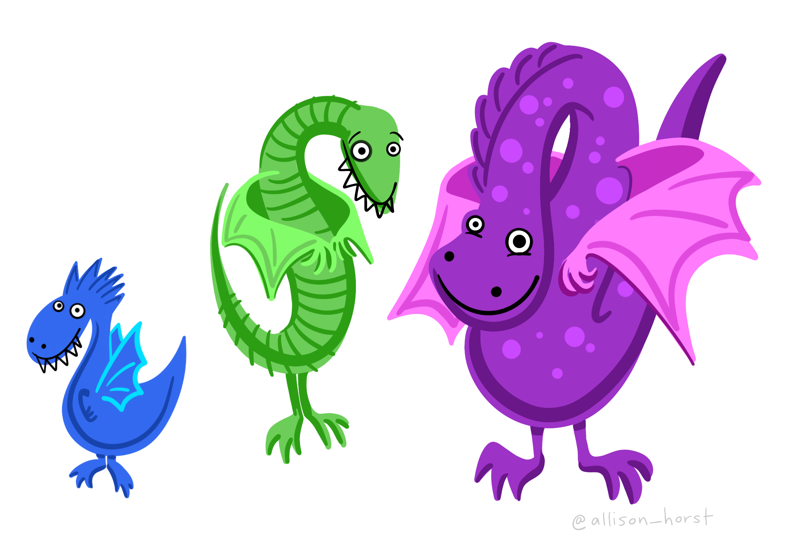
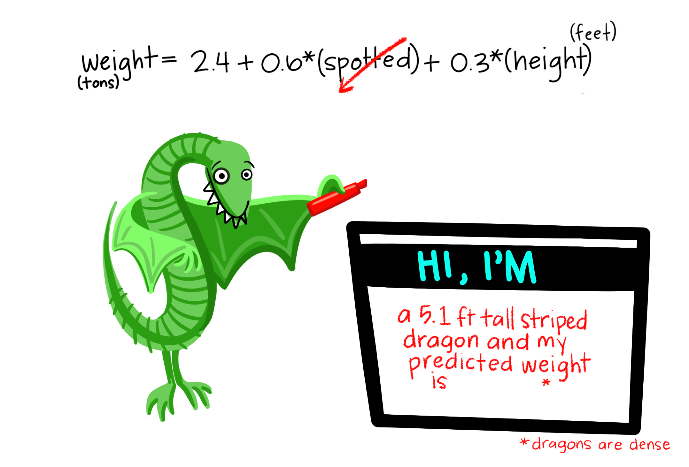
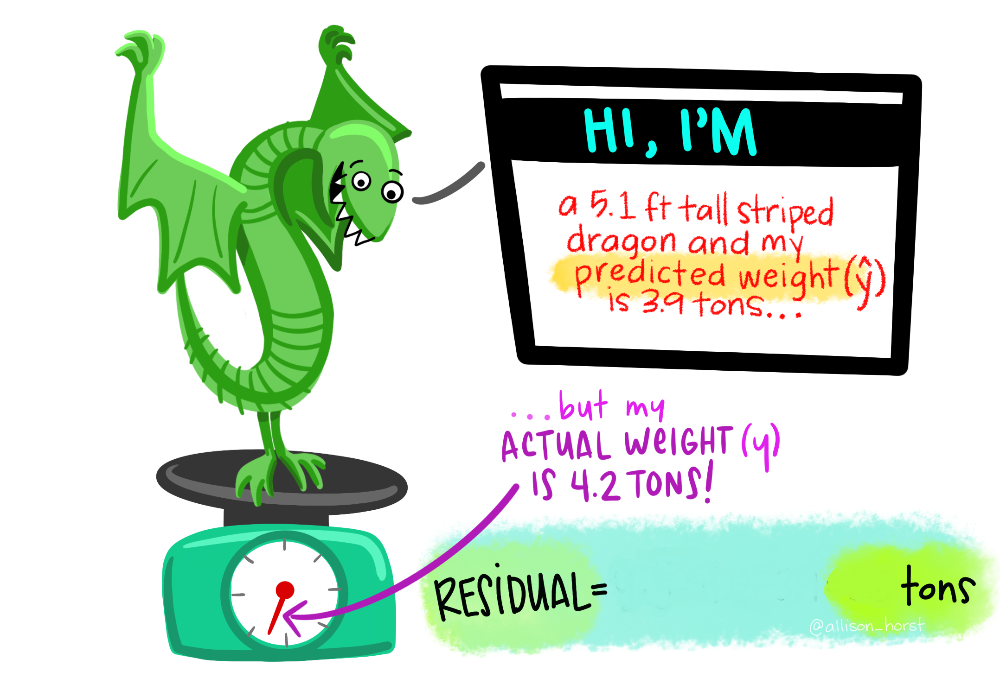
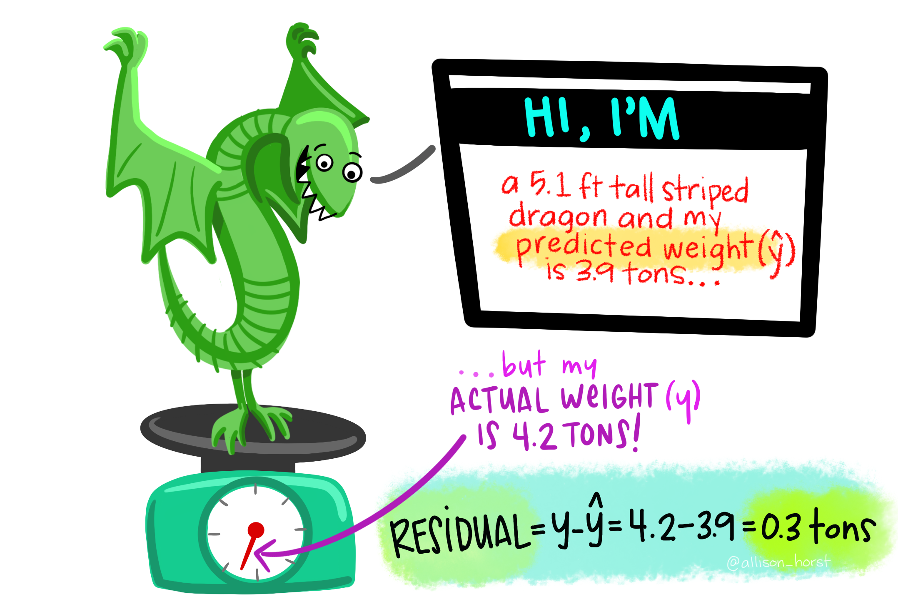
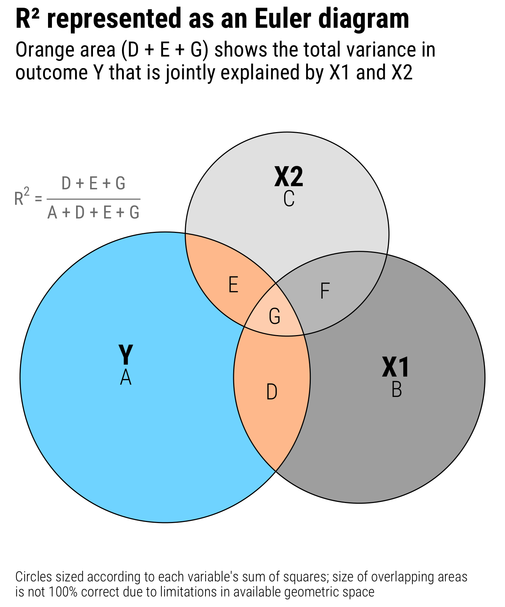
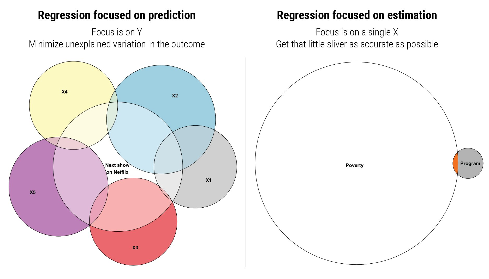
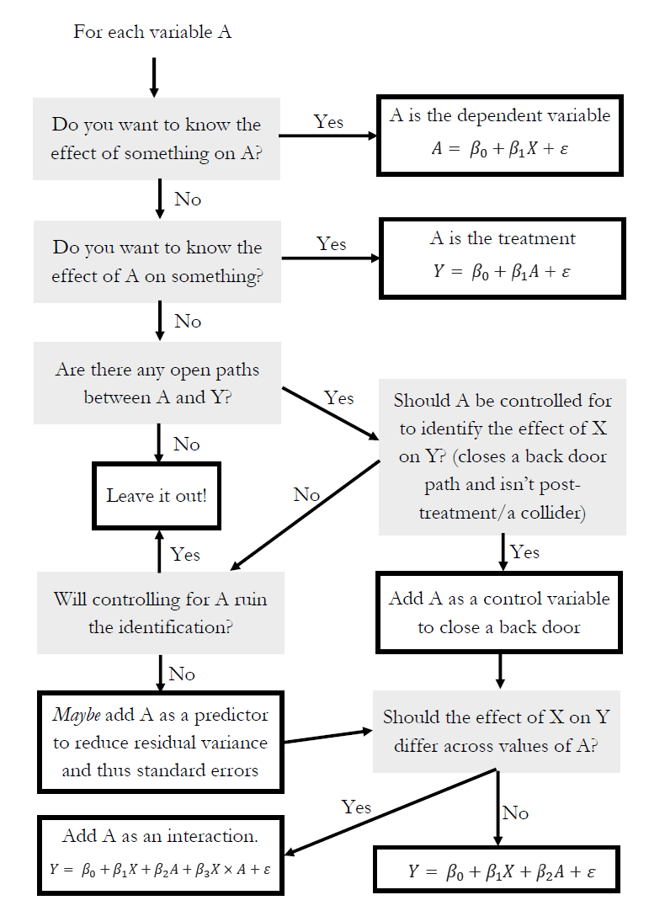

```{r setup, include=FALSE}
knitr::opts_chunk$set(warning = FALSE, message = FALSE, 
                      fig.retina = 3, fig.align = "center")
```

```{r packages-data, include=FALSE}
library(tidyverse)
library(broom)
library(patchwork)
```

```{r xaringanExtra, echo=FALSE}
xaringanExtra::use_xaringan_extra(c("tile_view"))
```

class: center middle main-title section-title-4

# Review of regression analysis

.class-info[

**Class 2**

.light[EDUC 265: Applied Regression Analysis<br>
UCI School of Education
]

]

---

name: outline
class: title title-8

# Plan for today

--

.box-1.medium.sp-after-half[Two variables]

--

.box-3.medium.sp-after-half[Two variables, and then some more]

--

.box-6.medium.sp-after-half[Null worlds and statistical significance]

---

layout: false
name: drawing-lines
class: center middle section-title section-title-1 animated fadeIn

# Two variables

---

layout: true
class: title title-1

---

# Essential parts of regression

.pull-left[
.box-inv-1.large[**Y**]

.box-1[Outcome variable]

.box-1[Response variable]

.box-1[Dependent variable]

.box-inv-1[Thing you want to<br>explain or predict]
]

--

.pull-right[
.box-inv-1.large[**X**]

.box-1[Explanatory variable]

.box-1[Predictor variable]

.box-1[Independent variable]

.box-inv-1[Thing you use to<br>explain or predict **Y**]
]

---

# Identify variables

.pull-left[
.box-inv-1[A study examines the effect of smoking on lung cancer]

.box-inv-1[Researchers predict genocides by looking at negative media coverage, revolutions in neighboring countries, and economic growth]
]

.pull-right[
.box-inv-1[You want to see if taking more AP classes in high school improves college grades]

.box-inv-1[Netflix uses your past viewing history, the day of the week, and the time of the day to guess which show you want to watch next]
]


---

layout: false

.center[
<figure>
  
</figure>
]

???

https://allisonhorst.com/everything-else

---

layout: false

.center[
<figure>
  
</figure>
]

???

https://allisonhorst.com/everything-else

---

layout: true
class: title title-1

---

# Sliders and switches

.center[
<figure>
  
</figure>
]

---

# Sliders and switches

.center[
<figure>
  
</figure>
]


---

# Two purposes of regression

.pull-left[
.box-inv-1.medium[Prediction]

.box-1[Forecast the future]

.box-1.sp-after[Focus is on **Y**]

.box-inv-1.small[Netflix trying to<br>guess your next show]

.box-inv-1.small[Predicting who will enroll in SNAP]
]

--

.pull-right[
.box-inv-1.medium[Explanation]

.box-1[Explain effect of **X** on **Y**]

.box-1.sp-after[Focus is on **X**]

.box-inv-1.small[Netflix looking at the effect of the<br>time of day on show selection]

.box-inv-1.small[Measuring the effect of<br>SNAP on poverty reduction]
]

---

# How?

.box-inv-1.medium.sp-after-half[Plot **X** and **Y**]

--

.box-inv-1.medium[Draw a line that approximates the relationship]

.box-1.tiny[and that would plausibly work for data not in the sample!]

--

.box-inv-1.medium.sp-after-half.sp-before-half[Find mathy parts of the line]

--

.box-inv-1.medium[Interpret the math]

---

# When you think happiness...

```{r make-cookies, include=FALSE}
cookies <- tibble(happiness = c(0.5, 2, 1, 2.5, 3, 1.5, 2, 2.5, 2, 3),
                  cookies = 1:10)

cookies_data <- cookies
cookies_model <- lm(happiness ~ cookies, data = cookies)
cookies_fitted <- augment(cookies_model)
```

.center[

```{r echo=FALSE}
cookies
```

]

---

layout: false

```{r cookies-base, echo=FALSE, message=FALSE, fig.dim=c(8, 4), out.width="100%"}
cookies_base <- ggplot(cookies_fitted, aes(x = cookies, y = happiness)) +
  geom_point(size = 3) +
  coord_cartesian(xlim = c(0, 10), ylim = c(0, 3)) +
  scale_x_continuous(breaks = 0:10) +
  labs(x = "Cookies eaten", y = "Level of happiness") +
  theme_minimal(base_size = 14) +
  theme(panel.grid.minor = element_blank(),
        plot.title = element_text(face = "bold"))

cookies_base
```

---

```{r cookies-spline, echo=FALSE, message=FALSE, fig.dim=c(8, 4), out.width="100%"}
cookies_base +
  geom_smooth(method = lm, color = "#0074D9", formula = y ~ splines::bs(x, 7), se = FALSE)
```

---

```{r cookies-loess, echo=FALSE, message=FALSE, fig.dim=c(8, 4), out.width="100%"}
cookies_base +
  geom_smooth(method = "loess", color = "#0074D9", se = FALSE)
```

---

```{r cookies-lm, echo=FALSE, message=FALSE, fig.dim=c(8, 4), out.width="100%"}
cookies_base +
  geom_smooth(method = "lm", color = "#0074D9", se = FALSE)
```

---

```{r cookies-lm-residual, echo=FALSE, message=FALSE, fig.dim=c(8, 4), out.width="100%"}
cookies_with_residual <- cookies_base +
  geom_smooth(method = "lm", color = "#0074D9", se = FALSE) +
  geom_segment(aes(xend = cookies, yend = .fitted), color = "#FF851B", size = 1)

cookies_with_residual
```

---

```{r cookies-residual-only, echo=FALSE, message=FALSE, fig.dim=c(8, 4), out.width="100%"}
cookies_residual_only <- ggplot(cookies_fitted, aes(x = cookies, y = .resid)) +
  geom_hline(yintercept = 0, color = "#B10DC9", size = 1) +
  geom_point(size = 3) +
  geom_segment(aes(xend = cookies, yend = 0), color = "#FF851B", size = 1) +
  coord_cartesian(xlim = c(0, 10), ylim = c(-1.5, 1.5)) +
  scale_x_continuous(breaks = 0:10) +
  labs(x = "Cookies eaten", y = "Distance from line") +
  theme_minimal(base_size = 14) +
  theme(panel.grid.minor = element_blank(),
        plot.title = element_text(face = "bold"))

cookies_residual_only
```

---

```{r cookies-resid-side-by-side, echo=FALSE, message=FALSE, fig.dim=c(8, 4), out.width="100%"}
(cookies_with_residual + labs(title = "Cookies and happiness")) + 
  (cookies_residual_only + labs(title = "Residuals"))
```

---

class: title title-1

# Ordinary least squares (OLS) regression

```{r cookies-lm-residual-shorter, echo=FALSE, message=FALSE, fig.dim=c(8, 3.5), out.width="100%"}
cookies_with_residual
```


---

layout: true
class: title title-1

---

# Drawing lines with math

$$
y = mx + b
$$

<table>
  <tr>
    <td class="cell-center">\(y\)</td>
    <td class="cell-left">&ensp;A number</td>
  </tr>
  <tr>
    <td class="cell-center">\(x\)</td>
    <td class="cell-left">&ensp;A number</td>
  </tr>
  <tr>
    <td class="cell-center">\(m\)</td>
    <td class="cell-left">&ensp;Slope (\(\frac{\text{rise}}{\text{run}}\))</td>
  </tr>
  <tr>
    <td class="cell-center">\(b\)</td>
    <td class="cell-left">&ensp;y-intercept</td>
  </tr>
</table>

---

# Slopes and intercepts

.pull-left[

$$
y = 2x - 1
$$

```{r simple-line-1, echo=FALSE, fig.dim=c(4.8, 3.5), out.width="100%"}
ggplot(data = tibble(x = 0:5), aes(x = x)) +
  stat_function(fun = function(x) 2 * x - 1, 
                color = "#BF3984", size = 1.5) +
  geom_vline(xintercept = 0) +
  geom_hline(yintercept = 0) +
  scale_x_continuous(breaks = 0:5) +
  scale_y_continuous(breaks = -1:9) +
  theme(panel.grid.minor = element_blank())
```

]

--

.pull-right[

$$
y = -0.5x + 6
$$

```{r simple-line-2, echo=FALSE, fig.dim=c(4.8, 3.5), out.width="100%"}
ggplot(data = tibble(x = 0:14), aes(x = x)) +
  stat_function(fun = function(x) -0.5 * x + 6, 
                color = "#BF3984", size = 1.5) +
  geom_vline(xintercept = 0) +
  geom_hline(yintercept = 0) +
  scale_x_continuous(breaks = 0:14) +
  scale_y_continuous(breaks = -1:9) +
  theme(panel.grid.minor = element_blank())
```

]

---

# Grϵϵκ, Latin, and extra markings

.box-inv-1[Statistics: use a sample to make inferences about a population]

--

.pull-left[
.box-1[Greek]

Letters like $\beta_1$ are the ***truth***

Letters with extra markings like $\hat{\beta_1}$ are our ***estimate*** of the truth based on our sample
]

--

.pull-right[
.box-1[Latin]

Letters like $X$ are ***actual data*** from our sample

Letters with extra markings like $\bar{X}$ are ***calculations*** from our sample
]

---

# Estimating truth

.box-inv-1.sp-after[Data → Calculation → Estimate → Truth]

--

.pull-left[
<table>
  <tr>
    <td class="cell-left">Data</td>
    <td class="cell-center">\(X\)</td>
  </tr>
  <tr>
    <td class="cell-left">Calculation&ensp;</td>
    <td class="cell-center">\(\bar{X} = \frac{\sum{X}}{N}\)</td>
  </tr>
  <tr>
    <td class="cell-left">Estimate</td>
    <td class="cell-center">\(\hat{\mu}\)</td>
  </tr>
  <tr>
    <td class="cell-left">Truth</td>
    <td class="cell-center">\(\mu\)</td>
  </tr>
</table>
]

--

.pull-right[
$$
\bar{X} = \hat{\mu}
$$

$$
X \rightarrow \bar{X} \rightarrow \hat{\mu} \xrightarrow{\text{🤞 hopefully 🤞}} \mu
$$
]

---

# Drawing lines with stats

$$
\hat{y} = \hat{\beta_0} + \hat{\beta_1} x_1 + \varepsilon
$$

<table>
  <tr>
    <td class="cell-center">\(y\)</td>
    <td class="cell-center">\(\hat{y}\)</td>
    <td class="cell-left">&ensp;Outcome variable (DV)</td>
  </tr>
  <tr>
    <td class="cell-center">\(x\)</td>
    <td class="cell-center">\(x_1\)</td>
    <td class="cell-left">&ensp;Explanatory variable (IV)</td>
  </tr>
  <tr>
    <td class="cell-center">\(m\)</td>
    <td class="cell-center">\(\hat{\beta_1}\)</td>
    <td class="cell-left">&ensp;Slope</td>
  </tr>
  <tr>
    <td class="cell-center">\(b\)</td>
    <td class="cell-center">\(\hat{\beta_0}\)</td>
    <td class="cell-left">&ensp;y-intercept</td>
  </tr>
  <tr>
    <td class="cell-center">&emsp;&emsp;</td>
    <td class="cell-center">&emsp;\(\varepsilon\)&emsp;</td>
    <td class="cell-left">&ensp;Error (residuals)</td>
  </tr>
</table>

.box-inv-1.smaller[(most of the time we can get rid of markings on Greek and just use β)]

---

# Modeling cookies and happiness

.pull-left[
$$
\hat{y} = \beta_0 + \beta_1 x_1 + \varepsilon
$$
&nbsp;

$$
\begin{aligned}
&\widehat{\text{happiness}} = \\ 
&\beta_0 + \beta_1 \text{cookies} + \varepsilon
\end{aligned}
$$

]

.pull-right[

```{r cookies-happiness-again, echo=FALSE, fig.dim=c(4.8, 4.2), out.width="100%"}
cookies_base +
  geom_smooth(method = "lm", color = "#0074D9") +
  coord_cartesian(xlim = c(0, 10), ylim = c(0, 4))
```

]

---

# Building models in R and Stata

```{r model-template, eval=FALSE}
name_of_model <- lm(<Y> ~ <X>, data = <DATA>)

summary(name_of_model)  # See model details
```

--

```{r broom examples, eval=FALSE}
library(broom)

# Convert model results to a data frame for plotting
tidy(name_of_model)

# Convert model diagnostics to a data frame
glance(name_of_model)
```

---

# Modeling cookies and happiness

.pull-left[
$$
\begin{aligned}
&\widehat{\text{happiness}} = \\ 
&\beta_0 + \beta_1 \text{cookies} + \varepsilon
\end{aligned}
$$

```{r build-cookie-model}
happiness_model <- 
  lm(happiness ~ cookies,
     data = cookies_data)
```

]

.pull-right[
`)
]

---

# Modeling cookies and happiness

.small-code[
```{r tidy-cookie-model}
tidy(happiness_model, conf.int = TRUE)
```
]

--

.small-code[
```{r glance-cookie-model}
glance(happiness_model)
```
]

---

# Translating results to math

.pull-left[

.small-code[
```{r tidy-cookie-model-small, echo=FALSE}
tidy(happiness_model, conf.int = TRUE) %>% 
  select(term, estimate)
```
]

.small[
$$
\begin{aligned}
&\widehat{\text{happiness}} = \\ 
&\beta_0 + \beta_1 \text{cookies} + \varepsilon
\end{aligned}
$$

$$
\begin{aligned}
&\widehat{\text{happiness}} = \\ 
&1.1 + 0.16 \times \text{cookies} + \varepsilon
\end{aligned}
$$
]
]

.pull-right[
`)
]

---

# Template for just two variables

.box-inv-1.medium[A one unit increase in X is *associated* with<br>a β<sub>1</sub> increase (or decrease) in Y, on average]

$$
\widehat{\text{happiness}} = \beta_0 + \beta_1 \text{cookies} + \varepsilon
$$

$$
\widehat{\text{happiness}} = 1.1 + 0.16 \times \text{cookies} + \varepsilon
$$

---

# Under the hood

.box-inv-1.medium[How can we calculate the optimal<br> β<sub>1</sub> and β<sub>0</sub>?]

$$
\widehat{\text{happiness}} = \beta_0 + \beta_1 \text{cookies} + \varepsilon
$$

$$
\beta_1 = \frac{  {{\sum{}}} (x_i - \bar{x})(y_i - \bar{y})}{ {{\sum{}}} (x_i - \bar{x})^2}
$$

$$
\beta_0 =  \bar{y} - \beta_1\bar{x}
$$

---

layout: false
name: lines-greek-regression
class: center middle section-title section-title-3 animated fadeIn

# Two variables, <br>and then some more

---

layout: true
class: title title-3

---

# Multiple regression

.box-inv-3[We're not limited to just one explanatory variable!]

--

$$
\hat{y} = \beta_0 + \beta_1 x_1 + \beta_2 x_2 + \cdots + \beta_n x_n + \varepsilon
$$

&nbsp;

--

```{r build-car-model-big}
car_model <- lm(hwy ~ displ + cyl + drv,
                data = mpg)
```

$$
\widehat{\text{hwy}} = \beta_0 + \beta_1 \text{displ} + \beta_2 \text{cyl} + \beta_3 \text{drv:f} + \beta_4 \text{drv:r} + \varepsilon
$$

---

# Modeling lots of things and MPG

.small-code[
```{r tidy-car-model-big}
tidy(car_model, conf.int = TRUE)
```
]

--

$$
\begin{aligned}
\widehat{\text{hwy}} =&\ 33.1 + (-1.12) \times \text{displ} + (-1.45) \times \text{cyl} \ + \\
&(5.04) \times \text{drv:f} + (4.89) \times \text{drv:r} + \varepsilon
\end{aligned}
$$

---

# Filtering out variation

.box-inv-3.medium.sp-after[Each **X** in the model explains<br>some portion of the variation in **Y**]

--

.box-3[Interpretation is a little trickier,<br>since you can only ever move<br>**one** switch or slider at at time]

---

# Template for continuous variables

.box-inv-3[*Holding everything else constant*, a one unit increase in **X** is *associated* with a β<sub>n</sub> increase (or decrease) in **Y**, on average]

$$
\begin{aligned}
\widehat{\text{hwy}} =&\ 33.1 + (-1.12) \times \text{displ} + (-1.45) \times \text{cyl} \ + \\
&(5.04) \times \text{drv:f} + (4.89) \times \text{drv:r} + \varepsilon
\end{aligned}
$$

--

.box-3.small[On average, a one unit increase in cylinders is associated with<br>1.45 lower highway MPG, holding everything else constant]

---

# Template for categorical variables

.box-inv-3[*Holding everything else constant*, **Y** is β<sub>n</sub> units larger (or smaller) in **X**<sub>n</sub>, compared to **X**<sub>omitted</sub>, on average]

$$
\begin{aligned}
\widehat{\text{hwy}} =&\ 33.1 + (-1.12) \times \text{displ} + (-1.45) \times \text{cyl} \ + \\
&(5.04) \times \text{drv:f} + (4.89) \times \text{drv:r} + \varepsilon
\end{aligned}
$$

--

.box-3[On average, front-wheel drive cars have 5.04 higher highway MPG than 4-wheel-drive cars, holding everything else constant]

---

# Economists and Greek letters

.box-inv-3[Economists like to assign all sorts of Greek letters<br>to their different coefficients]

$$
Y_i = \alpha + \beta P_i + \gamma A_i + e_i
$$

.box-inv-3.tiny[Equation 2.1 on p. 57 in *Mastering 'Metrics*]

.box-3.smaller[*i* = an individual]

.box-3.smaller[α ("alpha") = intercept]

.box-3.smaller[β ("beta") = coefficient just for *treatment*, or the causal effect]

.box-3.smaller[γ ("gamma") = coefficient for the *identifying variable*<br><small>(being in Group A or not)</small>]

---

# Economists and Greek letters

$$
\ln Y_i = \alpha + \beta P_i + \gamma A_i + \delta_1 \text{SAT}_i + \delta_2 \text{PI}_i + e_i
$$

.box-inv-3.tiny[Equation 2.2 on p. 61 in *Mastering 'Metrics*]

.box-3.small[*i* = an individual]

.box-3.small[α ("alpha") = intercept]

.box-3.small[β ("beta") = coefficient just for *treatment*, or the causal effect]

.box-3.small[γ ("gamma") = coefficient for the *identifying variable*<br><small>(being in Group A or not)</small>]

.box-3.small[δ ("delta") = coefficient for *control variables*]

---

# These are all the same thing!

$$
\ln Y_i = \alpha + \beta P_i + \gamma A_i + \delta_1 \text{SAT}_i + \delta_2 \text{PI}_i + e_i
$$

$$
\ln Y_i = \beta_0 + \beta_1 P_i + \beta_2 A_i + \beta_3 \text{SAT}_i + \beta_4 \text{PI}_i + e_i
$$
```{r eval=FALSE}
lm(log(income) ~ private + group_a + sat + parental_income, 
   data = income_data)
```

--

.box-inv-3[(I personally like the all-β version instead of using like the entire Greek alphabet, but you'll see both varieties in the real world)]


---

layout: false

.center[
<figure>
  
</figure>
]

???

https://allisonhorst.com/linear-regression-dragons

---

layout: false

.center[
<figure>
  
</figure>
]

???

https://allisonhorst.com/linear-regression-dragons


---


layout: false

.center[
<figure>
  
</figure>
]

???

https://allisonhorst.com/linear-regression-dragons


---

layout: false

.center[
<figure>
  
</figure>
]

???

https://allisonhorst.com/linear-regression-dragons

---

layout: false

.center[
<figure>
  
</figure>
]

???

https://allisonhorst.com/linear-regression-dragons

---

layout: false

.center[
<figure>
  
</figure>
]

???

https://allisonhorst.com/linear-regression-dragons

---

layout: false

.center[
<figure>
  
</figure>
]

???

https://allisonhorst.com/linear-regression-dragons

---

layout: false

.center[
<figure>
  
</figure>
]

???

https://allisonhorst.com/linear-regression-dragons

---

layout: true
class: middle

---

.box-3.large[What's R²?]

--

.box-3.large[What's a good R²?]

---

.center[
<figure>
  
</figure>
]

---

.center[
<figure>
  
</figure>
]

---

.center[
<figure>
  
</figure>
]

---

.center[
<figure>
  
</figure>
]

---

layout: false
name: significance
class: center middle section-title section-title-6 animated fadeIn

# Null worlds and<br>statistical significance

---

layout: true
class: title title-6

---

# "hopefully"

.box-inv-6.medium[How do we know if our estimate is the truth?]

$$
X \rightarrow \bar{X} \rightarrow \hat{\mu} \xrightarrow{\text{🤞 hopefully 🤞}} \mu
$$

---

layout: false

```{r process-imdb-data, include=FALSE}
library(ggplot2movies)  # Lots of movies from IMDB

# Clean up data
set.seed(1234)  # Set seed so we get the same sampled rows every time
movie_data <- movies %>% 
  # Make a binary column for genre
  select(title, year, rating, Action, Comedy) %>% 
  filter(!(Action == 1 & Comedy == 1)) %>% 
  mutate(genre = case_when(Action == 1 ~ "Action",
                           Comedy == 1 ~ "Comedy",
                           TRUE ~ "Neither")) %>%
  filter(genre != "Neither") %>%
  # Make genre a factor
  mutate(genre = factor(genre)) %>% 
  select(-Action, -Comedy) %>% 
  # Randomly select 200 movies in each genre
  group_by(genre) %>% 
  sample_n(200) %>% 
  ungroup()
```

.box-inv-6.medium.sp-after[Are action movies rated higher than comedies?]

<table>
  <tr>
    <td class="cell-left">Data</td>
    <td class="cell-left">IMDB ratings</td>
    <td class="cell-center">\(D\)</td>
  </tr>
  <tr>
    <td class="cell-left">Calculation&ensp;</td>
    <td class="cell-left">Average action rating − average comedy rating</td>
    <td class="cell-center">\(\bar{D} = \frac{\sum{D}_\text{Action}}{N} - \frac{\sum{D}_\text{Comedy}}{N}\)</td>
  </tr>
  <tr>
    <td class="cell-left">Estimate</td>
    <td class="cell-left">\(\bar{D}\) in a sample of movies</td>
    <td class="cell-center">\(\hat{\delta}\)</td>
  </tr>
  <tr>
    <td class="cell-left">Truth</td>
    <td class="cell-left">Difference in rating for <em>all</em> movies</td>
    <td class="cell-center">\(\delta\)</td>
  </tr>
</table>

---

.left-code[
```{r show-movies}
head(movie_data)
```
]

--

.right-code[
```{r movie-diffs}
movie_data %>% 
  group_by(genre) %>% 
  summarize(avg_rating = mean(rating))
```

$$
\hat{\delta} = \bar{D} = 5.41 - 5.84 = -0.43
$$
.box-6[Is the true δ -0.43?]
]

---

layout: true
class: title title-6

---

# Null worlds

--

.box-inv-6.medium[What would the world look like<br>if the true δ was really 0?]

--

.box-6[Action movies and comedies wouldn't all have the same rating, but on average there'd be no difference]

---

# Simulated null world

.box-inv-6[Shuffle the `rating` and `genre` columns<br>and calculate the difference in ratings across genres]

--

.box-inv-6[Do that ↑ 5,000 times]

--

.center[
```{r plot-null, echo=FALSE, fig.dim=c(4.8, 2.7), out.width="50%"}
library(infer)
set.seed(1234)

genre_diffs_null <- movie_data %>% 
  specify(rating ~ genre) %>% 
  hypothesize(null = "independence") %>% 
  generate(reps = 5000, type = "permute") %>% 
  calculate("diff in means", order = c("Action", "Comedy"))

genre_diffs_null %>% 
  visualize() + 
  # geom_vline(xintercept = -0.43, size = 1, color = "#77002c") +
  labs(x = "Simulated difference in average ratings (Action − Comedy)", 
       y = "Count", title = NULL)
```
]

---

# Check δ in the null world

.box-inv-6[Does the δ we observed fit well in the world where it's actually 0?]

.center[
```{r plot-null-delta, echo=FALSE, fig.dim=c(4.8, 2.7), out.width="50%"}
genre_diffs_null %>% 
  visualize() + 
  geom_vline(xintercept = -0.43, size = 1, color = "#FF4136") +
  labs(x = "Simulated difference in average ratings (Action − Comedy)", 
       y = "Count", title = NULL)
```
]

--

.box-6[That seems fairly rare for a null world!]

---

# How likely is that δ in the null world?

```{r get-p-value, echo=FALSE}
find_p_value <- genre_diffs_null %>% 
  get_p_value(obs_stat = -0.43, direction = "both") %>% 
  mutate(p_value_clean = scales::pvalue(p_value))
```

.pull-left[
`)
]

.pull-right[
.box-inv-6[What's the chance that we'd see that red line in a world where there's no difference?]

.box-6[p = `r find_p_value$p_value_clean`]

.box-6[That's really really low!]
]

---

# p-values

.box-inv-6[That `r find_p_value$p_value_clean` is a p-value]

--

.box-inv-6.sp-after[p-value = probability of seeing something<br>in a world where the effect is 0]

--

.box-6[The δ we measured doesn't fit well<br>in the null world, so it's most likely not 0]

--

.box-6[We can safely say that there's a difference between the two groups. Action movies are rated lower, on average, than comedies]

---

# Significance

.box-inv-6.sp-after[If p < 0.05, there's a good chance<br>the estimate is not zero and is "real"]

--

.box-6[If p > 0.05, we can't say anything] 

--

.box-6[That doesn't mean that there's no effect!<br>It just means we can't tell if there is.]

---

# No need for all that simulation

.box-inv-6.small[This simulation stuff is helpful for the intuition behind a p-value,<br>but you can also just interpret p-values in the wild]

--

.small-code[
```{r regular-t-test}
t.test(rating ~ genre, data = movie_data)
```
]


---

# Slopes and coefficients

.box-inv-6[You can find a p-value for any Greek letter estimate,<br>like β from a regression]

--

$$
\hat{\beta} \xrightarrow{\text{🤞 hopefully 🤞}} \beta
$$

--

.box-6[In a null world, the slope (β) would be zero]

--

.box-6[p-value shows us if β=hat would fit in a world where β is zero]

---

# Regression and p-values

.small-code[
```{r tidy-car-model-big-again}
tidy(car_model, conf.int = TRUE)
```
]


---

# Under the hood

.box-inv-6.medium[How can we calculate the s.e. of β<sub>1</sub>?]

$$
\widehat{\text{happiness}} = \beta_0 + \beta_1 \text{cookies} + \varepsilon
$$

$$
\text{SE}(\beta_1) = \frac{  {{\sigma}} }{ { \sqrt{  {\sum{}}} (x_i - \bar{x})^2}} 
$$

$$
{\hat{\sigma}} = \sqrt   \frac{  {{\sum{}}} (y_i - \bar{y})}{(n-2)}
$$

$$
\beta_0 =  \bar{y} - \beta_1\bar{x}
$$


---

# Let's read a regression table

.center[
<figure>
  
</figure>
]

---

# Let's re-read this regression table

.center[
<figure>
  
</figure>
]

---

layout: false

.center[
<figure>
  
</figure>
]

---

name: outline
class: title title-8

# Plan for next class

--

.box-8.medium[**Practice assignment**]

.box-inv-8.small[Attend the lab today, assignment due Tuesday night]

--

.box-8.medium[**Reading reactions**]

.box-inv-8.small.sp-after[Engage on Perusall, due Wednesday night]

--

.box-8.medium[**Keep working on Milestone 1**]

.box-inv-8.small.sp-after[Due Feb 04]

