```{r setup, include=FALSE}
knitr::opts_chunk$set(warning = FALSE, message = FALSE, 
                      fig.retina = 3, fig.align = "center")
```

```{r packages-data, include=FALSE}
library(tidyverse)
library(flair)
library(broom)
library(ggdag)
library(kableExtra)
library(scales)
library(patchwork)
library(infer)
library(MatchIt)

library(marginaleffects)  # Marginal effects stuff
library(emmeans)          # Marginal effects stuff

library(ggtext)           # Add markdown/HTML support to text in plots
library(glue)             # Python-esque string interpolation
library(gganimate)        # Make animated plots

library(ggrepel)          # Make labels that don't overlap
library(MetBrewer)        # Artsy color palettes

world_happiness <- read_csv("data/world_happiness.csv") %>% 
  mutate(latin_america = region == "Latin America & Caribbean") %>% 
  mutate(latin_america = factor(latin_america, labels = c("Not Latin America", "Latin America")))
```

```{r xaringanExtra, echo=FALSE}
xaringanExtra::use_xaringan_extra(c("tile_view"))
```

class: center middle main-title section-title-4

# Interactions and transformations

.class-info[

**Class 3**

.light[EDUC 265: Applied Regression Analysis<br>
UCI School of Education
]

]

---

name: outline
class: title title-8

# Plan for today

--

.box-1.medium.sp-after-half[Review]

--

.box-3.medium.sp-after-half[Transformations]

--

.box-6.medium.sp-after-half[Interactions]

--

.box-7.medium.sp-after-half[Polynomials]


---

layout: false
name: stuff
class: center middle section-title section-title-1 animated fadeIn

# Review

---

layout: true
class: title title-1

---

# Confounding

.pull-left[
.box-1.small[Experimental DAG]
```{r experimental-dag, echo=FALSE, fig.width=4, fig.height=3, out.width="90%"}
dagify(
  Y ~ X + A,
  coords = list(x = c(X = 1, Y = 2, A = 1.5),
                y = c(X = 1, Y = 1, A = 2)),
  labels = c(X = "X = x")
) %>% 
  ggplot(aes(x = x, y = y, xend = xend, yend = yend)) +
  geom_dag_edges() +
  geom_dag_point(color = "black", size = 11) +
  geom_dag_text() +
  geom_dag_text_repel(aes(label = label),
                      nudge_x = 0, nudge_y = 0.25,
                      color = "black", 
                      fontface = "bold", lineheight = 0.95, seed = 1234) +
  theme_dag()
```
]

--

.pull-right[
.box-1.small[Observational DAG]
```{r observational-dag, echo=FALSE, fig.width=4, fig.height=3, out.width="90%"}
dagify(
  Y ~ X + A,
  X ~ A,
  coords = list(x = c(X = 1, Y = 2, A = 1.5),
                y = c(X = 1, Y = 1, A = 2))
) %>% 
  ggplot(aes(x = x, y = y, xend = xend, yend = yend)) +
  geom_dag_edges() +
  geom_dag_point(color = "black", size = 11) +
  geom_dag_text() +
  theme_dag()
```
]

---

# Confounding

.pull-left[
.box-1.small[Experimental DAG]

```{r edu-earn-experiment, warning=FALSE, echo=FALSE, fig.width=6, fig.height=4.5, out.width="90%"}
edu_earn_coords <- list(x = c(Edu = 2, Earn = 4, Year = 2, Bkgd = 4, 
                              Loc = 3, JobCx = 3, Req = 1, U1 = 3),
                        y = c(Edu = 2, Earn = 2, Year = 3, Bkgd = 3, 
                              Loc = 3, JobCx = 1, Req = 2, U1 = 4))

dagify(
  Earn ~ Edu + Year + Bkgd + Loc + JobCx,
  NULL ~ Req,
  JobCx ~ Edu,
  Bkgd ~ U1,
  Loc ~ U1,
  exposure = "Edu",
  outcome = "Earn",
  latent = "U1",
  labels = c("Earn" = "Earnings", "Edu" = "Education",
             "Year" = "Year", "Bkgd" = "Background",
             "Loc" = "Location", "JobCx" = "Job connections",
             "U1" = "Unobserved stuff"),
  coords = edu_earn_coords) %>% 
  tidy_dagitty() %>% 
  node_status() %>% 
  ggplot(aes(x = x, y = y, xend = xend, yend = yend)) +
  geom_dag_edges() +
  geom_dag_point(aes(color = status), size = 14) +
  geom_dag_text(color = "black", size = 5) +
  scale_color_manual(values = c("#FF4136", "grey60", "#0074D9"),
                     na.value = "#7FDBFF") +
  guides(color = FALSE) +
  theme_dag()
```
]

--

.pull-right[
.box-1.small[Observational DAG]

```{r edu-earn-obs, echo=FALSE, fig.width=6, fig.height=4.5, out.width="90%"}
dagify(
  Earn ~ Edu + Year + Bkgd + Loc + JobCx,
  Edu ~ Req + Loc + Bkgd + oYear,
  JobCx ~ Edu,
  Bkgd ~ U1,
  Loc ~ U1,
  exposure = "Edu",
  outcome = "Earn",
  latent = "U1",
  labels = c("Earn" = "Earnings", "Edu" = "Education",
             "Year" = "Year", "Bkgd" = "Background",
             "Loc" = "Location", "JobCx" = "Job connections",
             "U1" = "Unobserved stuff"),
  coords = edu_earn_coords) %>% 
  tidy_dagitty() %>% 
  node_status() %>% 
  ggplot(aes(x = x, y = y, xend = xend, yend = yend)) +
  geom_dag_edges() +
  geom_dag_point(aes(color = status), size = 14) +
  geom_dag_text(color = "black", size = 5) +
  scale_color_manual(values = c("#FF4136", "grey60", "#0074D9"),
                     na.value = "#7FDBFF") +
  guides(color = FALSE) +
  theme_dag()
```

]


---

class: title title-1

# Let's hear it from psychology

.center[
<figure>
  
</figure>
]

---

layout: false

.center[
<figure>
  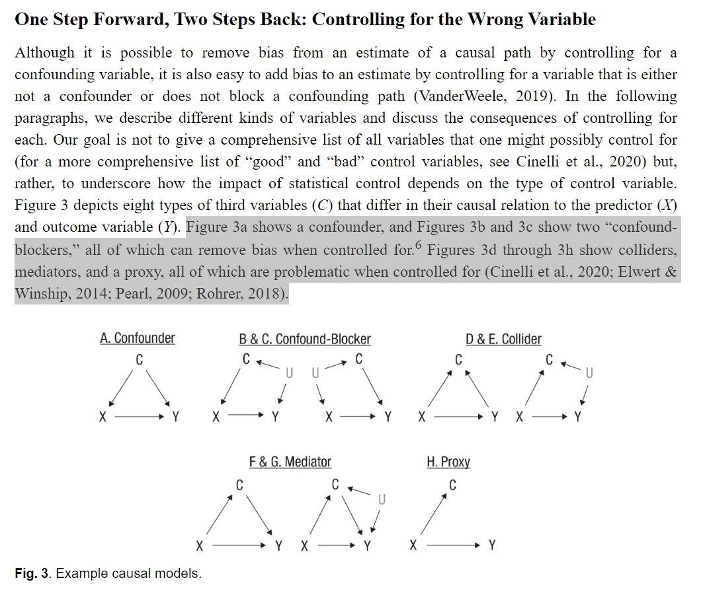
</figure>
]

---

class: title title-1

# Let's read a regression table together

.center[
<figure>
  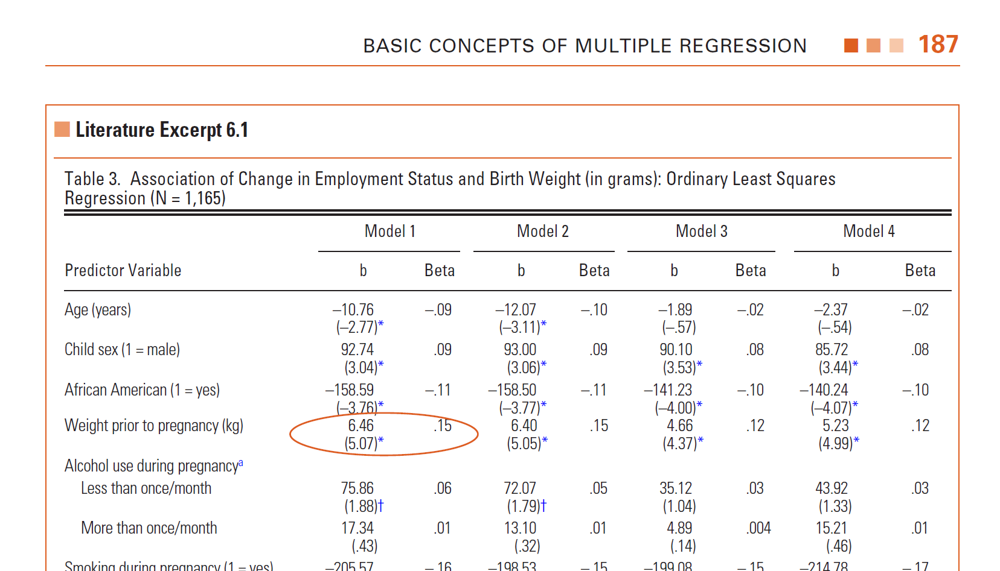
</figure>
]


---

layout: false

.box-1.medium.sp-after-half[🦦 Is this causal research? 🦦]

--

.box-1.medium.sp-after-half[Draw a DAG]

--

.box-1.medium.sp-after-half[What are switches vs. sliders?]

--

.box-1.medium.sp-after-half[Backdoors closed?]

--

.box-1.medium.sp-after-half[No colliders or mediators included?]

---

layout: false
name: stuff
class: center middle section-title section-title-3 animated fadeIn

# Transformations

---

layout: true
class: title title-3

---

class: title title-3

# Tell me why, why?

.box-inv-3.sp[~~Make your variables follow a normal distribution~~]

--

.box-3.sp-after[Interpretability]

--

.box-3.sp-after[OLS assumptions]

--

.box-3.sp-after[Modeling exponential growth]

--

.box-3.sp-after[Outliers]


---

class: title title-3

# Standardizing ↗️ Interpretability (?)

.center[
<figure>
  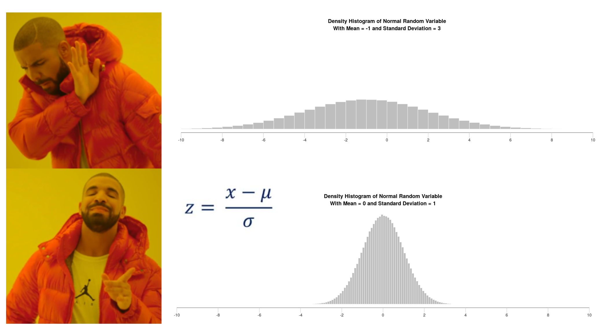
</figure>
]


---

class: title title-3

# Log() ↘️ Outliers
 
.center[
<figure>
  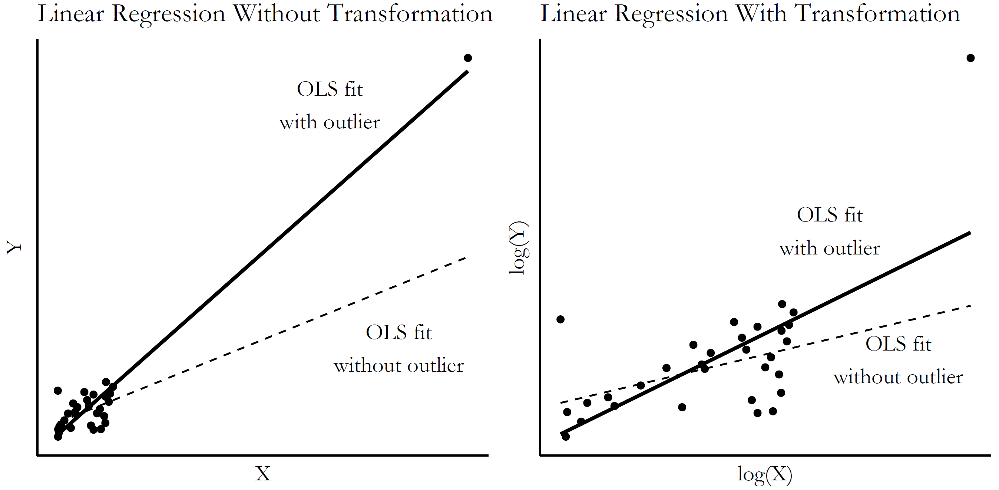
</figure>
]

--

.box-3.small[ ↗️ Interpretability (?)]

---

layout: false
name: interactions-regression
class: center middle section-title section-title-6 animated fadeIn

# Interactions

---

layout: true
class: title title-6

---

# Sliders and switches

.center[
<figure>
  
</figure>
]

---

layout: false

.smaller[
$$
\widehat{\text{Happiness}} = \beta_0 + \beta_1 \text{Life expectancy} + \beta_2 \text{Latin America} + \varepsilon
$$
]

--

.small-code[
```{r model-happiness-indicator}
model1 <- lm(happiness_score ~ life_expectancy + latin_america, 
             data = world_happiness)
tidy(model1)
```
]

--

.pull-left[
.box-inv-6.small[Life expectancy = continuous / slider]

.box-6.smaller["For every 1-year increase in life expectancy,<br>happiness is associated with a β<sub>1</sub> increase"]
]

--

.pull-right[
.box-inv-6.small[Latin America = categorical / switch]

.box-6.smaller["Being in Latin America is associated<br>with a β<sub>2</sub> increase in happiness"]
]

---

class: title title-6

# Indicators and interactions

.box-inv-6.medium[Indicators .tiny[(dummies)]]

--

.box-6.sp-after[Change in <span style="color: #F6D645;">intercept</span> for specific group]

---

layout: false

```{r plot-indicator-1, echo=FALSE, fig.width=12, fig.height=5.5, out.width="100%"}
ggplot(world_happiness, aes(x = life_expectancy, y = happiness_score)) +
  geom_point(aes(fill = latin_america), size = 5, pch = 21, color = "white", alpha = 0.7) +
  scale_fill_manual(values = c("grey70", "#B10DC9"), name = NULL) +
  labs(x = "Life expectancy", y = "Happiness score") +
  theme_bw(base_size = 21, base_family = "Fira Sans Condensed")
```

---

```{r plot-indicator-2, echo=FALSE, fig.width=12, fig.height=5.5, out.width="100%"}
model1_coefs <- tidy(model1)
la_shift <- filter(model1_coefs, term == "latin_americaLatin America")$estimate %>% round(2)
world_slope <- filter(model1_coefs, term == "life_expectancy")$estimate

ggplot(world_happiness, aes(x = life_expectancy, y = happiness_score)) +
  geom_point(aes(fill = latin_america), size = 5, pch = 21, color = "white", alpha = 0.7) +
  geom_abline(slope = filter(model1_coefs, term == "life_expectancy")$estimate, 
              intercept = filter(model1_coefs, term == "(Intercept)")$estimate, 
              color = "#0074D9", size = 2) +
  scale_fill_manual(values = c("grey70", "#B10DC9"), name = NULL) +
  labs(x = "Life expectancy", y = "Happiness score") +
  theme_bw(base_size = 21, base_family = "Fira Sans Condensed")
```

.box-6.small[World slope = `r round(world_slope, 3)`]

---

```{r plot-indicator-3, echo=FALSE, fig.width=12, fig.height=5.5, out.width="100%"}
ggplot(world_happiness, aes(x = life_expectancy, y = happiness_score)) +
  geom_point(aes(fill = latin_america), size = 5, pch = 21, color = "white", alpha = 0.7) +
  geom_abline(slope = filter(model1_coefs, term == "life_expectancy")$estimate, 
              intercept = filter(model1_coefs, term == "(Intercept)")$estimate, 
              color = "#0074D9", size = 2) +
  geom_abline(slope = filter(model1_coefs, term == "life_expectancy")$estimate, 
              intercept = filter(model1_coefs, term == "(Intercept)")$estimate +
                filter(model1_coefs, term == "latin_americaLatin America")$estimate, 
              color = colorspace::darken("#B10DC9", 0.3), size = 2) +
  scale_fill_manual(values = c("grey70", "#B10DC9"), name = NULL) +
  labs(x = "Life expectancy", y = "Happiness score") +
  theme_bw(base_size = 21, base_family = "Fira Sans Condensed")
```

.box-6.small[Latin America intercept shifted up `r round(la_shift, 3)`; line has same slope as world (`r round(world_slope, 3)`)]

---

.smaller[
$$
\begin{aligned}
\widehat{\text{Happiness}} = &\beta_0 + \beta_1 \text{Life expectancy} + \beta_2 \text{Latin America} + \\
&\beta_3 (\text{Life expectancy} \times \text{Latin America}) + \varepsilon
\end{aligned}
$$
]

--

.small-code[
```{r model-happiness-interaction}
model2 <- lm(happiness_score ~ life_expectancy + latin_america + 
               (life_expectancy * latin_america), data = world_happiness)
tidy(model2)
```
]

--

.box-6.small["In Latin America, for every 1-year increase in life expectancy,<br>happiness is associated with a <span style="color: #F6D645;">β<sub>1</sub> + β<sub>3</sub></span> increase *and* the intercept is β<sub>2</sub> lower"]

---

class: title title-6

# Indicators and interactions

.box-inv-6.medium[Indicators .tiny[(dummies)]]

.box-6.sp-after[Change in <span style="color: #F6D645;">intercept</span> for specific group]

.box-inv-6.medium.sp-before[Interactions]

--

.box-6[Change in <span style="color: #F6D645;">slope</span> for specific group]

---

```{r plot-interaction-1, echo=FALSE, fig.width=12, fig.height=5.5, out.width="100%"}
model2_coefs <- tidy(model2)
la_slope_shift <- filter(model2_coefs, term == "life_expectancy:latin_americaLatin America")$estimate
la_actual_slope <- filter(model2_coefs, term == "life_expectancy")$estimate + la_slope_shift

ggplot(world_happiness, aes(x = life_expectancy, y = happiness_score)) +
  geom_point(aes(fill = latin_america), size = 5, pch = 21, color = "white", alpha = 0.7) +
  geom_abline(slope = filter(model2_coefs, term == "life_expectancy")$estimate, 
              intercept = filter(model2_coefs, term == "(Intercept)")$estimate, 
              color = "#0074D9", size = 2) +
  geom_abline(slope = filter(model2_coefs, term == "life_expectancy")$estimate +
                filter(model2_coefs, term == "life_expectancy:latin_americaLatin America")$estimate, 
              intercept = filter(model2_coefs, term == "(Intercept)")$estimate +
                filter(model2_coefs, term == "latin_americaLatin America")$estimate, 
              color = colorspace::darken("#B10DC9", 0.3), size = 2) +
  scale_fill_manual(values = c("grey70", "#B10DC9"), name = NULL) +
  labs(x = "Life expectancy", y = "Happiness score") +
  theme_bw(base_size = 21, base_family = "Fira Sans Condensed")
```

.box-6.small[Latin America slope is `r round(la_slope_shift, 3)` + `r round(world_slope, 3)` = <span style="color: #F6D645;">`r round(la_actual_slope, 3)`</span>; different from rest of the world]

---

class: title title-6

# Interactions

.box-inv-6[What would happen if you ran this?]

.small-code[
```{r model-happiness-interaction-6}
model3 <- lm(happiness_score ~ (life_expectancy * latin_america), 
             data = world_happiness)
```
]

--

.small-code[
```{r show-model-happiness-interaction-6, echo=FALSE}
tidy(model3)
```
]

--

.box-6.small[**It still works!**<br>Both terms have to be in the model; R will add them for you if you leave them out]

---

class: title title-6

# Interactions

.box-inv-6[What would happen if you ran this?]

.small-code[
```{r model-happiness-interaction-2}
model4 <- lm(happiness_score ~ life_expectancy * region, # region has multiple categories
             data = world_happiness)
```
]

--

.pull-left-wide[
.small-code.smaller[
```{r show-model-happiness-interaction-2, echo=FALSE}
tidy(model4)
```
]
]

--

.pull-right-narrow[
.box-6.small[Changes in<br>slopes and intercepts<br>for each region]
]

---

class: title title-6

# General idea of interactions

.box-inv-6.medium[The *additional* change that happens when<br>combining two explanatory variables]

--

.box-6[Life expectancy effect]

--

.box-6[Latin America effect]

--

.box-6[Additional life expectancy effect in Latin America]


---

.pull-left[
.box-6[Is there a discount when combining cheese and chili?]

&nbsp;

.box-inv-6[What is the cheese effect?]

.box-inv-6[What is the chili effect?]

.box-inv-6[What is the<br>chili × cheese effect?]
]

.pull-right.center[
<figure>
  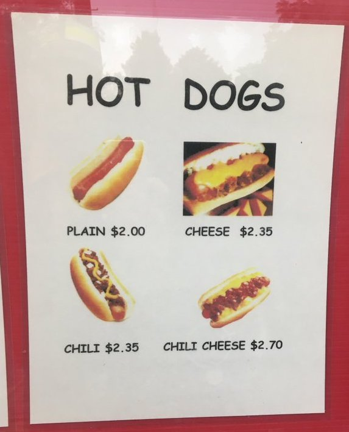
</figure>
]

???

- Cheese effect: 0.35
- Chili effect: 0.35
- Chili × cheese effect: 0

https://twitter.com/kevin_stange/status/1186056025897684992


---

.pull-left[

.center[
<figure>
  
</figure>
]

.small-code[
```{r hotdogs-data, echo=FALSE}
hotdogs <- tribble(
  ~price, ~cheese, ~chili,
  2.00,   FALSE,   FALSE,
  2.35,   TRUE,    FALSE,
  2.35,   FALSE,   TRUE,
  2.70,   TRUE,    TRUE
)
```

```{r show-hotdogs-data}
hotdogs
```
]
]

--

.pull-right.small-code[
```{r hotdogs-diff-diff}
model_hotdogs <- 
  lm(price ~ cheese + chili + 
       cheese * chili, 
     data = hotdogs)
```

```{r show-hotdogs-diff-diff-fake, eval=FALSE}
tidy(model_hotdogs)
```

```{r show-hotdogs-diff-diff, echo=FALSE}
tidy(model_hotdogs) %>% 
  select(term, estimate) %>% 
  mutate(estimate = round(estimate, 2))
```
]

---

class: title title-6

# Hot dogs? I study education!

.box-inv-6.medium[Common applications of interactions]

--

.box-6[Effects among subgroups]

--

.box-6[Multiplicative treatment effects]

--

.box-6[Difference-in-differences]


---

class: title title-6

# Heterogeneous treatment effects

.center[
<figure>
  
</figure>
]

???

https://www.tandfonline.com/doi/full/10.1080/19345747.2023.2191604

https://www.brookings.edu/articles/does-instructing-students-at-the-right-level-truly-drive-the-impacts-of-targeted-remediation-programs/


---

.center[
<figure>
  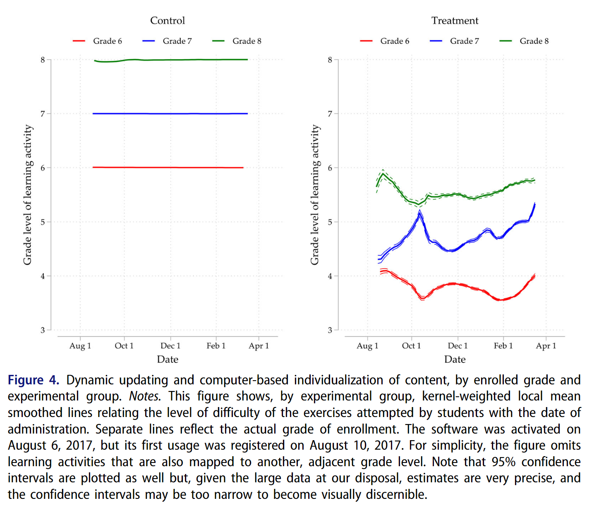
</figure>
]

.box-6.small[Do students further behind benefit more from individualized instruction?]

---

.center[
<figure>
  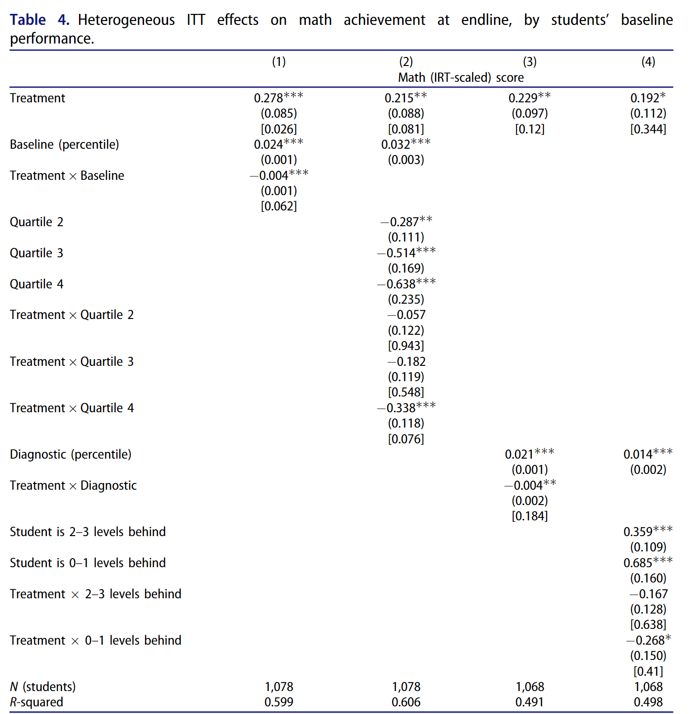
</figure>
]

---

class: title title-6

# Effects among discrete subgroups

.center[
<figure>
  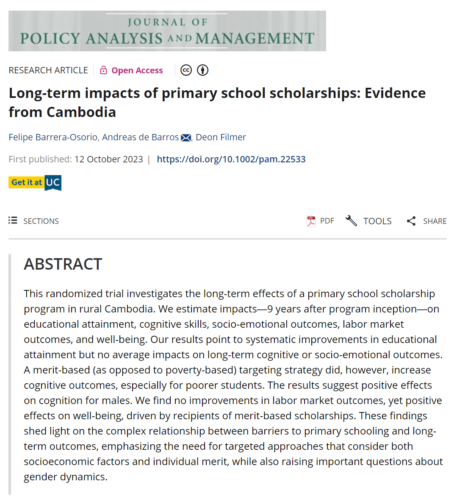
</figure>
]

???

We set out to discover whether scholarships could help third- and fourth-grade students in rural, impoverished areas of Cambodia attend and stay in primary school. More than that, we wanted to know which type of scholarship worked better — a merit scholarship, awarded based on academic achievement, or poverty scholarships, awarded according to highest financial need. Our research followed-up on these children 9 later, when they had reached young adulthood.

https://onlinelibrary.wiley.com/doi/full/10.1002/pam.22533

https://www.gse.harvard.edu/news/uk/19/02/scholarships-balance-equity-and-efficacy

https://blogs.worldbank.org/developmenttalk/power-label-merit-scholarships-vs-needs-based-scholarships


---

.center[
<figure>
  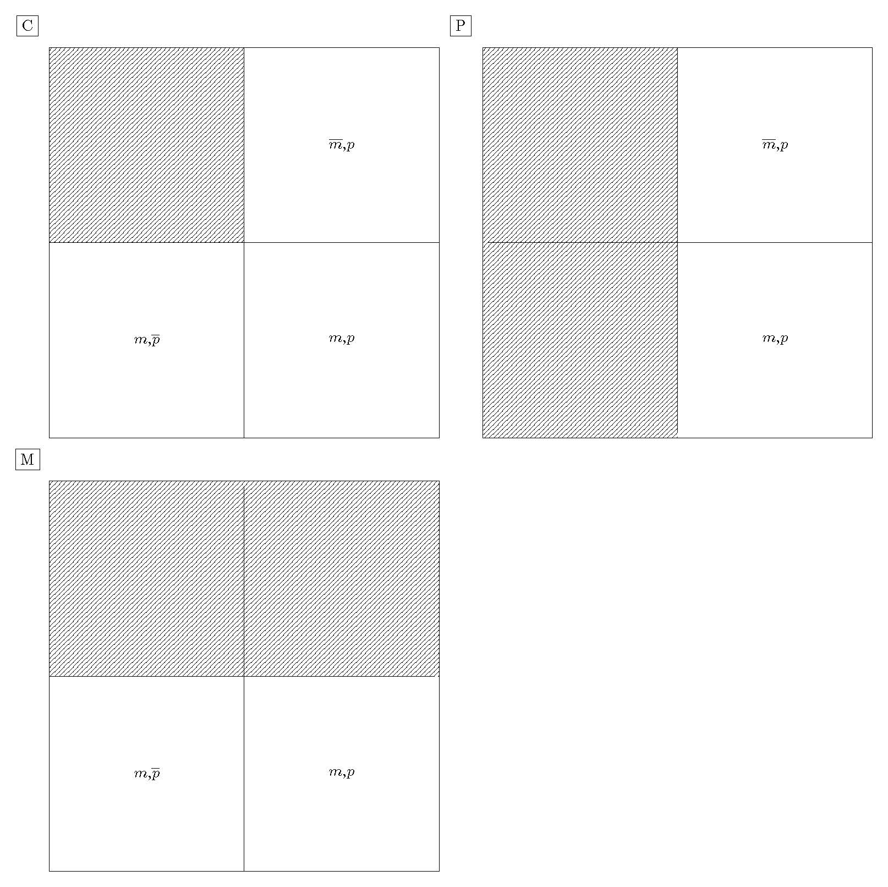
</figure>
]

.box-6.small[Does the "merit" (vs. "poverty") label of a scholarship increase its effect?]


---

.center[
<figure>
  
</figure>
]

.box-6.small[Does the "merit" (vs. "poverty") label of a scholarship increase its effect?]


---

class: title title-6

# Multiplicative treatment effects

.center[
<figure>
  
</figure>
]

---

.center[
<figure>
  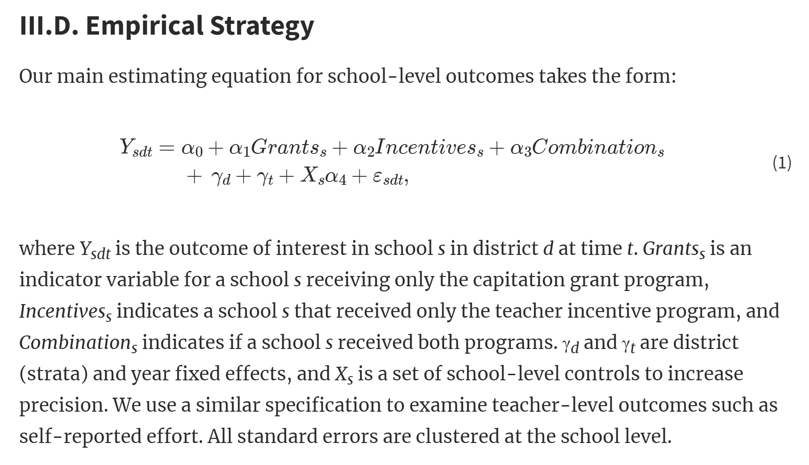
</figure>
]


---

class: title title-6

# A word of caution

.center[
<figure>
  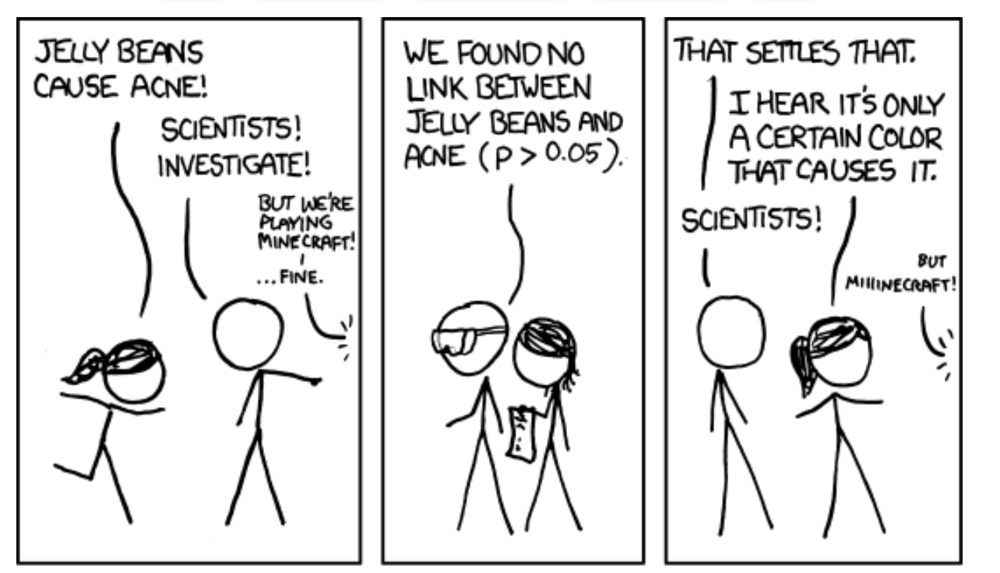
</figure>
]

---

.center[
<figure>
  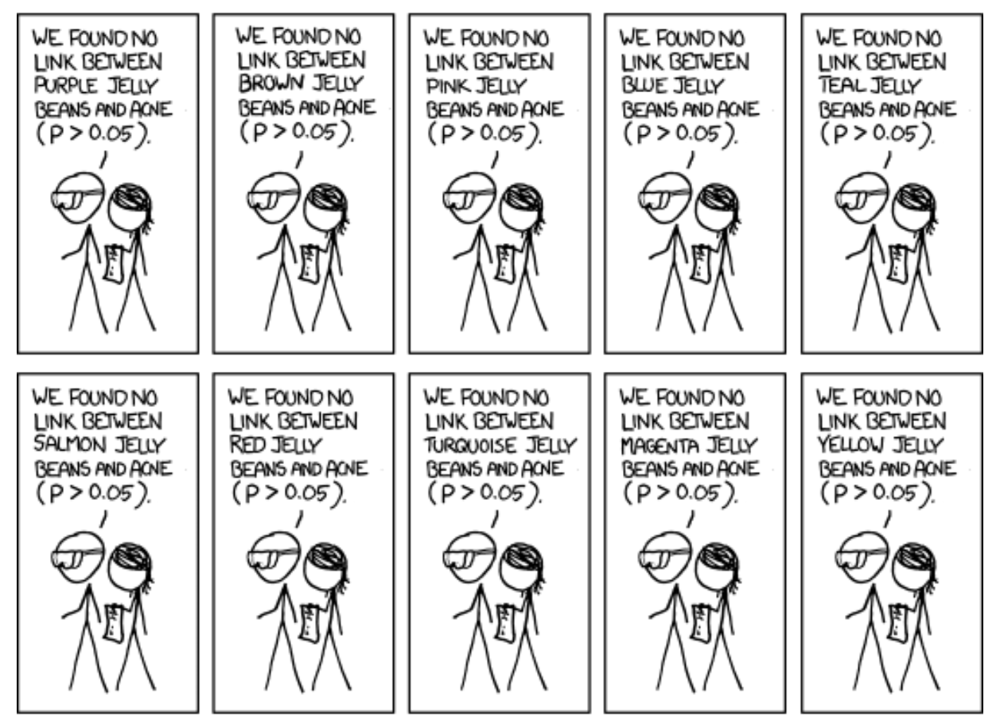
</figure>
]

---

.center[
<figure>
  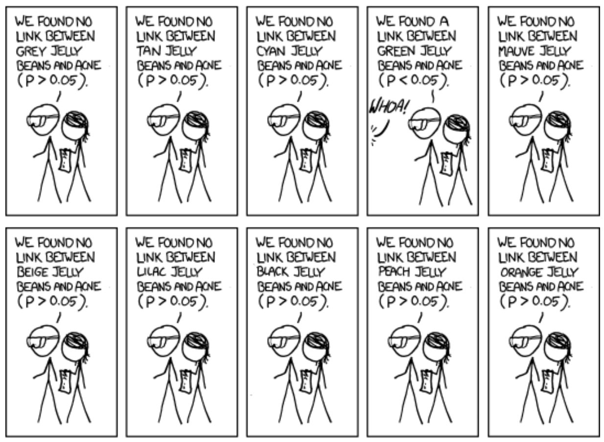
</figure>
]

---

.center[
<figure>
  
</figure>
]


---

layout: false
name: polynomials-regression
class: center middle section-title section-title-7 animated fadeIn

# Polynomials

---

layout: true
class: title title-7

---

# 🍪 Remember? 🍪

```{r make-cookies, include=FALSE}
cookies <- tibble(happiness = c(0.5, 2, 1, 2.5, 3, 1.5, 2, 2.5, 2, 3),
                  cookies = 1:10)

cookies_data <- cookies
cookies_model <- lm(happiness ~ cookies, data = cookies)
cookies_fitted <- augment(cookies_model)
```

.center[

```{r echo=FALSE}
cookies
```

]

---

layout: false

```{r cookies-base, echo=FALSE, message=FALSE, fig.dim=c(8, 4), out.width="100%"}
cookies_base <- ggplot(cookies_fitted, aes(x = cookies, y = happiness)) +
  geom_point(size = 3) +
  coord_cartesian(xlim = c(0, 10), ylim = c(0, 3)) +
  scale_x_continuous(breaks = 0:10) +
  labs(x = "Cookies eaten", y = "Level of happiness") +
  theme_minimal(base_size = 14) +
  theme(panel.grid.minor = element_blank(),
        plot.title = element_text(face = "bold"))

cookies_base
```
---

```{r cookies-spline, echo=FALSE, message=FALSE, fig.dim=c(8, 4), out.width="80%"}
cookies_base +
  geom_smooth(method = lm, color = "#0074D9", formula = y ~ splines::bs(x, 7), se = FALSE)
```

  
.box-7.small[Spline function with 7 degrees of freedom]

.box-7.small["ah, you mean a Flapdoodle with 3 tickle points?" 🤷️]


---

```{r cookies-lm, echo=FALSE, message=FALSE, fig.dim=c(8, 4), out.width="80%"}
cookies_base +
  geom_smooth(method = lm, color = "#0074D9", formula = y ~ poly(x, 1), se = FALSE)
```


.box-7.small[$$\beta_1 x$$]

---

```{r cookies-squared, echo=FALSE, message=FALSE, fig.dim=c(8, 4), out.width="80%"}
cookies_base +
  geom_smooth(method = lm, color = "#0074D9", formula = y ~ poly(x, 2), se = FALSE)
```


.box-7.small[$$\beta_1 x + \beta_2 x^2$$]

---

```{r cookies-cubed, echo=FALSE, message=FALSE, fig.dim=c(8, 4), out.width="80%"}
cookies_base +
  geom_smooth(method = lm, color = "#0074D9", formula = y ~ poly(x, 3), se = FALSE)
```


.box-7.small[$$\beta_1 x + \beta_2 x^2 + \beta_3 x^3$$] 


---


```{r cookies-marginal, echo=FALSE, message=FALSE, fig.dim=c(8, 4), out.width="80%"}

model_sq <- lm(happiness ~ cookies + I(cookies^2) + I(cookies^3),
               data = cookies)

civ_lib1 <- tidy(model_sq) |> filter(term == "civil_liberties") |> pull(estimate)
civ_lib2 <- tidy(model_sq) |> filter(term == "I(civil_liberties^2)") |> pull(estimate)
civ_lib3 <- tidy(model_sq) |> filter(term == "I(civil_liberties^3)") |> pull(estimate)

# Make a little function to do the math
civ_lib_slope <- function(x) civ_lib1 + (2 * civ_lib2 * x) + (3 * civ_lib2 * x * x)

civ_lib_slope(c(2, 8, 5))

tidy(model_sq)
```


.box-7.small[$$\beta_1 x + \beta_2 x^2 + \beta_3 x^3$$] 


---

```{r cookies-marginal2, echo=FALSE, message=FALSE, fig.dim=c(8, 4), out.width="80%"}

# Helpful functions
# -------------------
# Format numbers in pretty ways
nice_number <- label_number(style_negative = "minus", accuracy = 0.01)
nice_p <- label_pvalue(prefix = c("p < ", "p = ", "p > "))

# Point-slope formula: (y - y1) = m(x - x1)
find_intercept <- function(x1, y1, slope) {
  intercept <- slope * (-x1) + y1
  return(intercept)
}

# Use the Johnson color palette
clrs <- met.brewer("Johnson")

# Visualization settings
# ------------------------

# Custom ggplot theme to make pretty plots
# Get IBM Plex Sans Condensed at https://fonts.google.com/specimen/IBM+Plex+Sans+Condensed
theme_mfx <- function() {
  theme_minimal(base_family = "IBM Plex Sans Condensed") +
    theme(panel.grid.minor = element_blank(),
          plot.background = element_rect(fill = "white", color = NA),
          plot.title = element_text(face = "bold"),
          axis.title = element_text(face = "bold"),
          strip.text = element_text(face = "bold"),
          strip.background = element_rect(fill = "grey80", color = NA),
          legend.title = element_text(face = "bold"))
}

# Make labels use IBM Plex Sans by default
update_geom_defaults("label", 
                     list(family = "IBM Plex Sans Condensed"))
update_geom_defaults(ggtext::GeomRichText, 
                     list(family = "IBM Plex Sans Condensed"))
update_geom_defaults("label_repel", 
                     list(family = "IBM Plex Sans Condensed"))


model_sq <- lm(happiness ~ cookies + I(cookies^2) + I(cookies^3),
               data = cookies_data)

civ_lib1 <- tidy(model_sq) |> filter(term == "cookies") |> pull(estimate)
civ_lib2 <- tidy(model_sq) |> filter(term == "I(cookies^2)") |> pull(estimate)
civ_lib3 <- tidy(model_sq) |> filter(term == "I(cookies^3)") |> pull(estimate)

# Make a little function to do the math
civ_lib_slope <- function(x) civ_lib1 + (2 * civ_lib2 * x) + (3 * civ_lib3 * (x^2))

# civ_lib_slope(c(2, 5, 8))

tangents <- model_sq |> 
  augment(newdata = tibble(cookies = c(2, 5, 8))) |> 
  mutate(slope = civ_lib_slope(cookies),
         intercept = find_intercept(cookies, .fitted, slope)) |> 
  mutate(nice_label = glue("Cookies: {cookies}<br>",
                           "Fitted happiness: {nice_number(.fitted)}<br>",
                           "Slope: **{nice_number(slope)}**"))

ggplot(cookies_data, aes(x = cookies, y = happiness)) +
  geom_point(color = "grey30") +
  stat_smooth(method = "lm", formula = y ~ x + I(x^2) + I(x^3), linewidth = 1, se = FALSE, color = clrs[4]) +
  geom_abline(data = tangents, aes(slope = slope, intercept = intercept), 
              linewidth = 0.5, color = clrs[2], linetype = "21") +
  geom_point(data = tangents, aes(x = cookies, y = .fitted), size = 4, shape = 18, color = clrs[2]) +
  geom_richtext(data = tangents, aes(x = cookies, y = .fitted, label = nice_label), nudge_y = -.5) +
  labs(x = "Cookies", y = "Happiness") +
  scale_x_continuous(breaks = seq(0, 10, 1)) +
  expand_limits(x = c(0, 10), y = c(0, NA)) +
  theme_mfx()


```


.box-7.small[$$\beta_1 x + \beta_2 x^2 + \beta_3 x^3$$] 


---

name: outline
class: title title-8

# Plan for next class

--

.box-8.medium[**Practice assignments**]

.box-inv-8.small[Attend the lab today, Assignment 3 due Tuesday night]

.box-inv-8.tiny[Consider re-submitting Assignment 1, due at the same time]

--

.box-8.medium[**Reading reactions**]

.box-inv-8.small.sp-after[Engage on Perusall, due Wednesday night]

--

.box-8.medium[**Keep working on Milestone 1**]

.box-inv-8.small.sp-after[Due Feb 04]


