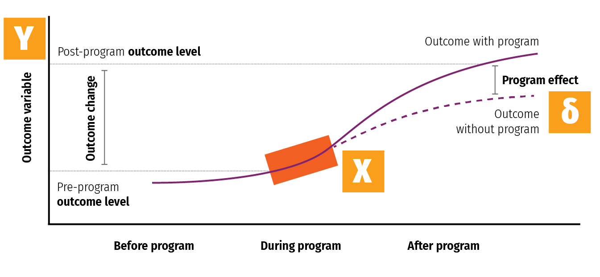
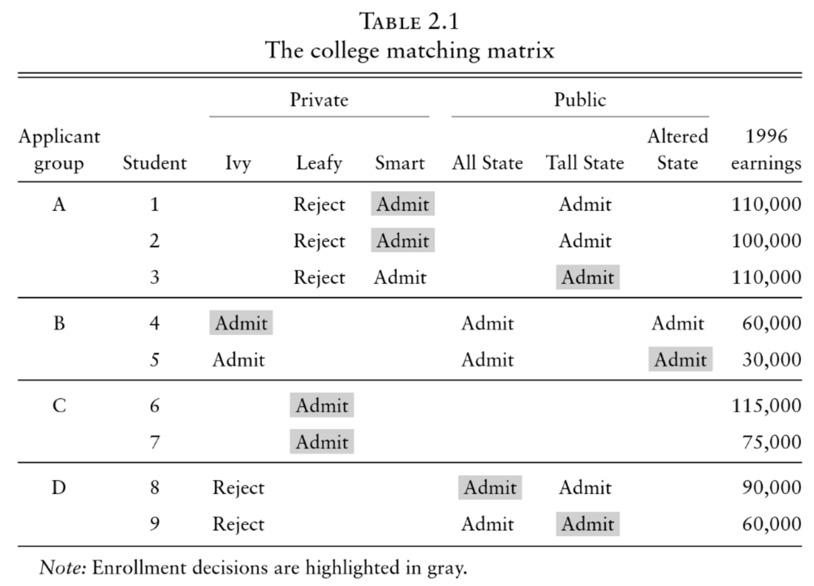
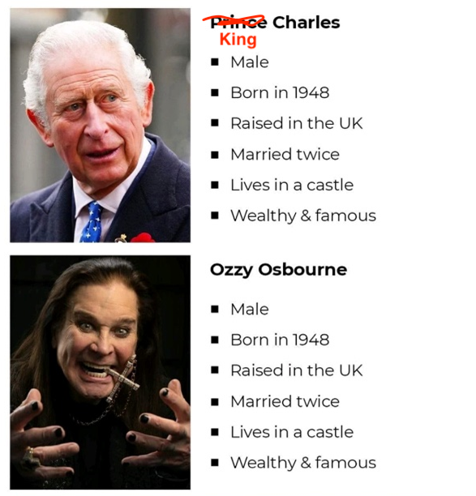

```{r setup, include=FALSE}
knitr::opts_chunk$set(warning = FALSE, message = FALSE, 
                      fig.retina = 3, fig.align = "center")

```

```{r packages-data, include=FALSE}
library(htmltools)
library(tidyverse)
library(ggdag)
library(broom)
```

```{r xaringanExtra, echo=FALSE}
xaringanExtra::use_xaringan_extra(c("tile_view"))
```

class: center middle main-title section-title-4

# Discrete outcomes and<br>regression adjustment

.class-info[

**Class 4**

.light[EDUC 265: Applied Regression Analysis<br>
UCI School of Education
]

]

---

layout: false
name: potential-outcomes
class: center middle section-title section-title-6 animated fadeIn

# Potential outcomes

---

layout: false
class: bg-full
background-image: url("img/05/spiderman.jpg")

---

layout: false
class: bg-full
background-image: url("img/05/multiverse.jpg")

---

layout: true
class: title title-6


---

# Program effect

<figure>
  
</figure>

---

# Some equation translations

.box-inv-6.medium[Causal effect = δ (delta)]

$$
\delta = P[Y\ |\ do(X)]
$$

--

$$
\delta = E[Y\ |\ do(X)] - E[Y\ |\ \hat{do}(X)]
$$

--

$$
\delta = (Y\ |\ X = 1) - (Y\ |\ X = 0)
$$

--

$$
\delta = Y_1 - Y_0
$$


---


layout: true
class: title title-6

---

layout: false

.box-6.large[Fundamental problem<br>of causal inference]

$$
\delta_i = Y_i^1 - Y_i^0 \quad \text{in real life is} \quad \delta_i = Y_i^1 - ???
$$

.box-inv-6[Individual-level effects are impossible to observe!]

.box-inv-6[There are no individual counterfactuals!]

---


layout: true
class: title title-6

---

# Average treatment effect (ATE)

.box-inv-6.medium[Solution: Use averages instead]

$$
\text{ATE} = E(Y_1 - Y_0) = E(Y_1) - E(Y_0)
$$

--

.box-6[Difference between average/expected value when<br>program is on vs. expected value when program is off]

$$
\delta = (\bar{Y}\ |\ P = 1) - (\bar{Y}\ |\ P = 0)
$$

---

layout: false

```{r po-table, echo=FALSE}
po <- tibble(
  Person = 1:8,
  Age = c("Old", "Old", "Old", "Old", "Young", "Young", "Young", "Young"),
  Treated = c(TRUE, TRUE, TRUE, FALSE, TRUE, FALSE, FALSE, FALSE),
  Y1 = c(80, 75, 85, 70, 75, 80, 90, 85),
  Y0 = c(60, 70, 80, 60, 70, 80, 100, 80)
) %>% 
  mutate(delta = Y1 - Y0) %>% 
  mutate(actual = ifelse(Treated, Y1, Y0)) %>% 
  mutate(`Outcome<br>with program` = ifelse(Treated, paste0("**", Y1, "**"), Y1),
         `Outcome<br>without program` = ifelse(!Treated, paste0("**", Y0, "**"), Y0),
         Effect = paste0("**", delta, "**"))
```

.small[
```{r basic-po, echo=FALSE}
po %>% 
  select(Person, Age, Treated, starts_with("Outcome"), Effect) %>% 
  knitr::kable(align = "cccccc")
```
]

---

.smaller.sp-after[
```{r basic-po1, echo=FALSE}
po %>% 
  select(Person, Age, Treated, starts_with("Outcome"), Effect) %>% 
  knitr::kable(align = "cccccc")
```
]

.pull-left.small[
$\delta = (\bar{Y}\ |\ P = 1) - (\bar{Y}\ |\ P = 0)$
]

.pull-right.small[
$\text{ATE} = \frac{20 + 5 + 5 + 5 + 10 + 0 + -10 + 5}{8} = 5$
]

---

class: title title-6

# CATE

.box-inv-6.sp-after[ATE in subgroups]

--

.box-6.medium[Is the program more<br>effective for specific age groups?]

---

.smaller.sp-after[
```{r basic-po-cate, echo=FALSE}
po %>% 
  select(Person, Age, Treated, starts_with("Outcome"), Effect) %>% 
  knitr::kable(align = "cccccc")
```
]

.pull-left.small[
$\delta = (\bar{Y}_\text{O}\ |\ P = 1) - (\bar{Y}_\text{O}\ |\ P = 0)$

$\delta = (\bar{Y}_\text{Y}\ |\ P = 1) - (\bar{Y}_\text{Y}\ |\ P = 0)$
]

.pull-right.small[
$\text{CATE}_\text{Old} = \frac{20 + 5 + 5 + 10}{4} = 10$

$\text{CATE}_\text{Young} = \frac{5 + 0 - 10 + 5}{4} = 0$
]

---

class: title title-6

# ATT and ATU

.box-inv-6.medium[Average treatment on the treated]

.box-6[ATT / TOT]

.box-6[Effect for those with treatment]

--

.box-inv-6.medium[Average treatment on the untreated]

.box-6[ATU / TUT]

.box-6[Effect for those without treatment]

---

.smaller.sp-after[
```{r basic-po-att, echo=FALSE}
po %>% 
  select(Person, Age, Treated, starts_with("Outcome"), Effect) %>% 
  knitr::kable(align = "cccccc")
```
]

.pull-left.small[
$\delta = (\bar{Y}_\text{T}\ |\ P = 1) - (\bar{Y}_\text{T}\ |\ P = 0)$

$\delta = (\bar{Y}_\text{U}\ |\ P = 1) - (\bar{Y}_\text{U}\ |\ P = 0)$
]

.pull-right.small[
$\text{CATE}_\text{Treated} = \frac{20 + 5 + 5 + 5}{4} = 8.75$

$\text{CATE}_\text{Untreated} = \frac{10 + 0 - 10 + 5}{4} = 1.25$
]

---

layout: true
class: title title-6

---

# ATE, ATT, and ATU

.box-inv-6.medium.sp-after[The ATE is the weighted average<br>of the ATT and ATU]

--

.center[
$\text{ATE} = (\pi_\text{Treated} \times \text{ATT}) + (\pi_\text{Untreated} \times \text{ATU})$

$(\frac{4}{8} \times 8.75) + (\frac{4}{8} \times 1.25)$

$4.375 + 0.625 = 5$
]

.box-6.smaller[**π** here means "proportion," not 3.1415]

---

# Selection bias

.box-inv-6.medium[ATE and ATT aren't always the same]

.box-inv-6.medium[ATE = ATT + Selection bias]

$$
\begin{aligned}
5 &= 8.75 + x \\
x &= -3.75
\end{aligned}
$$

.box-6[Randomization fixes this, makes x = 0]

---

# Actual data

.pull-left.smaller[
```{r po-actual, echo=FALSE}
po %>% 
  select(Person, Age, Treated, `Actual outcome` = actual) %>% 
  knitr::kable(align = "cccc")
```
]

.pull-right[
.box-inv-6[Treatment not<br>randomly assigned]

.box-inv-6[We can't see<br>unit-level causal effects]

.box-6[What do we do?!]
]

---

# Actual data

.pull-left.smaller[
```{r po-actual1, echo=FALSE}
po %>% 
  select(Person, Age, Treated, `Actual outcome` = actual) %>% 
  knitr::kable(align = "cccc")
```
]

.pull-right[
.box-inv-6[Treatment seems to be correlated with age]

```{r po-dag, echo=FALSE, fig.width=5, fig.height=3.2, out.width="100%"}
dagify(outcome ~ treatment + age,
       treatment ~ age,
       coords = list(
         x = c(outcome = 3, treatment = 1, age = 2),
         y = c(outcome = 1, treatment = 1, age = 2)
       ),
       labels = c(treatment = "Treatment", 
                  outcome = "Outcome", 
                  age = "Age"),
       exposure = "treatment",
       outcome = "outcome") %>% 
  tidy_dagitty() %>% 
  node_status() %>% 
  ggplot(aes(x = x, y = y, xend = xend, yend = yend)) +
  geom_dag_edges() +
  geom_dag_point(aes(color = status)) +
  geom_dag_label_repel(aes(label = label), nudge_y = 0.1, seed = 1234) +
  scale_color_manual(values = c("#F012BE", "#3D9970"), na.value = "grey80") +
  guides(color = FALSE) +
  theme_dag()
```
]

---

# Actual data

.pull-left.tiny[
```{r po-actual2, echo=FALSE}
po %>% 
  select(Person, Age, Treated, `Actual outcome` = actual) %>% 
  knitr::kable(align = "cccc")
```
]

.pull-right[
.box-inv-6[We can estimate the ATE by finding the weighted average of age-based CATEs]

.box-inv-6.tiny[As long as we assume/pretend treatment was randomly assigned within each age = unconfoundedness]

]

&nbsp;

.center[
$\widehat{\text{ATE}} = \pi_\text{Old} \widehat{\text{CATE}_\text{Old}} + \pi_\text{Young} \widehat{\text{CATE}_\text{Young}}$
]

---

# Actual data

.center.sp-after[
$\color{#FF851B}{\widehat{\text{ATE}}} = \pi_\text{Old} \color{#2ECC40}{\widehat{\text{CATE}_\text{Old}}} + \pi_\text{Young} \color{#0074D9}{\widehat{\text{CATE}_\text{Young}}}$
]

.pull-left-narrow.tiny[
```{r po-actual3, echo=FALSE}
po %>% 
  select(Person, Age, Treated, `Actual outcome` = actual) %>% 
  knitr::kable(align = "cccc")
```
]

.pull-right-wide.small[
&nbsp;

$\color{#2ECC40}{\widehat{\text{CATE}_\text{Old}}} = \frac{80 + 75 + 85}{3} - \frac{60}{1} = \color{#2ECC40}{20}$

$\color{#0074D9}{\widehat{\text{CATE}_\text{Young}}} = \frac{75}{1} - \frac{80 + 100 + 80}{3} = \color{#0074D9}{-11.667}$

$\color{#FF851B}{\widehat{\text{ATE}}} = (\frac{4}{8} \times \color{#2ECC40}{20}) + (\frac{4}{8} \times \color{#0074D9}{-11.667}) = \color{#FF851B}{4.1667}$
]

---

# ¡¡¡DON'T DO THIS!!!

.center.sp-after[
$\color{#FF851B}{\widehat{\text{ATE}}} = \color{#F012BE}{\widehat{\text{CATE}_\text{Treated}}} - \color{#AAAAAA}{\widehat{\text{CATE}_\text{Untreated}}}$
]

.pull-left-narrow.tiny[
```{r po-actual4, echo=FALSE}
po %>% 
  select(Person, Age, Treated, `Actual outcome` = actual) %>% 
  knitr::kable(align = "cccc")
```
]

.pull-right-wide.small.center[
$\color{#F012BE}{\widehat{\text{CATE}_\text{Treated}}} = \frac{80 + 75 + 85 + 75}{4} = \color{#F012BE}{78.75}$

$\color{#AAAAAA}{\widehat{\text{CATE}_\text{Untreated}}} = \frac{60 + 80 + 100 + 80}{4} = \color{#AAAAAA}{80}$

$\color{#FF851B}{\widehat{\text{ATE}}} = \color{#F012BE}{78.75} - \color{#AAAAAA}{80} = \color{#FF851B}{-1.25}$

&nbsp;

.box-6[You can only do this if treatment is random!]
]


---

# Matching and ATEs

.center[
$\widehat{\text{ATE}} = \pi_\text{Old} \widehat{\text{CATE}_\text{Old}} + \pi_\text{Young} \widehat{\text{CATE}_\text{Young}}$
]

.pull-left-wide[
.box-inv-6[We used age here because it correlates with (and confounds) the outcome]

.box-6.small[And we assumed unconfoundedness;<br>that treatment is<br>randomly assigned within the groups]
]

.pull-right-narrow[
`)
]

---

layout: false

.pull-left-narrow[
&nbsp;

&nbsp;

.box-6[Does attending a private university cause an increase in earnings?]
]

.pull-right-wide[
<figure>
  
</figure>
]

---

.pull-left-wide[
<figure>
  
</figure>
]

.pull-right-narrow[
.box-6[This is tempting!]

.box-inv-6[Average private − Average public]

.tiny[
$$
\begin{aligned}
\frac{110 + 100 + 60 + 115 + 75}{5} &= \color{#0074D9}{92} \\
\frac{110 + 30 + 90 + 60}{4} &= \color{#2ECC40}{72.5} \\
(\color{#0074D9}{92} \times \color{#7FDBFF}{\frac{5}{9}}) - (\color{#2ECC40}{72.5} \times \color{#01FF70}{\frac{4}{9}}) &= \color{#FF851B}{18,888}
\end{aligned}
$$
]

.box-6[**This is wrong!**]
]

.center[
$\color{#FF851B}{\widehat{\text{ATE}}} = \color{#7FDBFF}{\pi_\text{Private}} \color{#0074D9}{\widehat{\text{CATE}_\text{Private}}} + \color{#01FF70}{\pi_\text{Public}} \color{#2ECC40}{\widehat{\text{CATE}_\text{Public}}}$
]

---

class: title title-6

# Grouping and matching

.pull-left[
<figure>
  
</figure>
]

.pull-right[
.box-inv-6[These groups look like they have similar characteristics]

.box-inv-6.tiny[Unconfoundedness?]

```{r match-dag, echo=FALSE, fig.width=5, fig.height=3.2, out.width="80%"}
dagify(outcome ~ treatment + characteristics,
       treatment ~ characteristics,
       coords = list(
         x = c(outcome = 3, treatment = 1, characteristics = 2),
         y = c(outcome = 1, treatment = 1, characteristics = 2)
       ),
       labels = c(treatment = "Private university", 
                  outcome = "Income", 
                  characteristics = "Student characteristics (group)"),
       exposure = "treatment",
       outcome = "outcome") %>% 
  tidy_dagitty() %>% 
  node_status() %>% 
  ggplot(aes(x = x, y = y, xend = xend, yend = yend)) +
  geom_dag_edges() +
  geom_dag_point(aes(color = status)) +
  geom_dag_label_repel(aes(label = label), nudge_y = 0.1, seed = 1234) +
  scale_color_manual(values = c("#F012BE", "#3D9970"), na.value = "grey80") +
  guides(color = FALSE) +
  theme_dag()
```
]

---

.pull-left-wide[
<figure>
  
</figure>
]

.pull-right-narrow[
.box-inv-6[CATE Group A + CATE Group B]

.tiny[
$$
\begin{aligned}
\frac{110 + 100}{2} - 110 &= \color{#0074D9}{-5,000} \\
60 - 30 &= \color{#2ECC40}{30,000} \\
(\color{#0074D9}{-5} \times \color{#7FDBFF}{\frac{3}{5}}) + (\color{#2ECC40}{30} \times \color{#01FF70}{\frac{2}{5}}) &= \color{#FF851B}{9,000}
\end{aligned}
$$
]

.box-6[**This is less wrong!**]
]

.center[
$\color{#FF851B}{\widehat{\text{ATE}}} = \color{#7FDBFF}{\pi_\text{Group A}} \color{#0074D9}{\widehat{\text{CATE}_\text{Group A}}} + \color{#01FF70}{\pi_\text{Group B}} \color{#2ECC40}{\widehat{\text{CATE}_\text{Group B}}}$
]

---

class: title title-6

# Matching with regression

```{r schools-earnings, echo=FALSE, warning=FALSE, message=FALSE}
schools <- read_csv("data/public_private_earnings.csv") %>% 
  mutate(private = ifelse(str_detect(enrolled, "ivy"), TRUE, FALSE)) %>% 
  mutate(group_A = ifelse(group == "A", TRUE, FALSE))

# Only look at groups A and B, since C and D don't have people in both public
# and private schools. | means "or"
schools_small <- schools %>% 
  filter(group == "A" | group == "B")
```


$$
\text{Earnings} = \alpha + \beta_1 \text{Private} + \beta_2 \text{Group} + \epsilon
$$

--

.small-code.center[
```{r model-earnings-fake, eval=FALSE}
model_earnings <- lm(earnings ~ private + group_A, data = schools_small)
```
]

--

.small[
```{r model-earnings-results, echo=FALSE}
lm(earnings ~ private + group_A, data = schools_small) %>% 
  tidy() %>% 
  mutate(across(where(is.numeric), ~round(., 2))) %>% 
  knitr::kable()
```
]

--

.center.float-left[
.box-6[β<sub>1</sub> = $10,000]&emsp;.box-6[This is less wrong!]&emsp;.box-6[Significance details!]
]

---

layout: false

.center[
<figure>
  
</figure>
]

