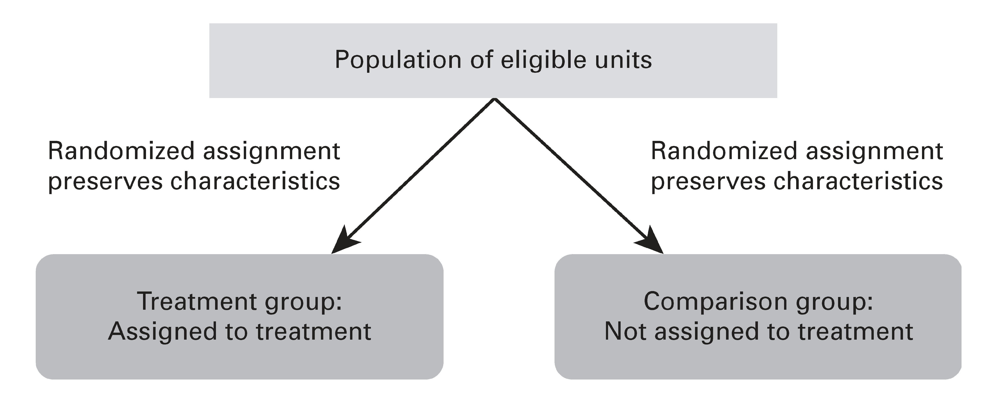

```{r setup, include=FALSE}
knitr::opts_chunk$set(warning = FALSE, message = FALSE, 
                      fig.retina = 3, fig.align = "center")
```

```{r packages-data, include=FALSE}
library(tidyverse)
library(infer)
library(broom)
library(ggdag)
library(MatchIt)
```

```{r xaringanExtra, echo=FALSE}
xaringanExtra::use_xaringan_extra(c("tile_view"))
```

class: center middle main-title section-title-4

# Randomized experiments

.class-info[

**Class 5 - Part 2**

.light[EDUC 265: Applied Regression Analysis<br>
UCI School of Education
]

]

---

name: outline
class: title title-8

# Plan for this section

--

.box-1.medium.sp-after-half[The magic of randomization]

--

.box-3.medium.sp-after-half[How to randomize]

--

.box-6.medium.sp-after-half[How to analyze randomized experiments]

---

name: magic-randomization
class: center middle section-title section-title-1 animated fadeIn

# The magic<br>of randomization

---

layout: true
class: title title-1

---

# Why randomize?

.box-1.large[Fundamental problem<br>of causal inference]

$$
\delta_i = Y_i^1 - Y_i^0 \quad \text{in real life is} \quad \delta_i = Y_i^1 - ???
$$

.box-inv-1[Individual-level effects are impossible to observe!]

.box-inv-1[There are no individual counterfactuals!]

---

# Why randomize?

.medium[
$$
\delta = (\bar{Y}\ |\ P = 1) - (\bar{Y}\ |\ P = 0)
$$
]

--

.box-inv-1.medium[Comparing average outcomes only works<br>if groups that received/didn't receive<br>treatment look the same]

---

# Why randomize?

.box-inv-1[With big enough samples, the magic of randomization<br>helps make comparison groups comparable]

.center[
<figure>
  
</figure>
]

---

# RCTs and DAGs

.pull-left[
.box-1.smaller[Observational DAG]
```{r observational-dag, echo=FALSE, fig.width=4, fig.height=2.4, out.width="90%"}
dagify(
  Y ~ X + Z,
  X ~ Z,
  coords = list(x = c(X = 1, Y = 2, Z = 1.5),
                y = c(X = 1, Y = 1, Z = 2)),
  labels = c(X = "Tutoring", Y = "Student performance", Z = "Income")
) %>% 
  ggplot(aes(x = x, y = y, xend = xend, yend = yend)) +
  geom_dag_edges() +
  geom_dag_point(color = "black", size = 11) +
  geom_dag_label_repel(aes(label = label),
                      nudge_x = 0, nudge_y = 0.25,
                      color = "black", 
                      fontface = "bold", lineheight = 0.95, seed = 1234) +
  theme_dag()
```
]

--

.pull-right[
.box-1.smaller[Experimental DAG]
```{r experimental-dag, echo=FALSE, fig.width=4, fig.height=2.4, out.width="90%"}
dagify(
  Y ~ X + Z,
  coords = list(x = c(X = 1, Y = 2, Z = 1.5),
                y = c(X = 1, Y = 1, Z = 2)),
  labels = c(X = "Tutoring", Y = "Student performance", Z = "Income")
) %>% 
  ggplot(aes(x = x, y = y, xend = xend, yend = yend)) +
  geom_dag_edges() +
  geom_dag_point(color = "black", size = 11) +
  geom_dag_label_repel(aes(label = label),
                      nudge_x = 0, nudge_y = 0.25,
                      color = "black", 
                      fontface = "bold", lineheight = 0.95, seed = 1234) +
  theme_dag()
```
]

--

.box-inv-1.small[When you *do*() X, delete all arrows into X; **confounders don't influence treatment!**]

---

layout: false
name: rct-howrand
class: center middle section-title section-title-3 animated fadeIn

# How to randomize

---

layout: true
class: title title-3

---

# How to randomize?

.center[
<figure>
  
</figure>
]

---

# Randomization devices

.box-inv-3.medium[Coins]

--

.box-inv-3.medium[Dice]

--

.box-inv-3.medium[Unbiased lottery]

--

.box-inv-3.medium[Random numbers + threshold]

--

.box-inv-3.medium[Atmospheric noise]

.box-3.tiny[random.org]

---

# Ingredients of random assignment

.box-inv-3.less-medium[List of eligible units]

--

.box-inv-3.less-medium[Number of experimental "arms"]

--

.box-inv-3.less-medium[Allocation fractions]

--

.box-inv-3.less-medium[A randomization device]

--

.box-inv-3.less-medium[Optional: Baseline data]

.center.float-left[
.box-3.tiny[Stratification] .box-3.tiny[Balance check]
]

---

# Practical decisions

.box-inv-3.less-medium[What is randomized?]

.center.float-left[
.box-3.tiny[Program vs no program] .box-3.tiny[Components vs bundle] .box-3.tiny[A/B versions] .box-3.tiny[Modality] .box-3.tiny[Intensity] 
]


--

.box-inv-3.less-medium[Level of randomization]

--

.box-inv-3.less-medium[Opportunities to randomize]

.center.float-left[
.box-3.tiny[Program expansion]  .box-3.tiny[Phase-in] .box-3.tiny[Oversubscription] .box-3.tiny[Undersubscription] .box-3.tiny[Rotation] .box-3.tiny[Admission cut-offs]
]

--

.box-inv-3.less-medium[Feasibility]

.center.float-left[
.box-3.tiny[Ethics]  .box-3.tiny[Politics] .box-3.tiny[Costs] .box-3.tiny[Timelines] .box-3.tiny[Communication] .box-3.tiny[Implementation]
]

---

layout: true
class: title title-3

---

# When to randomly assign

--

.box-inv-3[Demand for treatment exceeds supply]

--

.box-inv-3[Treatment will be phased in over time]

--

.box-inv-3[Treatment is in equipoise (genuine uncertainty)]

--

.box-inv-3[Local culture open to randomization]

--

.box-inv-3[When you're a nondemocratic monopolist]

--

.box-inv-3[When people won't know (and it's ethical!)]

--

.box-inv-3[When lotteries are going to happen anyway]

???

- When demand for treatment exceeds supply or treatment must be phased in over time (instead of doing the closest place first, etc.)
- When people don't know what they want to do = equipoise (medical trials have to be in equipoise - unethical to use a treatment that's clearly beneficial)
- When the local culture is favorable to random assignment - prime people to be more comfortable with it
- When you are a nondemocratic monopoly provider - if you're the only one with the treatment, you decide who gets it - like Google and Facebook and A/B testing
- When people won't know (as long as it's ethical) - resume name experiments, e-mails to politicians
- When lotteries are going to happen anyway


---

# When to <span style="color: #F6D645;">not</span> randomly assign

--

.box-inv-3[When you need immediate results]

--

.box-inv-3[When it's unethical or illegal]

--

.box-inv-3[When it's something that happened in the past]

--

.box-inv-3[When it involves universal ongoing phenomena]


???

Past: effects of city segregation or political regime type

Universal phenomena: climate change, social norms


---

layout: false
name: rct-how
class: center middle section-title section-title-6 animated fadeIn

# How to analyze<br>randomized experiments

---

layout: true
class: title title-6

---

# How to analyze RCTs

.box-inv-6.sp-after[Surprisingly easy, statistically!]

--

.box-6[Step 1: Check that key demographics<br>and other confounders are balanced]

--

.box-6[Step 2: Find difference in average outcome<br>in treatment and control groups]

---

# Example RCT

```{r imaginary-program, echo=FALSE}
set.seed(123)
fake_program_t <- tibble(person = 1:400, 
                         treatment = "Treatment",
                         age = round(rnorm(400, mean = 35, sd = 10), 0),
                         sex = sample(c("Male", "Female"), 400, replace = TRUE),
                         income_after = rnorm(400, mean = 250, sd = 70))

fake_program_c <- tibble(person = 401:800, 
                         treatment = "Control",
                         age = round(rnorm(400, mean = 35, sd = 10), 0),
                         sex = sample(c("Male", "Female"), 400, replace = TRUE),
                         income_after = rnorm(400, mean = 200, sd = 70))

imaginary_program <- bind_rows(fake_program_t, fake_program_c) %>% 
  sample_frac(1) %>% 
  mutate(male_num = ifelse(sex == "Male", 1, 0))
```

.small-code[
```{r show-imaginary-program}
imaginary_program
```
]

---

# 1. Check balance

```{r balance-table}
imaginary_program %>% 
  group_by(treatment) %>% 
  summarize(avg_age = mean(age),
            prop_male = mean(sex == "Male"))
```

---

# 1. Check balance

.left-code[
```{r balance-age, tidy=FALSE, message=FALSE, fig.show="hide", fig.dim=c(4.8, 4.2), out.width="100%"}
ggplot(imaginary_program, 
       aes(x = treatment, y = age, 
           color = treatment)) +
  stat_summary(geom = "pointrange", 
               fun.data = "mean_se", 
               fun.args = list(mult=1.96)) +
  guides(color = FALSE) +
  labs(x = NULL, y = "Age")
```
]

.right-plot[
`)
]

---

# 1. Check balance

.left-code[
```{r balance-sex, tidy=FALSE, message=FALSE, fig.show="hide", fig.dim=c(4.8, 4.2), out.width="100%"}
ggplot(imaginary_program, 
       aes(x = treatment, y = male_num, 
           color = treatment)) +
  stat_summary(geom = "pointrange", 
               fun.data = "mean_se", 
               fun.args = list(mult=1.96)) +
  guides(color = FALSE) +
  labs(x = NULL, y = "Proportion male")
```
]

.right-plot[
`)
]

---

# 2. Calculate difference


.left-code[
.box-inv-6.small[Group means]

```{r program-group-means}
imaginary_program %>% 
  group_by(treatment) %>% 
  summarize(avg_outcome = mean(income_after))

251 - 205
```
]

--

.right-code[
.box-inv-6.small[Regression]

```{r program-regression-fake, eval=FALSE}
rct_model <- lm(income_after ~ treatment, 
                data = imaginary_program)
tidy(rct_model)
```

```{r program-regression-real, echo=FALSE}
rct_model <- lm(income_after ~ treatment, 
                data = imaginary_program)
tidy(rct_model) %>% select(term, estimate, std.error)
```
]

---

# 2a. Show difference

.left-code[
```{r rct-diff, tidy=FALSE, message=FALSE, fig.show="hide", fig.dim=c(4.8, 4.2), out.width="100%"}
ggplot(imaginary_program, 
       aes(x = treatment, 
           y = income_after, 
           color = treatment)) +
  stat_summary(geom = "pointrange", 
               fun.data = "mean_se", 
               fun.args = list(mult=1.96)) +
  guides(color = FALSE) +
  labs(x = NULL, y = "Income")
```
]

.right-plot[
`)
]

---

# Should you control for stuff?

--

.box-6[No need!]

--

.box-6.small[All arrows into the treatment node are removed;<br>there's no confounding!]

--
  
.box-inv-6[But helpful]

--

.box-inv-6.small[You reduce standard errors (estimates won't change)]

--

.box-inv-6[Sometimes necessary]

--

.box-inv-6.small[Adjust for strata if you stratified randomization]


--

.box-inv-6[Just never for anything post-treatment]


---

name: outline
class: title title-8

# Plan for next class

--

.box-8.medium[**Reading reactions**]

.box-inv-8.small.sp-after[Submit on Perusall, due on Wednesday]

--

.box-8.medium[**Your paper**]

.box-inv-8.small[Look for my feedback at the end of the week]

--

.box-8.medium[**Exam in next week's lab session**]

.box-inv-8.small[Rough study guide posted]
