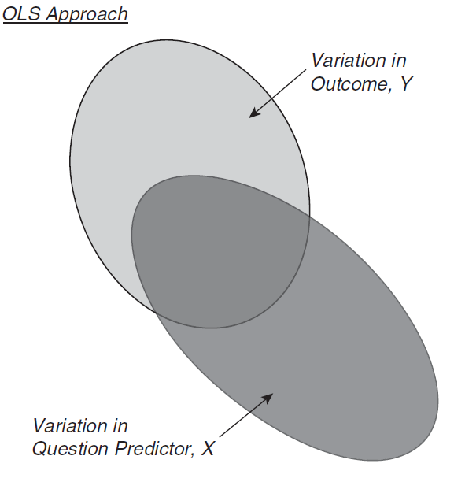
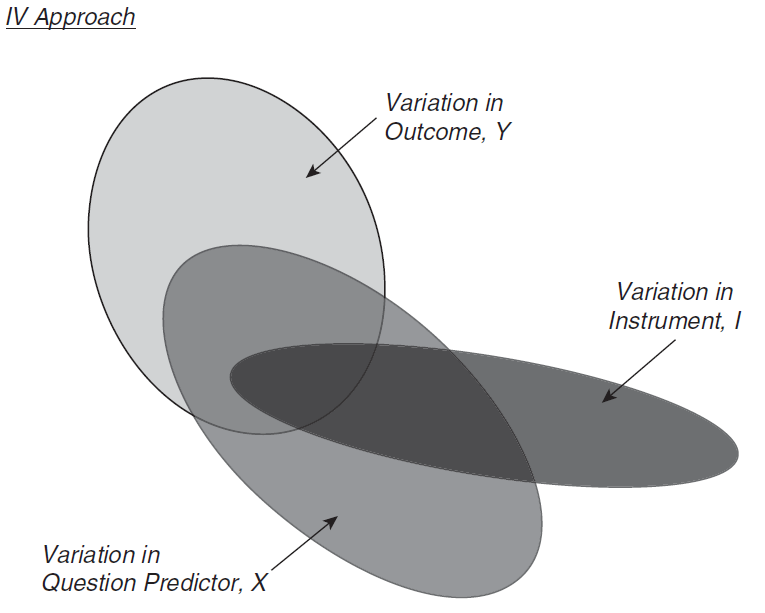
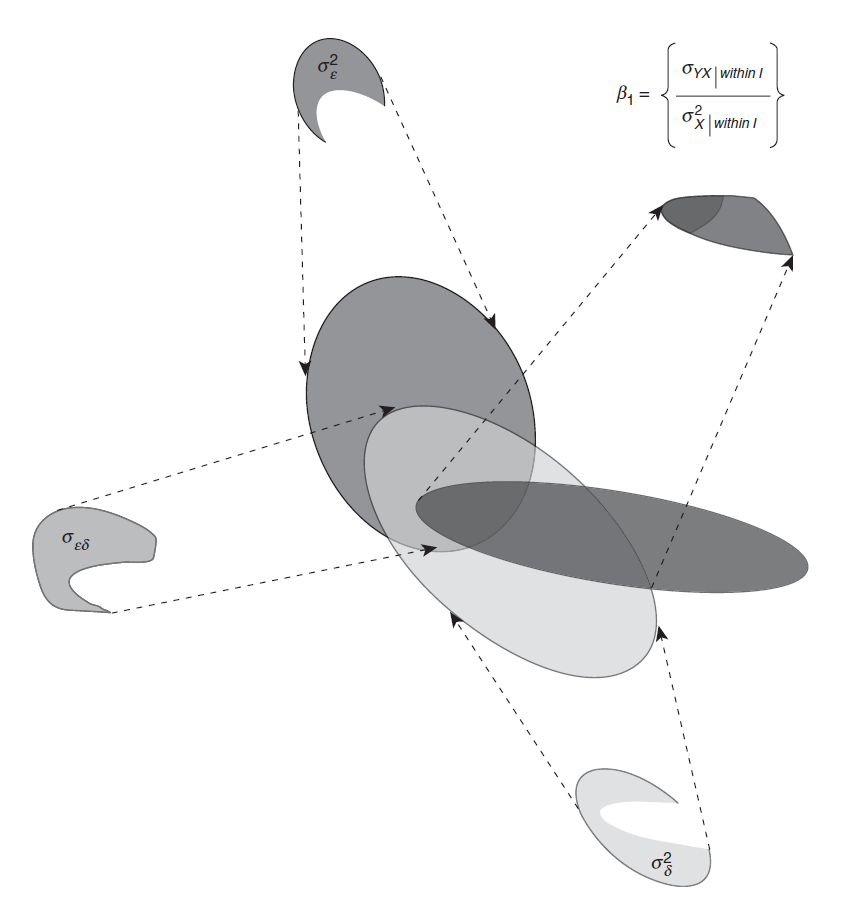
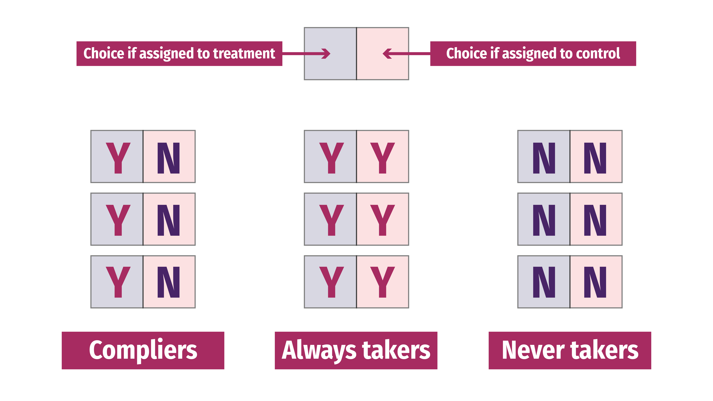
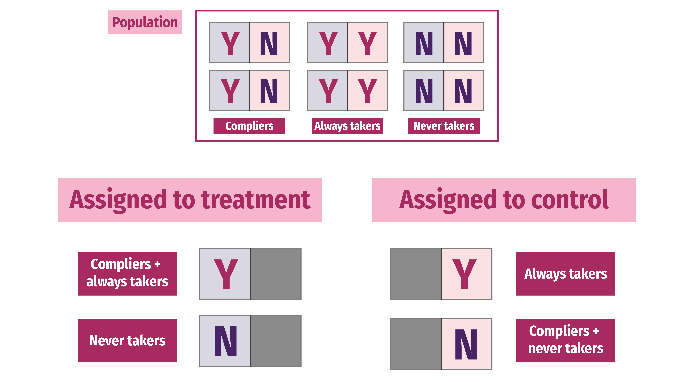
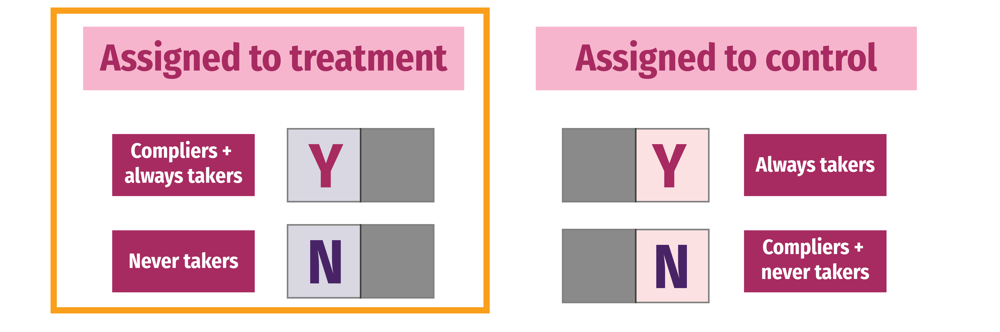
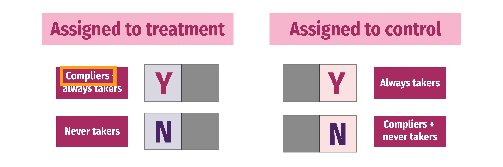
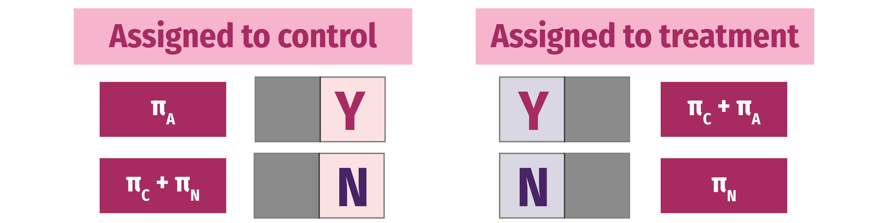

```{r setup, include=FALSE}
knitr::opts_chunk$set(warning = FALSE, message = FALSE, 
                      fig.retina = 3, fig.align = "center")
```

```{r packages-data, include=FALSE}
library(tidyverse)
library(broom)
library(ggdag)
library(kableExtra)
library(scales)
library(patchwork)
library(estimatr)
library(modelsummary)

set.seed(123456)

nrows <- 1000
father_education <- tibble(
  ability = rnorm(nrows, 35000, 10000),  # Ability
  fathereduc = rnorm(nrows, 15000, 20000),  # Father's education (IV)
  e_y = 0.43 * rnorm(nrows, 50000, 10000)  # Error for outcome
) %>% 
  mutate(educ = 3.7 + 0.52*fathereduc + 0.40*ability,  # Education (policy variable)
         wage = 5 + 0.23*educ + 0.5*ability - e_y) %>%  # Wage (outcome variable)
  mutate(wage = rescale(wage, to = c(7.75, 300)),  # Rescale from minimum wage to director wage (hourly)
         educ = rescale(educ, to = c(10, 23)),  # Rescale as years of school. Min 10 to max 23 (PhD)
         fathereduc = rescale(fathereduc, to = c(10, 23)),  # Rescale father's education
         ability = rescale(ability, to = c(0, 600))) %>%  # Rescale as Hypothetical test scores
  select(wage, educ, ability, fathereduc) %>% 
  mutate(across(everything(), ~round(., 2)))
```

```{r xaringanExtra, echo=FALSE}
xaringanExtra::use_xaringan_extra(c("tile_view"))
```

class: center middle main-title section-title-4

# Instrumental<br>variables

.class-info[

**Class 7**

.light[EDUC 265: Applied Regression Analysis<br>
UCI School of Education
]

]

---

name: quasi-experiments
class: center middle section-title section-title-4 animated fadeIn

# Quasi-experiments

---

&nbsp;

.box-4.large.sp-after[RCTs are great!]

--

.box-4.large[Super impractical to do<br>all the time though!]

---

layout: true
class: title title-4

---

# Quasi-experiments

--

.box-inv-4.medium[You can't always randomly<br>assign people to do things]

--

.box-inv-4.medium[So let other people (or the government,<br>or nature, or something else) do it for you]

---

# Quasi-experiments

.box-inv-4.medium.sp-after[**Quasi-experiment**<br>A situation where you, as researcher,<br>did not assign people to treatment/control]

--

.center.float-left.sp-after[
.box-4[External validity 👍]&ensp;.box-4[Selection 👎]
]

--

.box-inv-4.medium[Assignment to treatment is "as if" random]

???

Good bc of external validity; bad bc of selection

---

# Quasi-experiments vs. DAG adjustment

--

.box-inv-4[We did a lot of work with DAGs!<br>You're good at closing backdoors with regression]

--

.box-inv-4.sp-after[DAGs can work for any kind of observational data,<br>even without a quasi-experimentalish situation]

--

.box-4[Quasi-experiments are a little different:<br>the **context** isolates pathway between treatment and outcome]

--

.box-4.smaller[They're wildly popular in the social sciences,<br>maybe more credible (?) than just making DAG adjustments]

--

.box-4.smaller[You can still draw a DAG for a quasi-experiment though!]

---

# Analyzing quasi-experiments

--

.box-inv-4.medium[Instrumental variables]

.box-4.small[IV]

--

.box-inv-4.medium[Regression discontinuity]

.box-4.small.sp-after[RD; RDD]

--

.box-inv-4.medium[Difference-in-differences]

.box-4.small.sp-after[DiD; DD; diff-in-diff]


---

name: outline
class: title title-8

# Plan for today

--

.box-1.medium.sp-after-half[Endogeneity and exogeneity]

--

.box-3.medium.sp-after-half[Instruments]

--

.box-6.medium.sp-after-half[Treatment effects and compliance]


--

.box-7.medium.sp-after-half[Recap]

---
layout: false
name: endo-exo
class: center middle section-title section-title-1 animated fadeIn

# Endogeneity<br>and exogeneity

---

layout: true
class: title title-1

---

# Does education cause higher earnings?

```{r iv-dag-simple, echo=FALSE, fig.width=7, fig.height=3, out.width="70%"}
status_colors <- c(exposure = "#0074D9", outcome = "#FF851B", latent = "grey50")
status_colors_backdoor <- c(exposure = "#0074D9", outcome = "#FF851B", latent = "#FF4136")

node_details <- tribble(
  ~plot1, ~plot2, ~plot3, ~name, ~label, ~x, ~y, ~generic, ~mathy,
  TRUE, TRUE, TRUE, "treatment", "Education", 1, 1, "Program/policy", "X",
  TRUE, TRUE, TRUE, "outcome", "Earnings", 3, 1, "Outcome", "Y",
  FALSE, TRUE, TRUE, "unmeasured", "Ability", 2, 2, "Unmeasured confounders", "U",
  FALSE, FALSE, TRUE, "instrument", "Father's education", 0, 1, "Instrument", "Z"
)

node_labels <- node_details$label %>% 
  set_names(node_details$name)

node_labels_generic <- node_details$generic %>% 
  set_names(node_details$name)

iv_dag1 <- dagify(outcome ~ treatment,
                  exposure = "treatment",
                  outcome = "outcome",
                  coords = filter(node_details, plot1),
                  labels =  node_labels) %>% 
  tidy_dagitty() %>% 
  node_status()

ggplot(iv_dag1, aes(x = x, y = y, xend = xend, yend = yend)) +
  geom_dag_edges(start_cap = ggraph::circle(3, "lines"),
                 end_cap = ggraph::circle(3, "lines"),
                 edge_width = 1.5, 
                 arrow_directed = grid::arrow(length = grid::unit(0.75, "lines"), type = "closed")) +
  geom_dag_point(aes(color = status), size = 20) +
  geom_dag_label_repel(aes(label = label, fill = status), seed = 1234,
                       color = "white", fontface = "bold", size = 7,
                       family = "Fira Sans Condensed",
                       label.padding = grid::unit(0.75, "lines"),
                       # box.padding = grid::unit(2.5, "lines"),
                       direction = "y") +
  scale_color_manual(values = status_colors, na.value = "grey20") +
  scale_fill_manual(values = status_colors, na.value = "grey20") +
  guides(color = FALSE, fill = FALSE) + 
  theme_dag(base_size = 20)
```

--

.medium[
$$\color{#FF851B}{\text{Earnings}_i} = \beta_0 + \beta_1 \color{#0074D9}{\text{Education}_i} + \varepsilon_i$$
]

---

layout: false

.box-inv-1.medium[If we ran this regression, would β<sub>1</sub><br>give us the causal effect of education?]

.medium[
$$\text{Earnings}_i = \beta_0 + \beta_1 \text{Education}_i + \varepsilon_i$$
]

--

.box-1.medium[No!]

--

.float-left.center[.box-inv-1[Omitted variable bias!]&ensp;.box-inv-1[Unclosed backdoors!]]

--

.box-inv-1[**Endogeneity!**]

---

layout: false

.center[
<figure>
  
</figure>
]

---

layout: true
class: title title-1

---

# Exogeneity and endogeneity

.box-inv-1.medium[**Exogenous** variables]

--

.box-1[Value is not determined by<br>anything else in the model]

--

.box-1[In a DAG, a node that doesn't<br>have arrows coming into it]


---

# Exogeneity

.box-inv-1.medium[Education is exogenous: no arrows *into* it]

```{r show-iv-dag, echo=FALSE, out.width="100%"}
knitr::include_graphics(knitr::fig_chunk("iv-dag-simple", "png"))
```

---

# Exogeneity and endogeneity

.box-inv-1.medium[**Endogenous** variables]

--

.box-1[Value is determined by<br>something else in the model]

--

.box-1[In a DAG, a node that<br>has arrows coming into it]

---

# Endogeneity

.box-inv-1.medium[Education is endogenous: Ability → Education]

```{r iv-dag-endogenous, echo=FALSE, fig.width=7, fig.height=4, out.width="60%"}
iv_dag2 <- dagify(outcome ~ treatment + unmeasured,
                  treatment ~ unmeasured,
                  exposure = "treatment",
                  outcome = "outcome",
                  latent = "unmeasured",
                  coords = filter(node_details, plot2),
                  labels =  node_labels) %>% 
  tidy_dagitty() %>% 
  node_status() %>% 
  node_exogenous() %>% 
  node_dconnected() %>% 
  control_for("unmeasured")

ggplot(iv_dag2, aes(x = x, y = y, xend = xend, yend = yend)) +
  geom_dag_edges(start_cap = ggraph::circle(3, "lines"),
                 end_cap = ggraph::circle(3, "lines"),
                 edge_width = 1.5, 
                 arrow_directed = grid::arrow(length = grid::unit(0.75, "lines"), type = "closed")) +
  geom_dag_point(aes(color = status), size = 20) +
  geom_dag_label_repel(aes(label = label, fill = status), seed = 1234,
                       color = "white", fontface = "bold", size = 7,
                       family = "Fira Sans Condensed",
                       label.padding = grid::unit(0.75, "lines"),
                       box.padding = grid::unit(5, "lines"),
                       direction = "both") +
  scale_color_manual(values = status_colors, na.value = "grey20") +
  scale_fill_manual(values = status_colors, na.value = "grey20") +
  guides(color = FALSE, fill = FALSE) + 
  theme_dag(base_size = 20)
```

---

# Exgoeneity

.box-inv-1.medium[What would exogenous variation<br>in education look like?]

--

.box-1[Choices to get more education that are essentially random<br>(or at least uncorrelated with omitted variables)]

---

layout: false

.box-1.medium[We'd like education to be exogenous<br>.smaller[(an outside decision or intervention)], but it's not!]

```{r show-iv-dag-endo, echo=FALSE, out.width="45%"}
knitr::include_graphics(knitr::fig_chunk("iv-dag-endogenous", "png"))
```

--

.box-inv-1[Part of it is exogenous, but part of it is<br>caused by ability, which is in the DAG]

---

class: title title-1

# Fixing endogeneity with DAGs

```{r show-iv-dag-endo-again, echo=FALSE, out.width="45%"}
knitr::include_graphics(knitr::fig_chunk("iv-dag-endogenous", "png"))
```

--

.box-1[Close backdoor and adjust for ability]

--

.box-inv-1.smaller[Adjustment filters out the endogenous part of education and leaves us with just the endogenous part]

$$\text{Earnings}_i = \beta_0 + \beta_1 \text{Education}_i + \beta_2 \text{Ability}_i + \varepsilon_i$$

---

```{r calculate-effects, echo=FALSE}
# IPW with continuous treatment
# https://meghapsimatrix.com/post/continuous-r-rmarkdown/
# model_num <- lm(educ ~ 1, data = father_education)
# num <- dnorm(father_education$educ, 
#              predict(model_num),
#              sd(model_num$residuals))
# 
# model_den <- lm(educ ~ ability, data = father_education)
# den <- dnorm(father_education$educ, 
#              predict(model_den),
#              sd(model_den$residuals))

# Also works with ipw::ipwpoint
# weights_automatic <- ipw::ipwpoint(
#   exposure = educ,
#   family = "gaussian",
#   numerator = ~ 1,
#   denominator = ~ 1 + ability,
#   trunc = 0.05,
#   data = as.data.frame(father_education)
# )

# father_educ_ipw <- father_education %>% 
#   mutate(ipw = num / den)
# model3 <- lm(wage ~ educ, data = father_educ_ipw, weights = ipw)

model1 <- lm(wage ~ educ, data = father_education)
model2 <- lm(wage ~ educ + ability, data = father_education)
```

.pull-left-wide[
.small[
```{r show-table, echo=FALSE}
model_results <- modelsummary(list("Unadjusted" = model1, "Adjusted" = model2),
                              gof_omit = 'IC|Log|Adj', stars = TRUE)
model_results %>% 
  add_header_above(c(" " = 1, "Outome = wage" = 2)) %>% 
  row_spec(c(6, 9), extra_css = "border-bottom: 1px solid") %>% 
  row_spec(3, background = "#FFC6C6")
```
]
]

.pull-right-narrow[
.box-2[Unadjusted<br>is wrong!]

.box-1[Adjusted<br>is right!]

.box-inv-1.small[One year of education causes hourly wage to increase by $7.77]

.box-inv-1.smaller[(FAKE DATA)]
]
---

layout: true
class: title title-1

---

# But we can't measure ability!

```{r iv-dag-endogenous-confounding, echo=FALSE, fig.width=7, fig.height=4, out.width="40%"}
ggplot(iv_dag2, aes(x = x, y = y, xend = xend, yend = yend)) +
  geom_dag_edges(aes(edge_colour = adjusted),
                 start_cap = ggraph::circle(3, "lines"),
                 end_cap = ggraph::circle(3, "lines"),
                 edge_width = 1.5, 
                 arrow_directed = grid::arrow(length = grid::unit(0.75, "lines"), type = "closed")) +
  ggraph::scale_edge_colour_manual(values = c(unadjusted = "black", adjusted = "#FF4136")) +
  geom_dag_point(aes(color = status), size = 20) +
  geom_dag_label_repel(aes(label = label, fill = status), seed = 1234,
                       color = "white", fontface = "bold", size = 7,
                       family = "Fira Sans Condensed",
                       label.padding = grid::unit(0.75, "lines"),
                       box.padding = grid::unit(5, "lines"),
                       direction = "both") +
  scale_color_manual(values = status_colors_backdoor, na.value = "grey20") +
  scale_fill_manual(values = status_colors_backdoor, na.value = "grey20") +
  guides(color = FALSE, fill = FALSE, edge_colour = FALSE) + 
  theme_dag(base_size = 20)
```

$$\color{#FF851B}{\text{Earnings}_i} = \beta_0 + \beta_1 \color{#0074D9}{\text{Education}_i} + \beta_2 \color{#FF4136}{\text{Ability}_i} + \varepsilon_i$$

--

.box-inv-1.small[Unmeasurable ability node is in the error term (ε)]

$$\color{#FF851B}{\text{Earnings}_i} = \beta_0 + \beta_1 \color{#0074D9}{\text{Education}_i} + \color{#FF4136}{\varepsilon_i}$$

---

# Split exogeneity and endogeneity

.box-inv-1[What if we could somehow separate education<br>into its endogenous and exogenous parts?]

--

.SMALL[
$$
\begin{aligned}
\color{#FF851B}{\text{Earnings}_i} =& \beta_0 + \beta_1 \color{#B10DC9}{\text{Education}_i} + \varepsilon_i \\
& \beta_0 + \beta_1 (\color{#0074D9}{\text{Education}_i^\text{exog.}} + \color{#FF4136}{\text{Education}_i^\text{endog.}}) + \varepsilon_i \\
& \beta_0 + \beta_1 \color{#0074D9}{\text{Education}_i^\text{exog.}} + \underbrace{\beta_1 \color{#FF4136}{\text{Education}_i^{\text{endog.}}} + \varepsilon_i}_{\color{#AAAAAA}{\omega_i}} \\
& \beta_0 + \beta_1 \color{#0074D9}{\text{Education}_i^\text{exog.}} + \color{#AAAAAA}{\omega_i}
\end{aligned}
$$
]

---

# Find exogeneity with One Weird Trick™

.medium[
$$
\color{#FF851B}{\text{Earnings}_i} = \beta_0 + \beta_1 \color{#0074D9}{\text{Education}_i^\text{exog.}} + \color{#AAAAAA}{\omega_i}
$$
]

.box-inv-1.medium.sp-after[How do we find only Education<sup>exog.</sup>?]

--

.box-1.large[Use an instrument!]

---

layout: false

.center[
<figure>
  
</figure>
]

---

layout: false

.center[
<figure>
  
</figure>
]

---


layout: false
name: instruments
class: center middle section-title section-title-3 animated fadeIn

# Instruments

---

layout: true
class: title title-3

---

# What is an instrument?

--

.box-inv-3[Something that is correlated with the policy variable]

.box-3.small.sp-after[(Relevance)]

--

.box-inv-3[Something that does not directly cause the outcome]

.box-3.small.sp-after[(Exclusion)]

--

.box-inv-3[Something that is not correlated with the omitted variables]

.box-3.small[(Exogenity)]

---

layout: false

```{r iv-dag-general, echo=FALSE, fig.width=12, fig.height=6, out.width="100%"}
iv_dag4 <- dagify(outcome ~ treatment + unmeasured,
                  treatment ~ unmeasured + instrument,
                  exposure = "treatment",
                  outcome = "outcome",
                  latent = "unmeasured",
                  coords = filter(node_details, plot3),
                  labels =  node_labels_generic) %>% 
  tidy_dagitty() %>% 
  node_status() %>% 
  node_exogenous() %>% 
  node_dconnected() %>% 
  control_for("unmeasured")

ggplot(iv_dag4, aes(x = x, y = y, xend = xend, yend = yend)) +
  geom_dag_edges(aes(edge_colour = adjusted),
                 start_cap = ggraph::circle(3, "lines"),
                 end_cap = ggraph::circle(3, "lines"),
                 edge_width = 1.5, 
                 arrow_directed = grid::arrow(length = grid::unit(0.75, "lines"), type = "closed")) +
  geom_dag_point(aes(color = status), size = 30) +
  geom_dag_label_repel(aes(label = label, fill = status), seed = 1,
                       color = "white", fontface = "bold", size = 14,
                       family = "Fira Sans Condensed",
                       label.padding = grid::unit(0.75, "lines"),
                       box.padding = grid::unit(6, "lines"),
                       direction = "y") +
  scale_color_manual(values = status_colors_backdoor, na.value = "grey20") +
  ggraph::scale_edge_colour_manual(values = c(unadjusted = "black", adjusted = "#FF4136")) +
  scale_fill_manual(values = status_colors_backdoor, na.value = "grey20") +
  guides(color = FALSE, fill = FALSE, edge_colour = FALSE) +
  theme_dag(base_size = 28)
```

---

```{r iv-dag-example, echo=FALSE, fig.width=12, fig.height=6, out.width="100%"}
iv_dag3 <- dagify(outcome ~ treatment + unmeasured,
                  treatment ~ unmeasured + instrument,
                  exposure = "treatment",
                  outcome = "outcome",
                  latent = "unmeasured",
                  coords = filter(node_details, plot3),
                  labels =  node_labels) %>% 
  tidy_dagitty() %>% 
  node_status() %>% 
  node_exogenous() %>% 
  node_dconnected() %>% 
  control_for("unmeasured")

ggplot(iv_dag3, aes(x = x, y = y, xend = xend, yend = yend)) +
  geom_dag_edges(aes(edge_colour = adjusted),
                 start_cap = ggraph::circle(3, "lines"),
                 end_cap = ggraph::circle(3, "lines"),
                 edge_width = 1.5, 
                 arrow_directed = grid::arrow(length = grid::unit(0.75, "lines"), type = "closed")) +
  geom_dag_point(aes(color = status), size = 30) +
  geom_dag_label_repel(aes(label = label, fill = status), seed = 1234,
                       color = "white", fontface = "bold", size = 14,
                       family = "Fira Sans Condensed",
                       label.padding = grid::unit(0.75, "lines"),
                       box.padding = grid::unit(6, "lines"),
                       direction = "y") +
  scale_color_manual(values = status_colors_backdoor, na.value = "grey20") +
  ggraph::scale_edge_colour_manual(values = c(unadjusted = "black", adjusted = "#FF4136")) +
  scale_fill_manual(values = status_colors_backdoor, na.value = "grey20") +
  guides(color = FALSE, fill = FALSE, edge_colour = FALSE) +
  theme_dag(base_size = 28)
```

---

```{r iv-dag-letters, echo=FALSE, fig.width=12, fig.height=6, out.width="100%"}
mathy_coords <- node_details %>% 
  filter(plot3) %>% 
  select(name = mathy, x, y)

iv_dag_mathy <- dagify(Y ~ X + U,
                       X ~ U + Z,
                       exposure = "X",
                       outcome = "Y",
                       latent = "U",
                       coords = mathy_coords) %>% 
  tidy_dagitty() %>% 
  node_status() %>% 
  node_exogenous() %>% 
  node_dconnected()

ggplot(iv_dag_mathy, aes(x = x, y = y, xend = xend, yend = yend)) +
  geom_dag_edges(aes(edge_colour = adjusted),
                 start_cap = ggraph::circle(3, "lines"),
                 end_cap = ggraph::circle(3, "lines"),
                 edge_width = 1.5, 
                 arrow_directed = grid::arrow(length = grid::unit(0.75, "lines"), type = "closed")) +
  geom_dag_point(aes(color = status), size = 30) +
  geom_dag_text(aes(label = name),
                color = "white", fontface = "bold", size = 14,
                family = "Fira Sans Condensed") +
  scale_color_manual(values = status_colors_backdoor, na.value = "grey20") +
  ggraph::scale_edge_colour_manual(values = c(unadjusted = "black", adjusted = "#FF4136")) +
  scale_fill_manual(values = status_colors_backdoor, na.value = "grey20") +
  guides(color = FALSE, fill = FALSE, edge_colour = FALSE) +
  theme_dag(base_size = 28)
```

---

.pull-left[
.box-3.SMALL[**Relevance**<br>Correlated with policy]

.box-inv-3.smaller[Z → X &emsp; Cor(Z, X) ≠ 0]

.box-3.SMALL[**Excludability**<br>Correlated with outcome<br>*only through* policy]

.box-inv-3.smaller[Z → X → Y &emsp; Z &nrarr; Y &emsp; Cor(Z, Y | X) = 0]

.box-3.SMALL[**Exogeneity**<br>*Not* correlated<br>with omitted variables]

.box-inv-3.smaller[U &nrarr; Z &emsp; Cor(Z, U) = 0]

]

.pull-right[
&nbsp;

`)

.box-inv-3.smaller[**Relevance** testable with stats]

.box-inv-3.smaller[**Excludability** testable with stats + story]

.box-inv-3.smaller[**Exogeneity** requires story, no stats]
]

???

https://dlm-econometrics.blogspot.com/2020/08/horseshoes-and-hand-grenades.html

---

layout: true
class: title title-3

---

# Relevance

.box-3[Instrument causes change in policy]

.box-inv-3.smaller.sp-after[Z → X &emsp; Cor(Z, X) ≠ 0]

<hr>

--

.center.float-left.sp-after[.box-inv-3.sp-before[Social security number] .box-2.smaller[Probably not relevant (uncorrelated with education)]]

--

.center.float-left.sp-after[.box-inv-3.sp-before[3rd grade test scores] .box-5.smaller[Potentially relevant (early grades cause more education)]]

--

.center.float-left[.box-inv-3.sp-before[Father's education] .box-5.smaller[Relevant (Educated parents cause more education)]]

---

# Excludability

.box-3[Instrument causes outcome *only through* policy]

.box-inv-3.smaller.sp-after[Z → X → Y &emsp; Z &nrarr; Y &emsp; Cor(Z, Y | X) = 0]

<hr>

--

.center.float-left.sp-after[.box-inv-3.sp-before[Social security number] .box-5.smaller[Exclusive (SSN isn't correlated with hourly wages)]]

--

.center.float-left.sp-after[.box-inv-3.sp-before[3rd grade test scores] .box-5.smaller[Potentially exclusive (early grades probably don't cause wages)]]

--

.center.float-left[.box-inv-3.sp-before[Father's education] .box-5.smaller[Exclusive (Parent's education doesn't cause your wages (lol))]]

---

# Exogeneity

.box-3[Instrument not correlated with omitted variables]

.box-inv-3.smaller.sp-after[U &nrarr; Z &emsp; Cor(Z, U) = 0]

<hr>

--

.center.float-left.sp-after[.box-inv-3.sp-before[Social security number] .box-5.smaller[Exogenous (Unrelated to anything related to education)]]

--

.center.float-left.sp-after[.box-inv-3.sp-before[3rd grade test scores] .box-2.smaller[Not exogenous (Grades correlated with other education factors)]]

--

.center.float-left[.box-inv-3.sp-before[Father's education] .box-5.smaller[Exogenous (Birth to parents is random)]]

---

# The huh? factor

.box-inv-3.medium["A necessary but not a sufficient condition<br>for having an instrument that can satisfy<br>the exclusion restriction is <span style="color: #A52C60;">if people are<br>confused when you tell them about the<br>instrument's relationship to the outcome.</span>"]

.box-3.small[Scott Cunningham, *Causal Inference: The Mixtape*, p. 123]

---

layout: true
class: title title-3

---

# Instruments are hard to find!

.box-inv-3.medium[The trickiest thing to prove is<br>the exclusion restriction]

.box-3.sp-after[Instrument causes the outcome *only through* the policy]

--

.box-inv-3.medium[Most proposed instruments fail this!]

---

layout: true
class: title title-3

---

# COVID-19 as an instrument

.box-inv-3.medium[A global pandemic is a huge<br>exogenous shock to<br>social systems everywhere]

.box-3[Maybe we can use it as an instrument!]

---

# COVID-19 as an instrument

.box-inv-3[What effect does closing schools have on<br>student performance or lifetime earnings?]

```{r covid-dag-1, echo=FALSE, fig.width=8, fig.height=4, out.width="70%"}
covid_nodes <- tribble(
  ~name, ~label, ~x, ~y,
  "treatment", "School attendance", 1, 1, 
  "outcome", "Grades (or earnings)", 3, 1, 
  "unmeasured", "Unmeasured confounders", 2, 3,
  "instrument", "COVID-19", 0, 2 
)

node_labels_covid <- covid_nodes$label %>% 
  set_names(covid_nodes$name)

covid_dag1 <- dagify(outcome ~ treatment + unmeasured,
                     treatment ~ unmeasured + instrument,
                     exposure = "treatment",
                     outcome = "outcome",
                     latent = "unmeasured",
                     coords = covid_nodes,
                     labels =  node_labels_covid) %>%
  tidy_dagitty() %>% 
  node_status() %>% 
  node_exogenous() %>% 
  node_dconnected() %>% 
  control_for("unmeasured")

ggplot(covid_dag1, aes(x = x, y = y, xend = xend, yend = yend)) +
  geom_dag_edges(aes(edge_colour = adjusted),
                 start_cap = ggraph::circle(3, "lines"),
                 end_cap = ggraph::circle(3, "lines"),
                 edge_width = 1.5, 
                 arrow_directed = grid::arrow(length = grid::unit(0.75, "lines"), type = "closed")) +
  geom_dag_point(aes(color = status), size = 20) +
  geom_dag_label_repel(aes(label = label, fill = status), seed = 1,
                       color = "white", fontface = "bold", size = 7,
                       family = "Fira Sans Condensed",
                       label.padding = grid::unit(0.5, "lines"),
                       box.padding = grid::unit(4, "lines"),
                       direction = "both") +
  scale_color_manual(values = status_colors_backdoor, na.value = "grey20") +
  ggraph::scale_edge_colour_manual(values = c(unadjusted = "black", adjusted = "#FF4136")) +
  scale_fill_manual(values = status_colors_backdoor, na.value = "grey20") +
  guides(color = FALSE, fill = FALSE, edge_colour = FALSE) +
  theme_dag(base_size = 20)
```

---

# lolnope

```{r covid-dag-2, echo=FALSE, fig.width=14, fig.height=6, out.width="100%"}
covid_nodes_2 <- tribble(
  ~name, ~label, ~x, ~y,
  "treatment", "School attendance", 1, 1, 
  "outcome", "Grades (or earnings)", 3, 1, 
  "unmeasured", "Unmeasured confounders", 2, 4,
  "instrument", "COVID-19", -2, 1,
  "deaths", "Deaths", 0, 6,
  "health", "Health", 0, 5,
  "jobs", "Job losses", 0, 4,
  "isolation", "Social isolation", 0, 3,
  "anxiety", "Anxiety", 0, 2
)

node_labels_covid_2 <- covid_nodes_2$label %>% 
  set_names(covid_nodes_2$name)

covid_dag2 <- dagify(outcome ~ treatment + unmeasured + deaths + health + jobs + isolation + anxiety,
                     treatment ~ unmeasured + instrument + deaths + health + jobs + isolation + anxiety,
                     deaths ~ instrument,
                     health ~ instrument,
                     jobs ~ instrument,
                     isolation ~ instrument,
                     anxiety ~ instrument,
                     exposure = "treatment",
                     outcome = "outcome",
                     latent = "unmeasured",
                     coords = covid_nodes_2,
                     labels =  node_labels_covid_2) %>%
  tidy_dagitty() %>% 
  node_status() %>% 
  node_exogenous() %>% 
  node_dconnected() %>% 
  control_for("unmeasured")

ggplot(covid_dag2, aes(x = x, y = y, xend = xend, yend = yend)) +
  geom_dag_edges(aes(edge_colour = adjusted),
                 start_cap = ggraph::circle(3, "lines"),
                 end_cap = ggraph::circle(3, "lines"),
                 edge_width = 1.5, 
                 arrow_directed = grid::arrow(length = grid::unit(0.75, "lines"), type = "closed")) +
  geom_dag_point(aes(color = status), size = 20) +
  geom_dag_label_repel(aes(label = label, fill = status), seed = 1234,
                       color = "white", fontface = "bold", size = 7,
                       family = "Fira Sans Condensed",
                       label.padding = grid::unit(0.75, "lines"),
                       box.padding = grid::unit(2.5, "lines"),
                       direction = "y", nudge_x = 0.5) +
  scale_color_manual(values = status_colors_backdoor, na.value = "grey20") +
  ggraph::scale_edge_colour_manual(values = c(unadjusted = "black", adjusted = "#FF4136")) +
  scale_fill_manual(values = status_colors_backdoor, na.value = "grey20") +
  guides(color = FALSE, fill = FALSE, edge_colour = FALSE) +
  theme_dag(base_size = 20)
```

???

https://twitter.com/joshuasgoodman/status/1238517897829310464

---

# Falsifying exclusion assumptions

.box-inv-3[Can you think of some other way that the instrument<br>can cause the outcome outside of the policy?]

--

.box-inv-3[If so, the instrument doesn't meet exclusion restriction]

--

.pull-left[
`)
]

.pull-right[
.box-3.small[Instrument → ?? → outcome?]

.box-3.small[Rainfall → ?? → civil war?]

.box-3.small[Tobacco taxes → ?? → health?]

.box-3.small[Scrabble score → ?? →<br>Labor market success?]
]

---

layout: false
name: treatment-effects
class: center middle section-title section-title-6 animated fadeIn

# Treatment effects<br>and compliance

---

layout: true
class: title title-6

---

# Potential outcomes

.medium[
$$
\delta = (Y |\ P = 1) - (Y |\ P = 0)
$$
]

--

.box-inv-6[δ (delta) = causal effect]

--

.box-inv-6[P = Program]

--

.box-inv-6[Y = Outcome]

--

.medium[
$$
\delta = Y_1 - Y_0
$$
]

---

layout: false

.box-6.medium[Fundamental problem<br>of causal inference]

--

.less-medium[
$$
\delta_i = Y_i^1 - Y_i^0 \quad \text{in real life is} \quad \delta_i = Y_i^1 - ???
$$
]

--

.box-inv-6.medium[Individual-level effects are<br>impossible to observe!]

---

layout: true
class: title title-6

---

# Average treatment effect

.box-inv-6[Difference between average/expected value when<br>program is on vs. expected value when program is off]

.less-medium[
$$
\text{ATE} = E(Y_1 - Y_0) = E(Y_1) - E(Y_0)
$$
]

--

.box-inv-6[Can be found for a whole population, on average]

.less-medium[
$$
\delta = (\bar{Y}\ |\ P = 1) - (\bar{Y}\ |\ P = 0)
$$
]

---

layout: false

.box-6.medium[Every individual has a<br>treatment/causal effect]

--

.box-inv-6.medium[ATE = average of all<br>unit-level causal effects]

--

.box-inv-6.medium[ATE = Average effect<br>for the whole population]

---

layout: true
class: title title-6

---

# Other versions of causal effects

.box-inv-6.medium[Average treatment on the treated]

.box-6.sp-after[ATT/TOT]

--

.box-inv-6.medium.sp-before[Conditional average treatment effect]

.box-6[CATE]

---

# LATE

.box-inv-6.medium[Local average treatment effect (LATE)]

.box-6.sp-after[Narrower effect; only applies to some of the population]

--

.box-inv-6.medium[You can't make population-level<br>claims with LATE]

--

.box-6.small[(But that can be okay!)]

---

# LATE

&nbsp;

--

.box-inv-6.medium[In RCTs and IVs, LATE = **compliers**]

---

# Compliance

.pull-left[
.box-inv-6.less-medium[Complier]

.box-6.small.sp-after[Treatment<br>follows assignment]

.box-inv-6.less-medium[Always taker]

.box-6.small[Gets treatment<br>regardless of assignment]
]

--

.pull-right[
.box-inv-6.less-medium[Never taker]

.box-6.small.sp-after[Rejects treatment<br>regardless of assignment]

.box-inv-6.less-medium[Defier]

.box-6.small[Does the opposite<br>of assignment]
]

---

layout: false

<figure>
  
</figure>

---

layout: true
class: title title-6

---

# Ignoring defiers

--

.box-inv-6.medium[We can generally assume<br>that defiers don't exist]

--

.box-6.small[In drug trials this makes sense; you can't get access<br>to medicine without being in treatment group]

--

.box-6.small[In most education contexts as well; e.g., winners of charter-school lotteries won't have a *lower* probability of attending a charter than losers]

--

.box-6.small[Sometimes, it can make sense, though; e.g., maybe encouraging people to get vaccinated makes them *less* likely to get one]

---

# Ignoring defiers

&nbsp;

--

.box-inv-6.medium[Monotonicity assumption]

--

.box-6.small[Assignment to treatment only<br>has an effect in one direction]

--

.box-6.small[Assignment to treatment can only<br>increase—not decrease—your actual chance of treatment]

---

layout: false

<figure>
  
</figure>

---

layout: true
class: title title-6

---

# More causal effects

.box-inv-6.medium[Intent to treat (ITT)]

.box-6.small.sp-after[Effect of assignment (not actual treatment!)]

--

.center[
<figure>
  
</figure>
]

---

# More causal effects

.box-inv-6.medium[Complier Average Causal Effect (CACE)]

.box-6.small.sp-after[LATE for the compliers]

--

.center[
<figure>
  
</figure>
]

---

```{r itt-cace-stuff, include=FALSE}
set.seed(1234)

N <- 2000
df <- tibble(
  status = sample(c("Always taker", "Never taker", "Complier"), N, 
                  replace = TRUE, prob = c(0.2, 0.4, 0.4)),
  treatment = sample(c("Treatment", "Control"), N, replace = TRUE, prob = c(0.5, 0.5))
) %>% 
  mutate(has_tutor_0 = (status == "Always taker") * 1,
         has_tutor_1 = (status != "Never taker") * 1) %>% 
  mutate(health_0 = case_when(
    status == "Always taker" ~ rnorm(N, 1, 0.5),
    status == "Never taker"  ~ rnorm(N, 0, 0.6),
    status == "Complier"     ~ rnorm(N, 0.1, 0.4),
  )) %>% 
  mutate(health_1 = case_when(
    status == "Always taker" ~ rnorm(N, 1, 0.5),
    status == "Never taker"  ~ rnorm(N, 0, 0.6),
    status == "Complier"     ~ rnorm(N, 0.9, 0.7),
  )) %>% 
  mutate(has_tutor = case_when(
    treatment == "Treatment" ~ has_tutor_1,
    treatment == "Control"   ~ has_tutor_0
  )) %>% 
  mutate(health = case_when(
    has_tutor == 0 ~ health_0,
    has_tutor == 1 ~ health_1
  )) %>% 
  mutate(has_tutor = factor(has_tutor, labels = c("No tutor", "Tutor")))

min_health <- min(df$health_0, df$health_1)
max_health <- max(df$health_0, df$health_1)

df <- df %>% 
  mutate(across(starts_with("health"), 
                ~rescale(., to = c(0, 100), 
                         from = c(min_health, max_health))))

df_real <- df %>% 
  select(treatment, has_tutor, health)

has_tutor_time_machine <- df %>% 
  mutate(has_tutor = fct_relevel(has_tutor, "No tutor"),
         status = fct_relevel(status, "Complier"))
has_tutor <- df_real %>% 
  mutate(has_tutor = fct_relevel(has_tutor, "No tutor"))

has_tutor$learning <- has_tutor$health

# write_csv(df, here::here("static", "data", "has_tutor_time_machine.csv"))
# write_csv(df_real, here::here("static", "data", "has_tutor_observed.csv"))

viridisLite::viridis(n = 3, option = "plasma", end = 0.85)
```

# Hypothetical after-school tutoring program

.box-inv-6[An NGO offers an after-school tutoring program to help<br>students do better in school]

--

.box-inv-6[We can read everyone's minds and we know if<br>people are always takers, never takers, or compliers]

---

# Mind reading

```{r bed-nets-mind-reading, echo=FALSE, fig.width=9, fig.height=4, out.width="100%"}
set.seed(1234)
ggplot(has_tutor_time_machine, aes(y = health, x = treatment)) + 
  geom_point(aes(shape = has_tutor, color = status), 
             position = position_jitter(height = NULL, width = 0.25)) + 
  facet_wrap(vars(status)) + 
  labs(color = "Type of person", shape = "Compliance",
       x = NULL, y = "Child learning") +
  scale_color_viridis_d(option = "plasma", end = 0.85) +
  theme_bw(base_size = 16, base_family = "Fira Sans Condensed")
```

---

# Actual data

.box-inv-6[But we can't read minds! This is what we actually see:]

```{r bed-nets-actual, echo=FALSE, fig.width=9, fig.height=3.5, out.width="100%"}
set.seed(1234)
ggplot(has_tutor_time_machine, aes(y = health, x = has_tutor)) + 
  geom_point(aes(shape = has_tutor, color = status), 
             position = position_jitter(height = NULL, width = 0.25)) + 
  facet_wrap(vars(treatment)) + 
  labs(color = "Type of person", shape = "Compliance",
       x = NULL, y = "Child learning") +
  scale_color_viridis_d(option = "plasma", end = 0.85) +
  theme_bw(base_size = 16, base_family = "Fira Sans Condensed")
```

---

# Actual data

.box-inv-6[(Actually *this* is what we see)]

```{r bed-nets-actual-no-color, echo=FALSE, fig.width=9, fig.height=3.5, out.width="100%"}
set.seed(1234)
ggplot(has_tutor_time_machine, aes(y = health, x = has_tutor)) + 
  geom_point(aes(shape = has_tutor, color = status), 
             position = position_jitter(height = NULL, width = 0.25)) + 
  facet_wrap(vars(treatment)) + 
  labs(color = "Type of person", shape = "Compliance",
       x = NULL, y = "Child learning") +
  scale_color_manual(values = c("black", "black", "black")) +
  theme_bw(base_size = 16, base_family = "Fira Sans Condensed")
```

---

layout: false

```{r bed-nets-actual-smaller, echo=FALSE, fig.width=9, fig.height=3.5, out.width="70%"}
set.seed(1234)
ggplot(has_tutor_time_machine, aes(y = health, x = has_tutor)) + 
  geom_point(aes(shape = has_tutor, color = status), 
             position = position_jitter(height = NULL, width = 0.25)) + 
  facet_wrap(vars(treatment)) + 
  labs(color = "Type of person", shape = "Compliance",
       x = NULL, y = "Child learning") +
  scale_color_viridis_d(option = "plasma", end = 0.85) +
  theme_bw(base_size = 16, base_family = "Fira Sans Condensed")
```

.center[
<figure>
  
</figure>
]

---

```{r echo=FALSE, out.width="50%"}
knitr::include_graphics(knitr::fig_chunk("bed-nets-mind-reading", "png"))
```

$$
\begin{aligned}
\text{ITT}\ =\ & \color{#0D0887}{\pi_\text{compliers} \times (\text{T} - \text{C})_\text{compliers}} + \\
&\color{#B7318A}{\pi_\text{always takers} \times (\text{T} - \text{C})_\text{always takers}} + \\
&\color{#FEBA2C}{\pi_\text{never takers} \times (\text{T} - \text{C})_\text{never takers}}\\[6pt]
\text{ITT}\ =\ & \color{#0D0887}{\pi_\text{C} \text{CACE}} + \color{#B7318A}{\pi_\text{A} \text{ATACE}} + \color{#FEBA2C}{\pi_\text{N} \text{NTACE}}
\end{aligned}
$$

---

```{r echo=FALSE, out.width="50%"}
knitr::include_graphics(knitr::fig_chunk("bed-nets-mind-reading", "png"))
```

$$\text{ITT}\ =\ \color{#0D0887}{\pi_\text{C} \text{CACE}} + \color{#B7318A}{\pi_\text{A} \text{ATACE}} + \color{#FEBA2C}{\pi_\text{N} \text{NTACE}}$$
--

.box-6[Being assigned to treatment doesn't influence<>Always Takers (ATs) and Never Takers (NTs)!]

--

$$\text{ITT}\ =\ \color{#0D0887}{\pi_\text{C} \text{CACE}} + \color{#B7318A}{\pi_\text{A} \times 0} + \color{#FEBA2C}{\pi_\text{N} \times 0}$$

---

$$
\begin{aligned}
\text{ITT}\ =\ & \color{#0D0887}{\pi_\text{C} \text{CACE}} + \color{#B7318A}{\pi_\text{A} \text{ATACE}} + \color{#FEBA2C}{\pi_\text{N} \text{NTACE}} \\[6pt]
=\ & \color{#0D0887}{\pi_\text{C} \text{CACE}} + \color{#B7318A}{\pi_\text{A} \times 0} + \color{#FEBA2C}{\pi_\text{N} \times 0}\\[6pt]
\text{ITT}\ =\ &\color{#0D0887}{\pi_\text{C} \text{CACE}}
\end{aligned}
$$

--

.medium[
$$
\color{#0D0887}{\text{CACE}} = \frac{\text{ITT}}{\color{#0D0887}{\pi_\text{C}}}
$$
]

--

.box-6[ITT and π<sub>C</sub> are both findable!]

---

layout: true
class: title title-6

---

# Finding the ITT

.box-inv-6[ITT = effect of assignment to treatment on outcome]

$$\text{ITT} = (\bar{y}\ |\ \text{Treatment}) - (\bar{y}\ |\ \text{Control)}$$

--

.pull-left.small-code[
```{r}
has_tutor %>% 
  group_by(treatment) %>% 
  summarize(avg = mean(learning))
```
]

--

.pull-right.small-code[
```{r eval=FALSE}
itt_model <- lm(learning ~ treatment, 
                data = has_tutor)
tidy(itt_model)
```

```{r echo=FALSE}
itt_model <- lm(learning ~ treatment, 
                data = has_tutor)
tidy(itt_model) %>% select(term, estimate)
```
]

---

# Finding the π<sub>C</sub>

.box-inv-6.smaller[People in treatment group who complied are a combination of Always Takers and Compliers]

```{r echo=FALSE, out.width="50%"}
knitr::include_graphics(knitr::fig_chunk("bed-nets-actual-smaller", "png"))
```

$$
\begin{aligned}
\pi_\text{A} + \pi_\text{C} =& \text{% yes in treatment; or} \\
\pi_\text{C} =& \text{% yes in treatment} - \pi_\text{A}
\end{aligned}
$$

---

# Can we know π<sub>A</sub>?

$$\pi_\text{C} = \text{% yes in treatment} - \pi_\text{A}$$

```{r echo=FALSE, out.width="50%"}
knitr::include_graphics(knitr::fig_chunk("bed-nets-actual-smaller", "png"))
```

--

.box-inv-6.small[We can assume that the proportion of Always Takers<br>is the same across treatment and control]

--

.box-inv-6.small[We know how many people were in control but still had a tutor—that's π<sub>A</sub>!]

---

# Isolating π<sub>C</sub>

.small[
$$
\begin{aligned}
\pi_\text{C} =& \text{% yes in treatment} - \pi_\text{A} \\
=& \text{% yes in treatment} - \text{% yes in control}
\end{aligned}
$$
]

.pull-left.small-code.small[
```{r}
has_tutor %>% 
  group_by(treatment, has_tutor) %>% 
  summarize(n = n()) %>% 
  mutate(prop = n / sum(n))
```
]

--

.pull-right.small-code[
```{r}
# pi_c = prop yes in treatment - 
#        prop yes in control
pi_c <- 0.6104418 - 0.1952191
pi_c
```

.box-inv-6[41.5% compliers!]
]


---

# Finding the CACE, finally!

$$\text{CACE} = \frac{\text{ITT}}{{\pi_\text{C}}}$$

--

.pull-left.small-code.small[
```{r}
ITT <- tidy(itt_model) %>% 
  filter(term == "treatmentTreatment") %>% 
  pull(estimate)
ITT

pi_c
```
]

--

.pull-right.small-code[
```{r}
CACE <- ITT / pi_c
CACE
```

.box-inv-6.small[Tutors *cause* a 14.4 point<br>increase in child learning *for compliers*]
]

---

layout: false

.medium[
$$
\text{CACE} = \frac{\color{#FF4136}{\text{ITT}}}{\color{#B10DC9}{\pi_\text{C}}}
$$

$$
\color{#FF4136}{\text{ITT}} = (\bar{y}\ |\ \text{Treatment}) - (\bar{y}\ |\ \text{Control)}
$$

$$
\begin{aligned}
\color{#B10DC9}{\pi_\text{C}}\ =\ & \text{% yes in treatment} - \\
& \text{% yes in control}
\end{aligned}
$$
]

---

class: title title-6

# A faster way with 2SLS

.box-inv-6.medium[LATE for the compliers]

--

.box-6[If you use assignment to treatment as an instrument,<br>you can find the causal effect for just compliers]

--

.box-6[Instrumental variables in general give you the CACE]

---

class: title title-6

# CACE with 2SLS

.code-small[
```{r eval=FALSE}
model_2sls <- iv_robust(learning ~ has_tutor | treatment, 
                        data = has_tutor)
tidy(model_2sls)
```

```{r echo=FALSE}
model_2sls <- iv_robust(learning ~ has_tutor | treatment, 
                        data = has_tutor)
tidy(model_2sls) %>% select(1:5)
```
]

.box-inv-6[Same 14.421 effect!]

---

layout: false
name: using-instruments
class: center middle section-title section-title-7 animated fadeIn

# Recap

---

class: title title-7

# General IV process

--

.box-inv-7[**1: Is the instrument relevant?**<br>.smaller[Instrument predicts policy/program participation; F-statistic in 1st stage > 104]]

--

.box-inv-7[**2: Does the instrument meet exclusion assumption?**<br>.smaller[Instrument causes outcome *only through* policy/program. **Good luck.**]]

--

.box-inv-7[**3: Is the instrument exogenous?**<br>.smaller[No arrows going into instrument node in DAG]]

--

.box-inv-7[**4: 2-stage least squares (2SLS)**<br>.smaller[program ~ instrument; outcome ~ program_hat&emsp;**OR**&emsp;`iv_robust()`]]


---

name: outline
class: title title-8

# Plan for next class

--

.box-8.medium[**Reading reactions**]

.box-inv-8.small.sp-after[Mastering Metrics video mandatory, on Perusall]

.box-inv-8.small.sp-after[The Effect videos optional, highly recommended]

--

.box-8.medium[**DAM 3**]

--

.box-8.medium[**Milestone 2**]

.box-inv-8.small[Due on March 03]

.box-inv-8.small[Message your replicator today]


